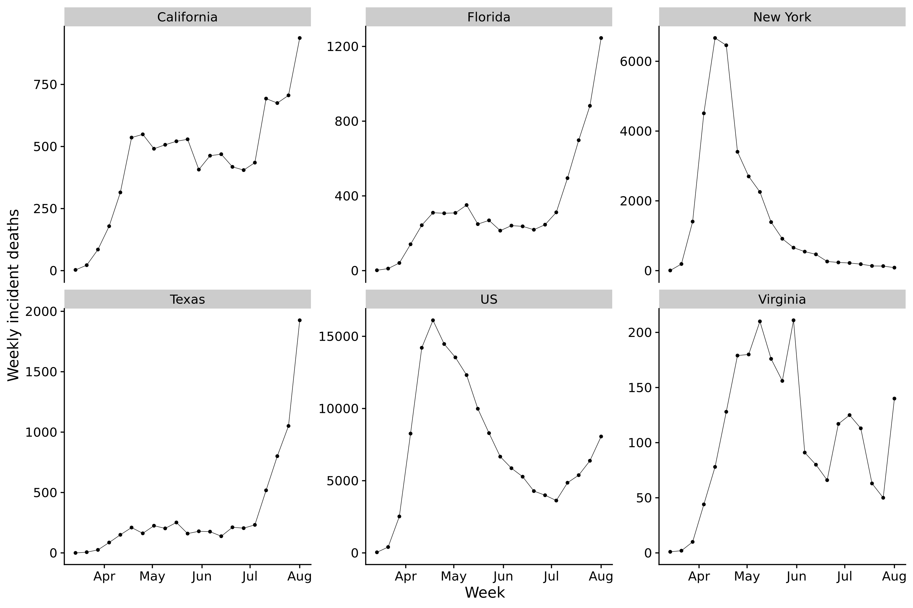
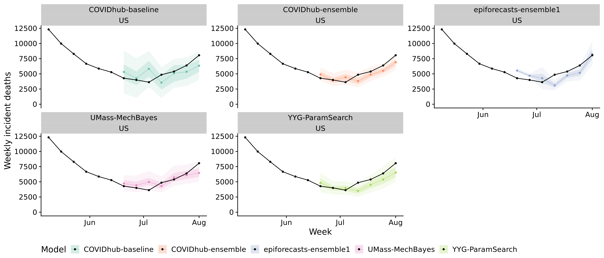

# Epidemiological background, data and forecasting models {#background-data}

Tracking a pandemic is not easy, let alone forecasting its trajectory into the future. It is not immediately clear what quantities we should be focusing on and how to forecast them. The following chapter is going to provide the background for the later discussion of evaluation and aggregation of the forecasts submitted to the COVID-19 Forecast Hub. It is first going to give a brief overview of different possible targets of interest and why the choice was made to look at deaths. It's purpose is not to give a complete introduction, but rather to highlight some of the complexities surrounding the choice of a prediction target. It then offers a very short introduction to different classes of modelling approaches common in epidemiology. It lastly introduces the COVID-19 Forecast Hub and gives an overview of the different forecasting models that will be analysed in the later chapters. 

## Overview of epidemiological prediction targets

Many different quantities may be of interest depending on the specific decisions to be made. These include e.g. current and future incidences or cumulative numbers of cases and deaths, the number of people who need a ventilator or treatment in an intensive care unit (ICU), or indicators about the likely trajectory of the epidemic. 

Metrics that directly capture the trajectory of the epidemic include the effective reproduction number and the doubling or halving time. The effective reproduction number, $R_t$ is the expected number of people that each infected person at time $t$ will infect themselves. In contrast to the basic reproduction number, $R_0$, the effective reproduction number varies over time, e.g. with changes in behaviour or different interventions implemented. See e.g. [@nishiuraEffectiveReproductionNumber2009] for an in-depth discussion and [@coriNewFrameworkSoftware2013] for one possible way to estimate $R_t$. [@gosticPracticalConsiderationsMeasuring2020] (with input from our working group at LSHTM) discuss some important practical considerations for estimating $R_t$. The doubling or halving time is the time expected until the number of cases doubles or halves, depending on the state of the epidemic. Both quantities can be a useful basis for policy decision, e.g. about whether or not to implement a lockdown, but they are not trivial to estimate. Also, there exists no ground truth against which different models could be compared. 

The most obvious prediction target, perhaps, is the number of infected cases, but there are a variety of problems associated with case numbers. First, it is not clear what the best definition of a case is. This was an issue especially in early 2020, when PCR tests were not readily available. Case numbers could vary substantially depending on whether one would count only cases confirmed by PCR testing or also those who clearly showed Covid-19 symptoms, but had not received a test. China, for example, reported 15 152 new cases for February 12 CITATION CHINA, a 600% surge from previous days, when they changed the reporting regime and decided to also report clinically confirmed cases. 
Secondly, changes in reported case counts cannot always directly be attributed to changes in the underlying epidemic. Even today, the number of confirmed cases depends on and varies a lot with testing efforts. CITATION TIM have even used this to estimate under-reporting by comparing the number of deaths to the number of reported cases. [CITATION, MAYBE TIM'S PAPER?]. Overall cases are in many locations estimated to be a multiple of what reported cases are. Thirdly, reported cases are subject to various delays and weekday effects. Patients may not be able to see a doctor over the weekend or hospitals do not forward cases to the authorities until the next Monday. To mitigate these, this thesis will only look at weekly data. Lastly, for many practical purposes such as estimating $R_t$, we need to figure out the date of symptom onset or even the date of infection of a patient, not only the date of report. A few countries publish very detailed line lists that include precise information about the estimated date of onset or date of infection of a particular person. But usually, delay distributions have to be estimated from very sparse data and have a lot of uncertainty around them. 

The COVID-19 Forecast Hub has decided to focus most of their efforts on deaths for a variety of reasons. Death counts are a very reliable source of data. While there has been some debate about people who are dying 'with Covid-19' or 'from Covid-19', a death can be defined and counted relatively easily compared to other metrics. Death counts are also largely independent from testing rates. They are therefore able to capture the pandemic as a whole, whereas reported case counts would often miss a substantial fraction of overall cases. The major problem with death counts in terms of their usefulness is that they are subject to long delays. Today's death counts therefore inform more about the state of affairs a month ago, then about the future trajectory of the disease. 

To a certain extent, the quantities described above can be used interchangeably, if we accept some loss of precision. We can model the sequence from infection to symptom onset, to report, to hospitalisation and finally to death by a sequence of delays that are characterised by different delay distributions. By convoluting the appropriate delay distributions we can e.g. shift cases back from their date of report to their probable date of symptom onset or date of infection. 

MAYBE FIGURE WITH ESTIMATED CASES ON DATE OF INFECTION


## An overview of common epidemiological models

A lot of different models are used in epidemiology to track and forecast epidemics. The following section will give a very brief overview of some general model types. This shall not be thought of as an exhaustive discussion, but is merely intended as a short primer that shall allow us to mentally place the COVID-19 Forecast Hub models in broad categories. 

### Compartmental models

Among the most widely used models in epidemiology are compartmental models. This split the general population in compartments. The basic compartments are *Susceptible* (S), *Infectious* (I) and *Recovered* (R), giving these models the name SIR models. The flow from one compartment to the other is characterised by a set of differential equations. Compartmental models help to model specific characterisitcs of people in different compartments. For example, People in the *Susceptible* compartment can be infected, while those who are in the *Recovered* compartment are assumed to be immune against further infection. Compartmental models are therefore able to model the depletion of susceptibles as the epidemic progresses. Other compartments, like *Exposed but not infectious* (E) can be introduced ad libitum to model e.g. incubation periods. For an in-depth discussion see CITATION BRAUER. 


### Time series models

Instead of explicitly modeling the disease dynamics, we can also use an agnostic approach and simply treat e.g. case numbers as an ordinary time series. The most notable classes of time series from the plethora of time series models that have been developed in the past (CITATION HYNDMAN? OR OTHER TEXTBOOK) are Auto-regressive Integrated Moving Average (ARIMA) models and State Space models that model separate Error, Trend and Seasonality components (ETS) of a time series. ARIMA and ETS models are very good in picking up past trends in the data. Without exogeneous information, they are however not able to incorporate any knowledge beyond the information included in the past time series. 

### Semi-mechanistic models

This is a very broad category of models that combine agnostic forecasting tools with epidemiological insights. For example, time series models can be extended by including some knowledge about the disease dynamics into the forecasts. One possibility that was employed in our own ensemble forecasts is $R_t$-based forecasting. The idea behind this is to estimate and forecast $R_t$ values and to model future cases based on the projected time series of $R_t$. The specific details of this approach shall be discussed later. In a similar vein, compartmental can be combined with Machine Learning models that help to determine the different parameters of the model. 


## The COVID-19 Forecast Hub

The COVID-19 Forecast Hub [@HomeCOVID19] (https://covid19forecasthub.org/) is a collaboration between he U.S. Centers for Disease Control and Prevention (CDC), academic research groups led by Professor Nicholas Reich at the University of Massachussets Amherst, and different industry partners. Starting on April 13, the consortium elicited weekly forecasts for all US states and territories and the US as a whole from research teams around the world. Forecasts were submitted every Monday in a probabilistic format. The predictive distribution was represented by the median and eleven prediction intervals ranging from a 10% prediction interval to a 98% prediction interval (i.e. the following 23 quantiles were recorded: `c(0.01, 0.025, seq(0.05, 0.95, by = 0.05), 0.975, 0.99)`). Forecasts were made for one to (at least) four week ahead horizons of targets like daily or weekly deaths and case numbers. 

Out of these targets, this thesis will focus only on weekly death incidences. The forecasts analysed here were made between XXX and XXXX. Some states were excluded in order to obtain a full set of complete forecasts. The ground truth data is provided by the Center for Systems Science and Engineering (CSSE) at Johns Hopkins University [@dongInteractiveWebbasedDashboard2020]. A plot of the data in a few select locations can be seen in Figure \ref{plot.observations}. 

- table with states included and models included? 



``` {r eval = FALSE}


```

## Overview of the forecasting models analysed

X models are included in this analysis. X of them come from independent research teams. These models are joined by a baseline model and an ensemble model provided by the Forecast Hub team. All models were again aggregated using different ensemble techniques for the purpose of this analysis. In the following, an overview over the different models submitted is given. The information is taken from the descriptions provided by the research teams on github (https://github.com/reichlab/covid19-forecast-hub/tree/master/data-processed) as of 07.08.2020. Descriptions are updated whenever the model changes. This overview may therefore not accurately reflect the model components over the entire history of past submissions included in the analysis. 

## COVIDhub-baseline

The baseline model basically assumes that incidences will be the same as in the past and models the uncertainty around this estimate according to the distribution of past changes in incidences. More precisely, forecasts for incidences are generated in the following way: The timeseries of all past incidences is taken and first differences are formed. These first differences, as well as the negative of these incidences are then used further along. From this vector of past changes, samples are drawn to get a predictive distribution of future changes. A predictive distribution for future incidences is then obtained by adding these samples to the last observed incidence. The predictive distribution is then shifted to enforce that the mean of the distribution equals the last observed value. Incidences below zero are truncated, and quantiles are obtained from the samples. 
## COVIDhub-ensemble

The COVID-19 ensemble model is formed by taking the arithmetic mean of respective quantiles from all eligible models. Models are deemed eligible if they pass some general sense checks (e.g. cumulative forecasts must in general not decrease over time). The number of models inclueded varies from state to state as not all teams submit forecasts for all locations. 

## epiforecasts-ensemble1

The epiforecasts ensemble is the model submitted by our working group at the London School of Hygiene and Tropical Medicine. It consists of three submodels that were aggregated using an equally weighted quantile average. The three submodels are two timeseries models and an $R_t$-based prediction model. The two timeseries models were generated using the forecastHybrid package in R. The package automatically selects an Autoregressive Integrated Moving Average (ARMIMA) model or a State Space model with appropriate error, trend and seasonality (ETS model). One of the timeseries models includes current cases as a lagged predictor, while the other is based on deaths only. The third model was generated using our own R packages EpiSoon and EpiNow. EpiSoon takes in reported cases to estimate the trajectory of $R_t$, the average number of people infected by each infected person. This trajectory is then forecasted into the future using forecastHybrid and transformed back to incidences. These three models are fit independently to each location. 
MAYBE MORE DETAILS AS IT'S OUR MODEL
Future cases were model using an exponential model, i.e. cases tomorrow were modeled as past cases times some factor. 


## IHME-CurveFit

IHME seems to be using an SEIR model for their model predictions. The metadate provided for the Forecast Hub reads: 'This model makes predictions about the future that are dependent on
  the assumption  that current interventions continue. The modeling approach in this
  study is divided into four components:  (i) identification and processing of COVID-19
  data;  (ii) statistical model estimation for population death rates as a function
  of time  since the death rate exceeds a threshold in a location;  (iii) predicting
  time to exceed a given population death threshold in states early in the pandemic;
  and  (iv) modeling health service utilization as a function of deaths." CurveFit
  package available at: https://github.com/ihmeuw-msca/CurveFit' CurveFit is a package that fits curves using nonlinear mixed effects. However, the github page for CurveFit points to two different github repos with code for SEIR models and their website (https://ihmeuw-msca.github.io/CurveFit/) confirms this. 
  
  
## UMass-MechBayes

https://github.com/dsheldon/covid

UMass-MechBayes is a Bayesian model build from a classical SEIR compartmental model. All parameters have prior distributions and time-varying dynamics as well as noise from observations are modeled explicitly. In addition, it includes two compartments 'dead' and 'hospitalised and will die'. The model is fit independently to each state. 


## YYG-ParamSearch

n SEIR model that makes daily infections and deaths projections for US states.
  A machine learning layer learns the best parameters/inputs for each state.
  The model accounts for state reopenings.

https://covid19-projections.com
https://github.com/youyanggu/covid19_projections

'We''ve built a SEIR model with learned parameters to make daily
  projections regarding COVID-19 infections and deaths in all 50 US states and
  70+ countries. The model also accounts for individual state-by-state reopenings
  and the resulting effects on infections and deaths. The parameters/inputs
  of this simulator are learned using hyperparameter optimization that minimizes
  the error between the projected outputs (projected daily deaths) and the actual
  results (reported daily deaths). Because the infections curve is unique for every
  region, we let the model use each region''s own data to learn the best set of parameters
  for that region. This includes parameters such as: mortality rate, initial R_0,
  post-lockdown R, and the inflection date of any lockdowns. Other variables such
  as the latency period, infectious period, and virus shedding period are fixed based
  on published literature. After some additional validation techniques to minimize
  overfitting, we use the learned parameters to simulate the future and make
  projections. See website for full description, methods, and results.'


