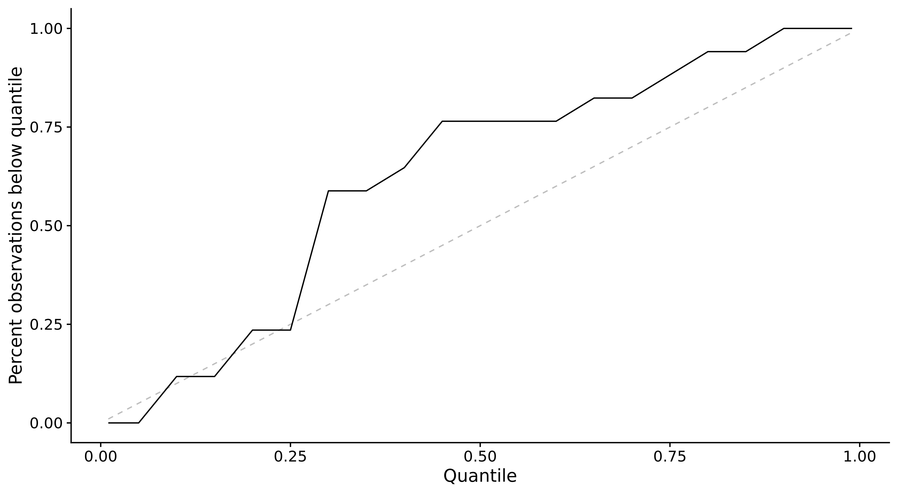
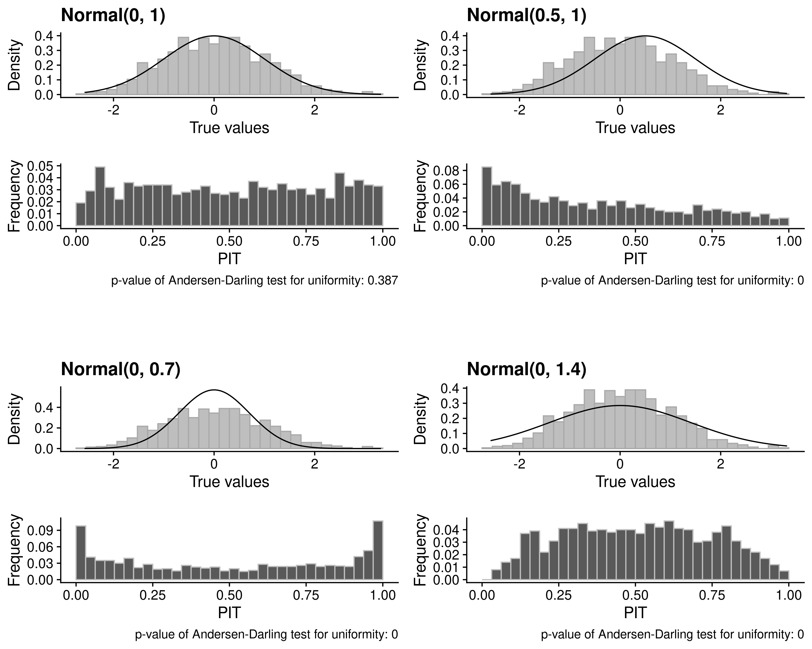
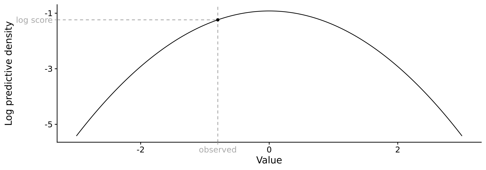
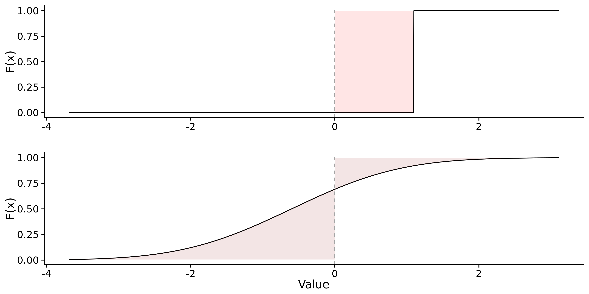

# Forecasting and evaluation {#evaluation}

Model evaluation is an integral of the forecasting process that can provide us with valuable insights. It can give us a better understanding of how a model works and how it can be improved. It can help us to choose among multiple models and it can provide the basis to combine models into an ensemble that works better than all individual models. This chapter provides the theoretical foundation for the discussion of model aggregation in Chapter \@ref(model-aggregation) and for the analysis presented in Chapter \@ref(results). It first defines the term 'forecast' and gives a brief overview of different types of forecasts to provide a background for the remainder of this chapter. It then reviews the forecasting paradigm as formulated by @gneitingCalibratedProbabilisticForecasting2005 and @gneitingProbabilisticForecastsCalibration2007 that is at the core of forecast evaluation. The forecasting paradigm states that we should focus on two central aspects of forecasts, 'calibration' and 'sharpness'. The chapter will therefore present different ways of assessing calibration and sharpness, followed by a discussion of proper scoring rules that allow us to summarise the quality of a forecast in a single number. It lastly proposes an evaluation algorithm THINK ABOUT THIS AGAIN and presents the `scoringuitls` package in more detail. 

## Types of forecasts

A forecast is the forecaster’s stated belief about the future. In terms of quantitative forecasts we can distinguish point forecasts from so-called probabilistic forecasts. A point forecast (e.g. "there will be 40m world-wide Covid-19 cases by the end of 2020") is the simplest form of a forecast. It can, in essence, be understood as an estimate for the mean of the unknown true data-generating distribution. In addition to the point forecast, we would also like the forecaster to at least state their uncertainty around the mean forecast. This makes a forecast much more useful in any applied decision making context, as very certain forecast may imply different actions than wildly uncertain ones. Ideally, however, predictions should be stated in terms of the entire predictive distributions [@gneitingStrictlyProperScoring2007]. Providing the entire predictive distribution allows the forecaster to express their belief about all aspects of the underlying data-generating distribution (including e.g. skewness or the width of its tails). 

These forecasts can be reported in different formats. The predictive distribution can be expressed analytically, but oftentimes it will be represented by a set of predictive samples from that distribution. This is especially handy as the forecaster can use algorithms like Markov Chain Monte Carlo (MCMC) algorithms to generate predictions if no analytical expression of the predictive distribution is available. The downside is that predictive samples take a lot of storage space. They also come with a loss of precision that is especially pronounced in the tails of the predictive distribution, where we need quite a lot of samples to characterise the distribution accurately. To circumvent these problems, often quantiles of the predictive distribution are reported instead. Quantile forecasts can easily be obtained from explicit distributional forecasts as well as from predictive samples. 

Note that the forecaster could also in principle state their forecasts in a binary way. They could for example ask: "will the number of Covid-19 cases in 2020 exceed 40 million?" and state a probability that this will happen. This type of forecasting is common in many classification problems, but will not be discussed further here. It is, however, naturally related to the cumulative distribution function of the predictive distribution. 

The different forecast types and formats require slightly different approaches to evaluation. But before we discuss the different appropriate metrics, we turn to the question "What is a good forecast?". 

## The forecasting paradigm

Any forecaster should aim to minimise the difference between the predictive distribution and the unknown true data-generating distribution [@gneitingProbabilisticForecastsCalibration2007]. For an ideal forecast, we therefore have 
$$ P_t = F_t $$
where $P_t$ is the the cumulative density function (CDF) of the predictive distribution at time $t$ and $F_t$ is the CDF of the true, unknown data-generating distribution. As we don't know the true data-generating distribution, we cannot assess the difference between the two distributions directly. @gneitingCalibratedProbabilisticForecasting2005 and @gneitingProbabilisticForecastsCalibration2007 instead suggest to focus on two central aspects of the predictive distribution, *calibration* and *sharpness*. Calibration refers to the statistical consistency between the predictive distribution and the observations. There are different possible ways in which a model can be (mis-)calibrated (see @gneitingProbabilisticForecastsCalibration2007 for details), but for the remainder of this thesis it suffices to say that a well calibrated forecast does not systematically deviate from the observed values. Sharpness is a feature of the forecast only and describes how concentrated the predictive distribution is, i.e. how precise the forecasts are. The general forecasting paradigm states that we should *maximise sharpness of the predictive distribution subject to calibration*. To summarise these concepts in more familiar terms: we can think of calibration as "how correct is this forecast?" and of sharpness as "how useful would this forecast be if it were true". Take, fore example, the task of predicting rain in a city like London. A model that predicted a rain probability of 20% for every single day could be called correct (to be precise, this model would be marginally calibrated according to @gneitingProbabilisticForecastsCalibration2007). This model, however, would be much less useful than a model that would be able to accurately predict the weather every day. 

The following sections look at calibration and sharpness in more detail. We first discuss different ways to assess these two properties independently. This can give the forecaster a better understanding of how their forecasts could be improved. Then, we introduce proper scoring rules that allow us to represent the quality of a forecast in one numeric value. 


## Assesssing calibration 

In absence of knowledge of the true data-generating distribution we can never prove calibration, but only look for absence of miscalibration. Several strategies have been proposed to detect systematic deviations of the predictive distributions from the observations (see e.g. @funkAssessingPerformanceRealtime2019; @gneitingProbabilisticForecastsCalibration2007; @gneitingStrictlyProperScoring2007). In order to get a clearer picture of the different ways in which a model can be miscalibrated, it makes sense to look at calibration from more than one angle. In the following we explore three different ways to approach calibration. The first one is bias, i.e. systematic over- or underprediction. The second one is empirical coverage, i.e. how many of the observed values are covered by different parts of the predictive distribution. The third is the probability integral transform (PIT) a transformation of the original observed values that allows us to assess calibration more easily. 

### Calibration and bias

Systematic over- or underprediction is a very common form of miscalibration. It therefore makes sense to dedicate separate attention to detecting systematic biases. We present three different bias metrics geared towards continuous, integer and quantile forecasts. 

For continuous forecasts, assessing whether a predictive distribution has a tendency to over- or underpredict can be very easily achieved by simply evaluating the predictive distribution at the true observed value. DO WE HAVE A CITATION FOR THIS? To improve the interpretability of the score we can transform it to a value between -1 (under-prediction) and 1 (over-prediction). Bias is then measured as 

$$B_t (P_t, x_t) = 1 - 2 \cdot (P_t (x_t))$$
where $P_t$ is the cumulative distribution function of the predictive distribution for the true value $x_t$. When using predictive samples, $P_t (x_t)$ is simply the fraction of predictive samples for $x_t$ that are smaller than the true observed $x_t$.

For integer valued forecasts, [@funkAssessingPerformanceRealtime2019] adapt this formula slightly and propose the following metric: 
$$B_t (P_t, x_t) = 1 - (P_t (x_t) + P_t (x_t + 1))$$
to adjust for the integer nature of the forecasts. Bias can then again assume values between -1 (under-prediction) and 1 (over-prediction) and is 0 ideally. 

For quantile forecasts, we propose the following metric to assess bias: 
\begin{align*}
  B_t &= (1 - 2 \cdot \max \{i | q_{t,i} \in Q_t \land q_{t,i} \leq x_t\}) \mathbb{1}( x_t \leq q_{t, 0.5}) \\
  &+ (1 - 2 \cdot \min \{i | q_{t,i} \in Q_t \land q_{t,i} \geq x_t\}) \mathbb{1}( x_t \geq q_{t, 0.5})
\end{align*}, 

where $Q_t$ is the set of quantiles that form the predictive distribution at time $t$. They represent our belief about what the true value $x_t$ will be. For consistency, we define $Q_t$ such that it always includes the element $q_{t, 0} = - \infty$ and $q_{t,1} = \infty$. $\mathbb{1}()$ is the indicator function that is $1$ if the condition is satisfied and $0$ otherwise. In clearer terms, $B_t$ is defined as the maximum percentile rank for which the corresponding quantile is still below the true value, if the true value is smaller than the median of the predictive distribution. If the true value is above the median of the predictive distribution, then $B_t$ is the minimum percentile rank for which the corresponding quantile is still larger than the true value. If the true value is exactly the median, both terms cancel out and $B_t$ is zero. For a large enough number of quantiles, the percentile rank will equal the proportion of predictive samples below the observed true value, and this metric coincides with the one for continuous forecasts. Figure \ref{fig:bias-example} exemplifies a possible visualisation of bias for one-week-ahead predictions made by the COVIDhub-baseline model. MAYBE JUST DROP THAT PLOT? 

``` {r bias-example, echo = FALSE, out.width = "100%", fig.cap = "One week ahead forecasts from the COVIDhub-baseline model for the US (top) and corresponding bias values (bottom)"}

knitr::include_graphics("../visualisation/chapter-3-evaluation/bias_example.png")

```
### Calibration and empirical coverage

Another way to look at calibration (precisely: probabilistic calibration in @gneitingProbabilisticForecastsCalibration2007) is to compare empirical coverage of observed values with the nominal coverage implied by the CDF of the predictive distribution. This is most easily understood in the context of quantile forecasts, but can in principle be transferred to continuous and integer forecasts as well. 

To assess empirical coverage at a certain interval range, we simply measure the proportion of true observed values that fall into corresponding range of the predictive distribution. If the 0.05, 0.25, 0.75, and 0.95 quantiles are given, then 50% of the true values should fall between the 0.25 and 0.75 quantiles and 90% should fall between the 0.05 and 0.95 quantiles. We can calculate and plot these values to inspect how well different interval ranges of the forecast are calibrated. This is illustrated in the left plot in Figure \@ref(fig:coverage) where the empirical coverage of the US forecasts of the COVIDhub-baseline model is shown. We can seen that the interval coverage for the outer prediction intervals looks reasonable, but inner prediction intervals seem to miss too many observations. 

``` {r coverage, echo = FALSE, out.width = "50%", fig.show = "hold", fig.cap = "Empirical coverage of prediction intervals (left) quantiles of the predictive distribution (right) for one week ahead forecasts from the COVIDhub-baseline model."}

knitr::include_graphics("../visualisation/chapter-3-evaluation/interval-coverage.png")


```

To get an even more precise picture, we can also look at the percentage of true values below every single quantile of the predictive distribution. This is shown on the right in Figure \@ref(fig:coverage). This plot suggests that the miscalibration largely comes from an upward bias of the inner prediction interval. The major problem to address then, it seems, is not necessarily the general width of the prediction intervals, but foremost the upward bias of the inner quantiles. 

<!-- Note that this is a slightly different result from what Figures \@ref(fig:interval-coverage) and \@ref(fig:pit-baseline-model) suggested which underlines the importance of looking at miscalibration from various angles.  -->

### Calibration and the probability integral transform

<!-- If we compare this to Figure \@ref(fig:pit-baseline-model), we can see a similar pattern that suggests underdispersion of the predictive distribution in both Figures. Compared to the PIT histogram, the coverage plot is able to narrow the problem down to the inner prediction intervals.  -->

As explained earlier, the CDF of predictice distribution $P_t$ should ideally be equal to the CDF of the true unknown distribution $F_t$ that generated the observed value $x_t$. In order to assess whether there are substantial deviations between the two, @dawidPresentPositionPotential1984 suggested to transform the observed values using the predictive distribution. The idea is then to 
check whether the probability integral transform (PIT) of the observed values follows a uniform distribution. The PIT is given by 

$$u_t = P_t (x_t)$$
where $u_t$ is the transformed variable and $P_t(x_t)$ is the predictive distribution evaluated at the true observed value $x_t$. If $P_t = F_t$ at all times $t$, then $u_t, t = 1 \dots T$ will follow a uniform distribution (for a proof see e.g. @angusProbabilityIntegralTransform1994). 

In the case of discrete outcomes, the PIT is no longer uniform even when forecasts are ideal. As @funkAssessingPerformanceRealtime2019 suggest, we can instead use a randomised PIT instead by redefining $$u_t = P_t(x_t) + v \cdot (P_t(x_t) - P_t(x_t - 1) )$$
where $x_t$ is again the observed value at time $t$, $P_t()$ is the CDF of the predictive distribution function and $P_t (-1) = 0$ by definition. $v_t$ is a standard uniform variable and independent of $x_t$. If $P_t$ is equal to the true data-generating distribution function, then $u_t$ is standard uniform. @czadoPredictiveModelAssessment2009 also propose a non-randomised version of the PIT for count data that could be used alternatively. 

One can then plot a histogram of $u_t$ values to look for deviations from uniformity. U-shaped histograms often result from predictions that are too narrow, while hump-shaped histograms indicate that predictions may be too wide. Biased predictions will usually result in a triangle-shaped histogram. Figure \@ref(fig:pit-examples) shows four different simulated example PIT histograms that illustrate these characteristics. 
``` {r pit-examples, echo = FALSE, out.width = "100%", fig.asp = 0.7, fig.align = "center", fig.cap = "Four examples of different predictive distributions and the correspoding PIT histograms below. The data always follows the same Normal(0,1) distribution. Preditive distributions are indicated by the title of the subplot."}



```
In addition to the visual inspection, @funkAssessingPerformanceRealtime2019 suggest to apply an Anderson-Darling [@andersonAsymptoticTheoryCertain1952] test for uniformity to the transformed values. The test cannot prove uniformity, but only assess whether there is evidence against it. As a rule of thumb, Funk et al. suggest there is no evidence to call a forecasting model miscalibrated if the p-value found was greater than a threshold of $p \geq 0.1$, some evidence that it is miscalibrated if $0.01 < p < 0.1$, and good evidence that it is miscalibrated if $p \leq 0.01$. The test seems rather conservative though^[As evidence, we present the results of a small simulation study with i = 1 000 iterations. For every iteration, n = 1 000 true values were simulated. Everyone of these true values was 'predicted' using s = 10 000 samples from the same standard normal distribution. For each set of true values and predictions, the probability integral transform was applied followed by the Anderson-Darling test for uniformity. Out of 1000 iterations, there were 165 p-values $\leq 0.01$, 88 p-values $0.01 < p < 0.1$ and 747 p-values $\leq 0.01$. Note that 1000 true values is quite high for many applied settings. For n = 100 true_values and s = 2000 samples, the result was 108, 87 and 805. We can conclude that the AD test may be prone to reject a meaningful fraction of well calibrated predictions.]

@hamillInterpretationRankHistograms2001 discusses in length that uniformity of the PIT histogram is a necessary, but not a sufficient condition for calibration. Nevertheless, the PIT histogram can give us a good impression of the reliability of our forecasts. Figure \@ref(fig:pit-baseline-model) shows the pit histogram for one-week-ahead predictions made by the COVIDhub-baseline model across different states. We can see that the PIT histogram presents a pattern that suggests under-dispersion may be present, i.e. at least some of the confidence intervals may be too narrow. This corresponds well to the observation made in the coverage plot in Figure \@ref(fig:coverage). 

``` {r pit-baseline-model, echo = FALSE, out.width = "100%", fig.cap = "PIT histogram for one-week-ahead forecasts from the COVIDhub-baseline model. In order to obtain samples, a separate gamma distribution was first fit to every set of quantiles provided to the Forecast Hub using the `nloptr` package [@R-nloptr]. Samples were then drawn from these distributions. We can see a pattern commonly found in underdispersed predictions"}

knitr::include_graphics("../visualisation/chapter-3-evaluation/pit-baseline-model.png")

```


After having looked at calibration, we can now turn to sharpness, the second aspect central to model evaluation. 


## Assessing sharpness

Sharpness, i.e. the ability to produce narrow forecasts, is a quality of the forecasts only and does not depend on the observations. Sharpness is therefore only of interest conditional on calibration: a very precise forecast is not useful if it is clearly wrong. Again we need to take slightly different approaches for continuous, integer and quantile forecasts. For continuous and integer forecasts we follow the suggestion from @funkAssessingPerformanceRealtime2019. For quantile forecasts we propose a novel metric. 

For continuous and integer forecasts, @funkAssessingPerformanceRealtime2019 suggest to measure sharpness as the normalised median absolute deviation about the median (MADN), i.e. 

$$ S_t(P_t) = \frac{1}{0.675} \cdot \text{median}(|y - \text{median(y)}|) $$, 

where $y$ is the vector of all predictive samples and $\frac{1}{0.675}$ is a normalising constant that ensures that sharpness will equal the standard deviation of the predictive distribution if $P_t$. 

For quantile forecasts, we propose to measure sharpness as a weighted mean of the width of the interval ranges. Let $Q_t$ be a set of predicted quantiles for a true $x_t$ at time $t$. This set of quantiles is assumed to be symmetric, such that there always exist corresponding elements $q_{t, \frac{\alpha}{2}}$ and $q_{t, 1-\frac{\alpha}{2}}$. These corresponding pairs of quantiles cover a $(1 - \alpha) \cdot 100$ interval range. We measure the sharpness of a quantile forecast at time $t$ as

$$\text{sharpness}_t = \sum_{\alpha} \frac{\alpha}{2} (q_{t, 1 - \frac{\alpha}{2}} - q_{t, \frac{\alpha}{2}}) $$.

The width of prediction intervals is a natural way to measure the sharpness of a predictive distribution. Weighting the width of different intervals with $\frac{\alpha}{2}$ ensures that the score does not grow indefinitely for very large prediction intervals (and correspondingly, very small $\alpha$). We also argue that $\frac{\alpha}{2}$ is a natural choice for a weight as it corresponds to the weight most commonly used in the weighted interval score described in the next section. 

## Proper scoring rules

Instead of assessing calibration and sharpness independently, we can make use of proper scoring rules to express the quality of our forecast in a single number. Propriety is a feature of a score that guarantees that the ideal forecast will always receive the lowest score [@gneitingStrictlyProperScoring2007]. A forecaster judged by a proper scoring rule is therefore always incentivised to make forecasts as close to the true data-generating distribution as possible. In the following, three proper scoring rules will be presented. 

MAYBE EXPLANATION OF SEPARATION OF PROPER SCORING RULES INTO CALIBRATION AND SHARPNESS PART? HANS HERSBACH? 

### Log Score

The Log score is probably the oldest proper scoring rule and can be traced back to @shannonMathematicalTheoryCommunication1948 and his work on communication and information theory and to @goodRationalDecisions1952 who first proposed a log score for binary predictions. The Log Score is now widely used in all sorts of fields, especially in Bayesian inference (see e.g. [@gelmanUnderstandingPredictiveInformation2014]). The log score is simply the log density of the predictive distribution at time $t$ evaluated at the true observed value, i.e. 

$$ \text{log score}_t = \log p_t(x_t)$$
where $p_t$ is the predictive density function at time $t$. This is illustrated in Figure \ref{fig:log-score}. In this formulation, larger values are better, but one can of course simply reverse the sign. One problem with the log score is that it can be quite unstable for values of $p_t(x_t)$ close to zero. The log score will therefore not play a large role in this thesis, but is mentioned for completeness sake as it of great importance to many applications. It also illustrates the concept of looking at observations in terms of the predictive distribution quite nicely. 

``` {r log-score, echo = FALSE, out.width = "100%", fig.cap = "Illustration of the Log score as the log predictive desnity evaluated at the true observed value"}



```


### (Continuous) Ranked Probability Score

THIS SECTION COULD BE FORMULATED SLIGHTLY NICER. MAYBE START WITH THE PART THAT WE MEASURE THE DISTANCE BETWEEN CDF AND PREDICTIVE DISTRIBUTION. 

The Continuous Ranked Probability Score (CRPS) [@mathesonScoringRulesContinuous1976; @gneitingStrictlyProperScoring2007] is another proper scoring rule that is considered more stable and therefore better suited for our purposes. The CRPS is defined as 

\begin{equation}
(\#eq:crps)
\text{CRPS}(P_t, x_t) = \int_{-\infty}^\infty \left( P(y) - \mathbb(1)(y \geq x_t) \right)^2 dy,
\end{equation}

where $P_t$ is again the CDF of the predictive distribution and $x_t$ is the true observed value. 

The CRPS can also be expressed as 

$$ \text{CRPS}(P_t, x_t) = \frac{1}{2} \mathbb{E}_{P_t} |X - X'| - \mathbb{E}_P |X - x_t| $$,

where $X$ and $X'$ are independent realisations from the predictive distributions $P_t$ with finite first moment (@gneitingStrictlyProperScoring2007). This formulation is convenient as we can simply replace $X$ and $X'$ with predictive samples and sum over all possible combinations to obtain the desired sample CRPS. 

For integer counts, we can use the Ranked Probability Score (RPS) as proposed by @epsteinScoringSystemProbability1969 and  @murphyRankedProbabilityScore1969, and discussed e.g. by @czadoPredictiveModelAssessment2009. The RPS is defined as 

$$ \text{rps}(P_t, x_t) = \sum_{y = 0}^\infty (P_t(y) - \mathbb(1) (y \geq x_t))^2 $$

Smaller values of the (C)RPS are preferable. For the case of a point prediction, the predictive distribution degenerates to a distribution with its entire masss on the single predicted point. In this case, the CRPS is equivalent to the mean absolute error (MAE) of the point prediction. If we consider Equation \@ref(eq:crps) for a step function, then the crps will equal the area between the true observed value and the predicted value (as $1^2 = 1$ and the height of the rectangle is again 1).
This is illustrated in the top half of Figure \@ref(fig:crps-explanation). For other distributions this will not hold, as $P_t()$ is in Equation \@ref(eq:crps). Intuitively, we can nevertheless understand the CRPS as measuring the vertical distance between the predictive CDF and the true value as illustrated in the bottom half of Figure \@ref(crps_explanation), 

``` {r crps-explanation, echo = FALSE, out.width = "100%", fig.cap = "Illustration of the CRPS. Top: CRPS for a predictive distribution with point mass on the predicted value, $1$. The CRPS corresponds to the mean absolute error of the point prediction, i.e. the absolute difference between the predicted value 1 and the true observed value 0. Bottom: Intuitive llustration of the CRPS as the vertical distance between the CDF and the true value. Note that the CRPS does not in fact equal the shaded area, as the term in @\ref(eq:crps) is squared."}



```

### Interval score

The Interval Score is a proper scoring rule to evaluate predictions in a quantile format [@bracherEvaluatingEpidemicForecasts2020; @gneitingStrictlyProperScoring2007]. Let us consider a pair of predictive quantiles $q_{\frac{\alpha}{2}}, q_{1-\frac{\alpha}{2}}$ that form a $(1 - \alpha) * 100$ prediction interval. Let us denote $q_{\frac{\alpha}{2}}$, the lower bound, as $l$, and $q_{1-\frac{\alpha}{2}}$, the upper bound, as $u$. Then the Interval score is given as 

$$\text{IS}_{\alpha} = (u - l) + \frac{2}{\alpha} \cdot (l - x) \cdot \mathbb{1}(x \leq l) 
+ \frac{2}{\alpha} \cdot (x - u) \cdot \mathbb{1}(x \geq u)$$

This score can be separated into three parts: $(u - l)$ measures the sharpness of the predictive distribution. $\frac{2}{\alpha} \cdot (l - x) \cdot \mathbb{1}(x \leq l)$ and $\frac{2}{\alpha} \cdot (x - u) \cdot \mathbb{1}(x \geq u)$ are penalties that occur if the observed value falls below the lower or above the upper end of the interval range. Smaller values of the interval scores are preferred. 

Usually, more than one predictive interval is reported at once. We can obtain the overall interval score as a (weighted) sum of individual interval score contributions:

$$ \text{IS} = \sum_\alpha w_\alpha \cdot \text{IS}_\alpha$$. 

This interval score is proper for any non-negative choice of $w_\alpha$. For $w_\alpha = \frac{\alpha}{2}$, one can show that the interval score converges to the CRPS for an increasing set of equally spaced prediction intervals [@bracherEvaluatingEpidemicForecasts2020] MAYBE MORE REFERENCES FROM THE PAPER. We shall call the so weighted score the weighted interval score (WIS). 

PART THAT WIS FOR ALPHA = 1 IS PROPORTIONAL TO THE MAE

<!-- ### Scoring point forecasts -->

<!-- All forecasts discussed in this thesis are probabilistic forecasts. Nevertheless, it may be interesting to look at some metrics for point forecasts as well (bad sentence).  -->
<!-- Numerous different metrics are available to help evaluate the quality of point forecasts. The package `metrics` lists XXX. Most  -->
<!-- important: Mean Squared Error (MSE), Mean Absolute Error (MAE), Mean Absolute Percentage Error (MAPE).  -->

## A proposed evaluation framework

The previous sections have introduced a variety of different metrics that can help to highlight different important aspects of model performance. Based on these individual building blocks we propose the following structured approach to model evaluation: 

1. Visualise the observed data as well as the predictions to get a feeling for how individual models perform. Revisit these plots at each step of the evaluation process. 
2. Calculate summarised scores for all metrics and proper scoring rules to obtain a ranking of the different models and a rough indicator of potential problems. Break down scores by aggregating over different subgroups of the data like locations, dates or forecast horizons. 
3. Examine calibration and sharpness in detail. This includes examining PIT histograms and plots for bias, coverage and sharpness, broken down again by different subgroups. This analysis can provide important feedback for model improvement and help to avoid possible pitfalls hidden by the aggregated scores. 
4. Use a regression framework to help with model selection and determine significant differences between model performance. We propose estimating a mixed-effects model with the chosen proper scoring rule as the dependent variable and quantities of interest like the individual models as fixed effects. Quantities that are of lesser interest like location or time effects can be modeled as random effects. This regression framework is especially helpful if we have missing forecasts, for example if not all models have submitted forecasts for all locations or time points. Model effect estimates can then be used to inform decision in a model selection process. 

This structured evaluation approach will guide the evaluation of the Forecast Hub models and the ensembles in Chapter \@ref(results). 

## The scoringutils package

The structured model evaluation approach outlined in the last section is greatly facilitated through the `scoringutils` [@R-scoringutils] package. The package makes all metrics described in this chapter easily available and automatically applies the appropriate metrics to a forecast. It also allows for simple aggregation over arbitrary subgroups which makes summarising, plotting and fitting a regression very convenient. 

The stable (but now outdated) version of the package is available on CRAN, the development version can be found on github^[[github.com/epiforecasts/scoringutils](https://github.com/epiforecasts/scoringutils)]. Internally, `scoringutils` uses `data.table` to allow for an efficient handling of large data.frames. The package is extensively documented, has example data and a vignette that walks the user through all relevant steps. 

Evaluation metrics in the package can be accessed in two different ways.  They can either be used independently from each other in a format built around vectors and matrices. Alternatively, users can decide to have forecasts automatically scored in a `data.frame` format through the function `eval_forecast`. 

`eval_forecast` takes in a `data.frame` with predictions and true observed values. Users then specify the unit of a single observation with the `by` argument that takes in a character vector with different column names. If predictions are for example made on different forecast dates by several models for several locations over different horizons, then the user should specify `by = c("model", "forecast_date", "location", "horizon")`. Scores can be aggregated over different groups using `summarise_by`. If we are only interested in the score per model, we would specify `summarise_by = c("model")`. The `quantiles` argument allows us to summarise the aggregated scores by a set of quantiles. This is especially useful for plotting. 

The following snippet shows an example evaluation that uses toy data from the package: 

``` {r quantile-example1}
quantile_example <- data.table::setDT(scoringutils::quantile_example_data_long)
print(quantile_example, 3, 3)
```

``` {r quantile-example2}
eval <- scoringutils::eval_forecasts(quantile_example, 
                                     by = c("model", "id", "horizon"), 
                                     quantiles = c(0.5),
                                     summarise_by = c("model", "range"))
print(eval)
```

'Calibration', in the context of this `eval_forecasts` output refers to the coverage achieved by the respective interval range. The column 'coverage_deviation' denotes the deviation of empirical interval coverage from the desired interval coverage (i.e. coverage deviation = empirical coverage - desired interval coverage. This is reported instead of empirical coverage, as it does not really make sense to average over the empirical coverage for different ranges. 
