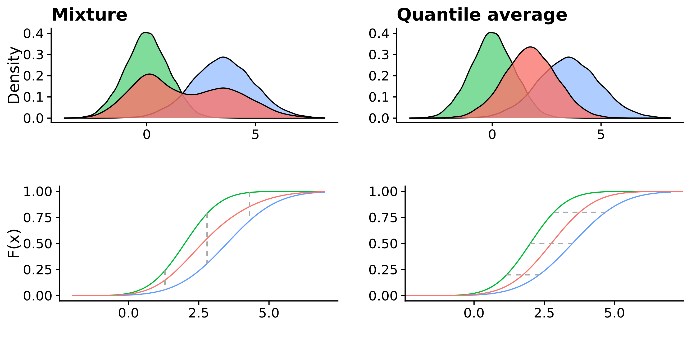

# Model aggregation {#model-aggregation}

Following the discussion of proper scoring rules in Chapter \@ref(evaluation) we go one step further in this chapter and explore how we can combine individual models to optimal ensembles using these proper scoring rules. This chapter presents two approaches, Quantile Regression Averaging (QRA) that builds upon the weighted interval score and a novel stacking approach that forms an ensemble that minimises the continuous ranked probability score. Prior to discussing these model aggregation approaches, this Chapter provides an intuition for why model ensembles can improve predictive performance and for how different predictive distributions can be combined. 

## Theoretical idea

Oftentimes, a single forecasting model is not able to capture the nuances and full complexity of the true data-generating process. Different models have different strengths and weaknesses and often can represent some aspects well that other models may miss. This allows us to increase predictive performance by aggregating individual models. 

As an illustrative example, let us consider a number of models that each try to predict one single unknown true value. All models are correct on expectation (i.e. $\mathbb{E}(\hat{y}_k) = y$), but all exhibit an independent prediction error (i.e. $\hat{y}_k = y + \epsilon_k$). Every single model will be biased ($\epsilon_k$ has zero probability of being exactly zero, even if $\mathbb{E}(\epsilon_k) = 0$). The average of all these model predictions, however, will converge to the true value for an increasing number of models. This is, in very simplified terms, the idea behind the mean ensemble. Note that in practice, prediction errors of different models are seldom completely independent, but are instead often correlated, which may reduce the effectiveness of model aggregation. Adding a model to the ensemble of course only makes sense if we indeed believe that its predictions do not deviate systematically from the true values. However, in many circumstances this decision will not be clear cut. Instead, we could decide to give less weight to models that have performed poorly in the past and more weight towards those that performed well. This is the idea behind weighted ensembles. 

In the following, we discuss two different ways of combining predictive distributions, the quantile average and the mixture distribution. The quantile average aligns all corresponding quantiles of the predictive distributions and determines the quantiles of the ensemble distribution as a weighted average of the corresponding ensemble member quantiles. We can understand this as a horizontal combination of the cumulative distribution functions (CDF) of the individual predictive distributions. A mixture distribution, on the other hand, can be understood as a vertical combination of the CDFs of the individual ensemble member distribution. It may, however, be more intuitive to think of it as the result of random sampling from the individual ensemble member distributions. The mixture distribution can again be weighted by drawing from the individual distributions with different probabilities. These ideas are illustrated in Figure \@ref(fig:average-mixture-example). In principle, the average seems more appropriate if we there is one single future scenario and we want to optimally predict it. The mixture may be better suited if we believe that our models reflect different possible future scenarios and are uncertain, which of these scenarios will occur.
``` {r average-mixture-example, out.width = "95%", echo = FALSE, fig.cap = "Two different ways of combining two predictive distributions (based on predictive samples). The left is a mixture distribution (red) generated by taking random samples with equal probability from the two original distributions (green and blue). The right is a quantile average that was generated by taking the pairwise mean of the sorted vectors of the predictive samples from the two distributions. The lower two plots show the same combinations in terms of averages of the cumulative distribution functions. The mixture can be thought of as a vertical combination of CDFs, while the quantile average is a vertical combination."}



```

In the following, we present two different ensemble formation strategies. The Quantile Regression Average (QRA) is an ensemble strategy suited for quantile forecasts that determines optimal weights for a weighted quantile average. The CRPS ensemble works with predictive samples and determines optimal weights for a mixture distribution. 

## The Quantile Regression Average ensemble

The Quantile Regression Average [@nowotarskiComputingElectricitySpot2015] is an ensemble strategy build upon the weighted interval score presented in Chapter \@ref(evaluation). 
Consider a forecast made for observation $i, i = 1, \dots, n$ by model $k, k = 1, \dots, K$ at different quantile levels $\tau \in (0,1)$. The corresponding quantile prediction for observation $i$ from model $k$ at quantile level $\tau$ is denoted $q_{ik\tau}$. The ensemble prediction at quantile level $\tau$, $q_{i, \text{ensemble},\tau}$ is then a weighted average of the corresponding predictive quantiles of the individual models: 
$$q_{i,\text{ensemble}, \tau} = \sum_{k = 1}^K w_k \cdot q_{ik\tau},$$
where $w_k$ is the weight given to model $k$. The weights are usually constrained to be non-negative and to sum up to one. To get an optimal ensemble, we are looking for the combination of weights that, across all quantile levels $\tau$, produce an ensemble which minimises the weighted interval score over past observations. The optimisation problem can be denoted as follows [@ryantibshiraniQuantileStacking2020]: 
$$\mathop{\text{arg min}}_{w} \sum_{i=1}^n \sum_{\tau} \psi_{_\tau} \bigg(y_i - \sum_{k=1}^K w_k q_{ik\tau} \bigg),$$
where $\psi_{\tau}()$ denotes the so-called pinball loss at quantile level $\tau$. The pinball loss is defined as 
$$\psi_{\tau}(x) = \max(\tau \cdot x, (\tau-1)\cdot x).$$ 
The solution to this minimisation problem yields the ensemble that minimises past weighted interval scores. This optimisation problem can be extended in a number of ways. For example, one can estimate different weights for different quantile levels or one can incorporate additional constraints, e.g. that quantiles not cross. The minimisation problem (including the additional constraints) can conveniently be solved using the `quantgen` package [@R-quantgen]. 


## The CRPS ensemble

Instead of the weighted interval score, we can also use the CRPS as a basis for an ensemble formation approach. The major conceptual advantage of using CRPS and predictive samples is that we can create a mixture distribution instead of a quantile average. The approach described in the following is a form of stacking (see @yaoUsingStackingAverage2018) that is in theory optimal even if the true data-generating distribution is not among the individual ensemble distributions. While many other strategies like Bayesian Model Averaging eventually [@rafteryBayesianModelAveraging1997; @hoetingBayesianModelAveraging1999; @rafteryUsingBayesianModel2005] converge to putting all their weights to the single model that is closest to the true data-generating distribution, stacking is able to combine information from all models to form an optimal ensemble. 

This CRPS ensembling approach was developed in collaboration with Yuling Yao from the Columbia University in New York and is implemented in the R package `stackr` [@R-stackr]. The following method overview is based on work written by Yuling Yao and can also be found in the `stackr` vignette. 

As stated in Equation \@ref(eq:crps) in Chapter \@ref(evaluation), the CRPS for a predictive distribution with finite first moment and the corresponding true value $y$ is given by 
$$crps(F,y)=\mathbb{E}_X|X-y|- \frac{1}{2}\mathbb{E}_{X,X^\prime}|X-X'|.$$
The notation is slightly altered in comparison to Chapter \@ref(evaluation) to keep consistency with the `stackr` vignette and also to avoid having $x$ denote samples as well as observations. The predictive distribution is denoted by $F$ and true observed values are donated by $y$. Let us assume we have data from $T$ time points $t = 1, \dots, T$ in $R$ regions $r = 1, \dots, R$. Observations are denoted $y_{tr}$. Predictive samples are generated from $K$ different models $k = 1, \dots, K$. For every observation $y_{tr}$ the $S$ predictive samples $s = 1, \dots, S$ are denoted $x_{1ktr}, \dots, x_{Sktr}$. 

Let us first look at the CRPS for one observation and one predictive model before deriving the CRPS of a mixture of all models. Based on the predictive samples, we can compute the CRPS of the $k$-th model for the observation $y_{tr}$ at time $t$ in region $r$ as
\begin{align*}
 \widehat {\text{crps}}_{ktr} &= \widehat {\text{crps}}(x_{1ktr}, \dots, x_{Sktr},y_{tr}) \\
 &= \frac{1}{S} \sum_{s=1}^S  |x_{sktr}-y_{tr}| - \frac{1}{2S^2} \sum_{s, j=1}^S |x_{sktr}- x_{jktr}|.
\end{align*}
Now we want to aggregate predictions from these $K$ models. When the prediction is a mixture of the $K$
models with weights $w_1, \dots, w_s$, the CRPS can be expressed as
\begin{align*}
 \widehat {\text{crps}}_{\text{ensemble}, tr} (w_1, \dots, w_K) 
 =& \frac{1}{S} \sum_{k=1}^K w_k  \sum_{s=1}^S |x_{skt}-y_t| \\
 &- \frac{1}{2S^2}  (\sum_{k=1}^K   \sum_{k, k'=1 }^K w_k w_{k'}   \sum_{s, j=1}^S |x_{skt}- x_{jk't}| ).
\end{align*}
The overall CRPS for the mixture of all models for all observations can then simply be obtained by summing up the individual CRPS contributions from the different pairs of observations and predictions over all regions and time points. We can extend this framework by assigning different weights to different time points and regions. This makes sense for example if we want to assign less weight to older observations because we believe they are less characteristic of the current and future dynamics. Similarly, we might want to give more or less weight to certain regions. Mathematically we can introduce a time-varying weight $\lambda_1, \dots, \lambda_T$, e.g. $\lambda_t = 2-(1-t/T)^2$ to penalize earlier estimates. Likewise  we can introduce a region-specific weight $\tau_r$. 

To obtain the optimal CRPS weights we finally solve a quadratic optimisation:
\begin{align*}
 &\min_{w_1, \dots, w_K} \sum_{t=1}^T  \sum_{r=1}^R\lambda_t\tau_r  \widehat {crps}_{\text{ensemble}, tr} (w), \\
  &s.t. ~{0\leq w_1, \dots, w_K \leq 1, \sum_{k=1}^K w_k=1}. 
\end{align*}
In `stackr`, this is implemented using the `optimizing` function from the `rstan` [@R-rstan] package. To speed up computation, the terms $\sum_{s=1}^S |x_{skt}-y_{tr}|$, $\sum_{s, j=1}^S |x_{sktr}- x_{jktr}|$, and $\sum_{s, j=1}^S |x_{sktr}- x_{jk'tr}|$ are only computed once for all $k, k'$ pairs. Currently, `stackr` does not yet support different forecast horizons, but instead one horizon has to be chosen to optimise for. 

After having obtained the mixture weights we can now obtain the final mixture by drawing samples from the individual member distribution distributions with probability equal to the weight asssigned to the corresponding model. This is implemented in the function `mixture_from_samples` in `stackr`. The following code snippet illustrates how a CRPS ensemble can be obtained using `stackr`: 

$~$

``` {r stackr1} 
splitdate <- as.Date("2020-03-28")
data <- data.table::setDT(stackr::example_data)
print(data, 3, 3)
```

$~$

``` {r stackr2}
traindata <- data[date <= splitdate]
testdata <- data[date > splitdate]

# Obtain weights based on training data
weights <- stackr::crps_weights(traindata)

# create mixture based on predictive samples in the testing data. 
test_mixture <- stackr::mixture_from_samples(testdata, weights = weights)
print(test_mixture, 3, 3)
```
