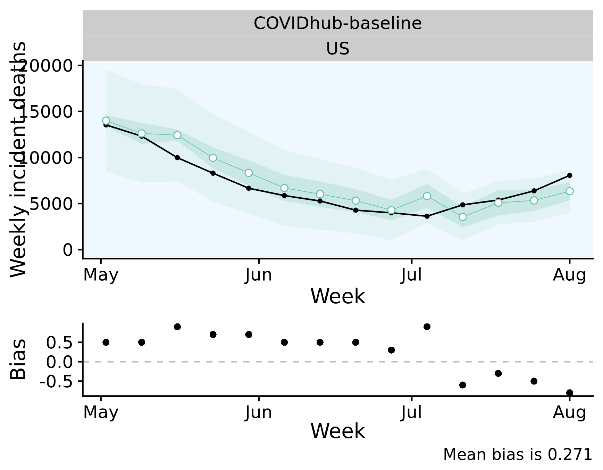
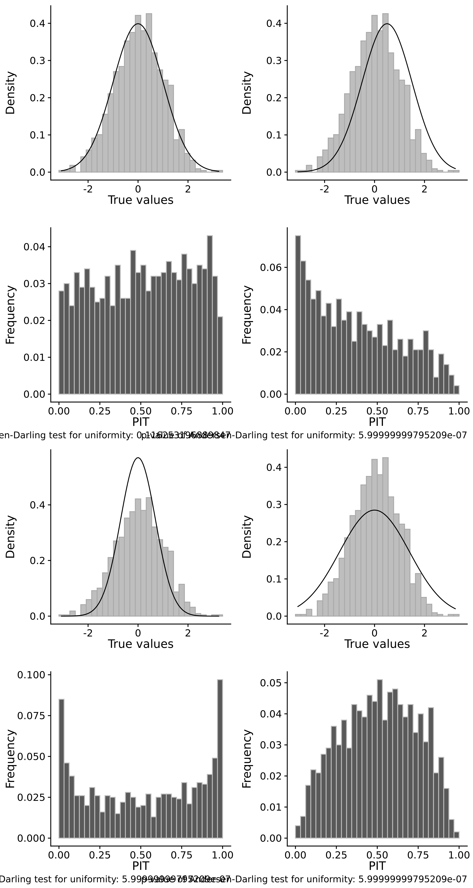
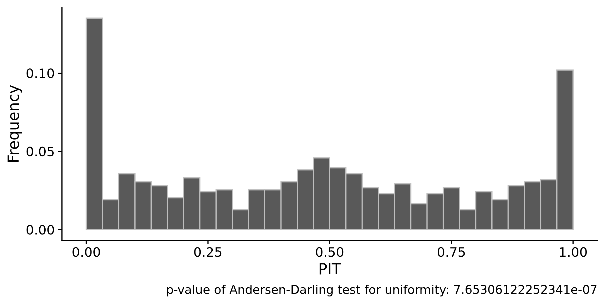
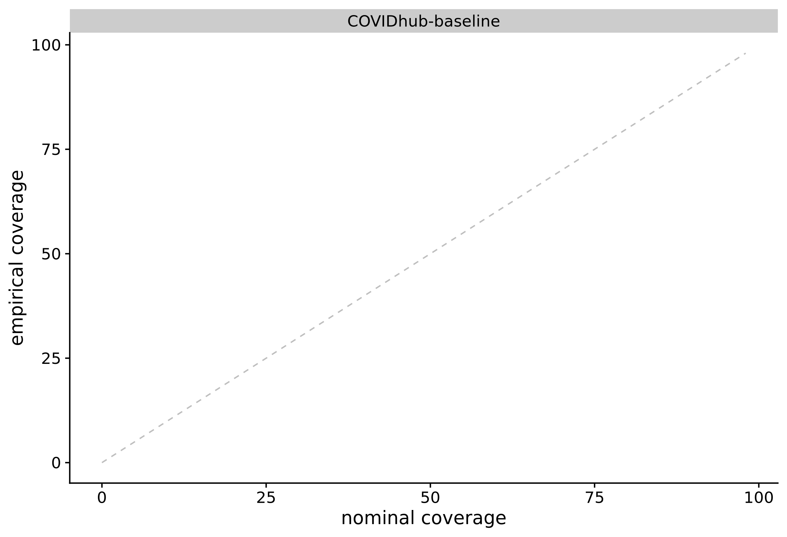
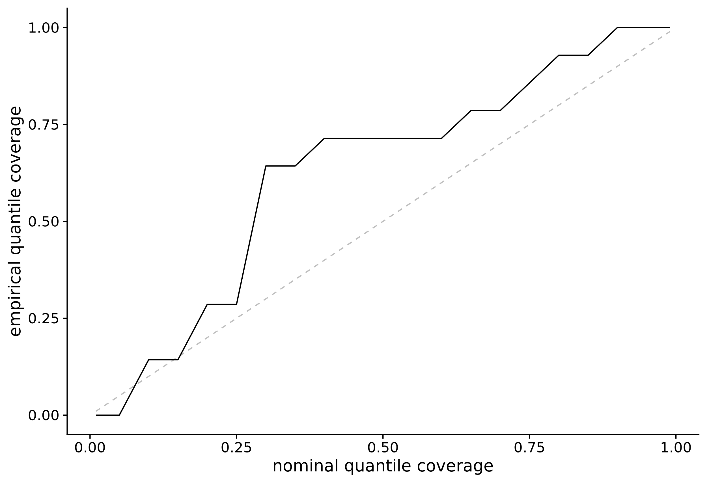
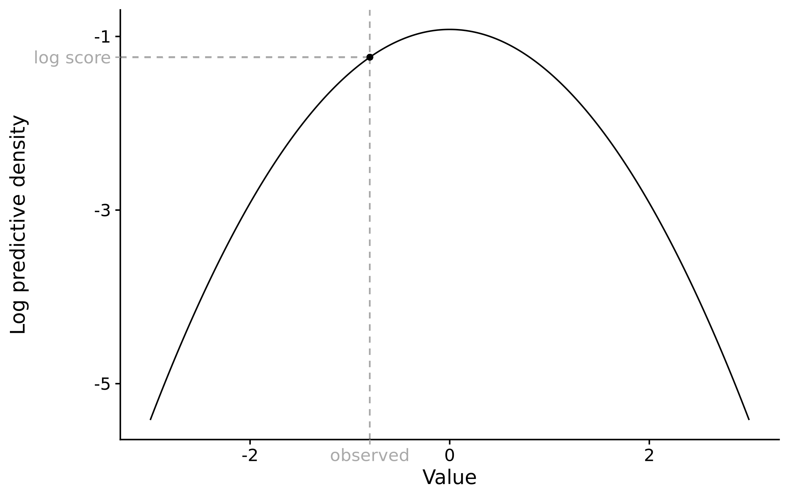

# Forecasting and evaluation {#evaluation}

This chapter will lay out a detailed evaluation framework we can use to evaluate the forecasts submitted to the COVID-19 Forecast Hub. It will, however, go beyond describing an evaluation framework for quantile forecasts, but instead approach this topic from a broader angle and include all kinds of probabilistic forecasts. The chapter will first give a brief overview of different types of forecasts that can be made. This will serve as a theoretical background for the remainder of this chapter. Then, it will introduce the forecasting paradigm as formulated by Gneiting et al. [@gneitingCalibratedProbabilisticForecasting2005; @gneitingProbabilisticForecastsCalibration2007] Lastly, it will discuss a variety of evaluation scores and metrics in detail. 

## Types of forecasts

A forecast is the forecaster’s stated belief about the future. This belief can be stated in a variety of ways with differing degrees of complexity. The simplest way to state our belief about the future is a point forecast, for example “the number of deaths from Covid-19 cases in the US December 2020 will be 20 000”. This is, in essence, an estimate of the mean of the unknown true data-generating distribution of deaths from Covid-19 in the US in December 2020. We could go one step further and also try and quantify our uncertainty by stating a variance or standard deviation. This could be understood as a point forecast for the variance of the distribution - or it could be understood as a first step towards a probabilistic forecast.

Ideally, predictions should be stated in terms of predictive distributions. This allows us to state our beliefs about all aspects of the underlying data-generating distribution (including e.g. skewness or the width of its tails) and helps us to accurately quantify our uncertainty. We could for example make a forecast stating that “the number of cases in December 2020 follows a discretised normal distribution with a mean of 25 000 and a variance of 2,000”. Such a forecast is called a probabilistic forecast. This thesis focuses mainly on probabilistic forecasts. The predictive distribution can be expressed analytically, but intead it will often be represented by a set of predictive samples from that distribution. This is especially handy as we can use algorithms like Markov Chain Monte Carlo (MCMC) algorithms to generate predictions if no analytical expression of the predictive distribution is available. The downside is that predictive samples take a lot of storage space. They also come with a loss of precision that is especially pronounced in the tails of the predictive distribution, where we need quite a lot of samples to characterise the distribution accurately. 

To circumvent these problems, often quantiles of the predictive distribution are stored instead. Quantile forecasts can easily be obtained from explicit distributional forecasts as well as from predictive samples. 

Note that we could also in principle state our forecasts in a binary way. We could for example ask: "Will the number of Covid-19 related deaths in December 2020 exceed 25 000?" and give a probability that this will happen. This type of forecasting is common in many classification problems, but will not be the focus of this thesis. 

All of these forecast types require slightly different approaches to evaluation. The following section will introduce the general forecasting paradigm proposed by Gneiting et al., and the remainder of this chapter will derive a consistent evaluation framework based on it. 

## What is a good forecast? - The forecasting paradigm

Ideally, the predictive distribution is equal to the true data-generating distribution [see @gneitingProbabilisticForecastsCalibration2007], i.e.
$$ P_t = F_t $$
where $P_t$ is the the cumulative density function (CDF) of the predictive distribution for a given quantity at time $t$ and $F_t$ is the CDF of the true, unknown data-generating distribution. In practice, the true data-generating distribution $F_t$ is unknown. Following Gneiting et al. we can instead focus our efforts on two aspects of the predictive distribution *calibration* and *sharpness*. Calibration refers to the statistical consistency between the predictive distribution and the observation. There are different possible ways in which a model can be (mis-)calibrated (see [@gneitingProbabilisticForecastsCalibration2007]), but for the remainder of this thesis it suffices to say that a well calibrated forecast does not systematically deviate from the observed values. Sharpness is a feature of the forecast only and describes how concentrated the predictive distribution is, i.e. how precise the forecasts are. The general forecasting paradigm formulated by [@gneiting_probabilistic_2007] states that we should *maximise sharpness of the predictive distribution subject to calibration*. To summarise these concepts in more familiar terms: we can think of calibration as "how correct is this forecast?" and of sharpness as "how useful would this forecast be if it were true". Take, fore example, the task of predicting rain in a city like London. A model that predicted a rain probality of 20% for every single day could be called correct (to be precise, this model would be marginally calibrated according to Gneiting et al.). This model, however, would be much less useful than a model that would be able to accurately predict the weather every day. 


## Assessing forecasts

In order to derive a consistent way of assessing forecasts, the following sections will focus on calibration and sharpness. First, different ways to assess these two properties independently will be discussed. This can give the forecaster a better understanding of how their forecasts could be improved. Then, proper scoring rules will be introduced that allow us to represent the quality of a forecast in one numeric value. 

### Assesssing calibration 
In absence of knowledge of the true data-generating distribution we cannot prove calibration, but only look for absence of miscalibration. Several strategies have been proposed to detect systematic deviations of the predictive distributions from the observations ([@funkAssessingPerformanceRealtime2019; @gneitingProbabilisticForecastsCalibration2007; @gneitingStrictlyProperScoring2007]). In order to get a clearer picture of the different ways in which a model can be miscalibrated, it makes sense to look at calibration from more than one angle. We will discuss a bias metric as well as the probability integral transformation (PIT) for integer and continuous forecasts and separate bias and calibration metrics for quantile forecasts. 

#### Assessing bias
Systematic over- or underprediction is a very common form of miscalibration. It therefore makes sense to dedicate separate attention to detecting systemating biases. 
$$B_t (P_t, x_t) = 1 - 2 \cdot (P_t (x_t))$$

where $P_t$ is the cumulative distribution function of the predictive distribution for the true value $x_t$. When using predictive samples, $P_t (x_t)$ is simply the fraction of predictive samples for $x_t$ that are smaller than the true observed $x_t$.

For integer valued forecasts, [@funkAssessingPerformanceRealtime2019] adapt this formula slightly and propose the following metric 
$$B_t (P_t, x_t) = 1 - (P_t (x_t) + P_t (x_t + 1))$$

to adjust for the integer nature of the forecasts. In the continuous as well as the discrete case, Bias can assume values between -1 (underprediction) and 1 (overprediction) and is 0 ideally. 

For quantile forecasts, we propose the following metric to assess bias: 
\begin{align*}
  B_t &= (1 - 2 \cdot \max \{i | q_{t,i} \in Q_t \land q_{t,i} \leq x_t\}) \mathbb{1}( x_t \leq q_{t, 0.5}) \\
  &+ (1 - 2 \cdot \min \{i | q_{t,i} \in Q_t \land q_{t,i} \geq x_t\}) \mathbb{1}( x_t \geq q_{t, 0.5})
\end{align*}, 

where $Q_t$ is the set of quantiles that form the predictive distribution at time $t$. They represent our belief about what the true value $x_t$ will be. For consistency, we define $Q_t$ such that it always includes the element $q_{t, 0} = - \infty$ and $q_{t,1} = \infty$. $\mathbb{1}()$ is the indicator function that is $1$ if the condition is satisfied and $0$ otherwise. In clearer terms, $B_t$ is defined as the maximum percentile rank for which the corresponding quantile is still below the true value, if the true value is smaller than the median of the predictive distribution. If the true value is above the median of the predictive distribution, then $B_t$ is the minimum percentile rank for which the corresponding quantile is still larger than the true value. If the true value is exactly the median, both terms cancel out and $B_t$ is zero. For a large enough number of quantiles, the percentile rank will equal the proportion of predictive samples below the observed true value, and this metric coincides with the one for continuous forecasts. Figure \ref{fig:bias-example} shows the the bias for each 1 week ahead prediction made by the COVIDhub-baseline model. 

``` {r bias-example, echo = FALSE, fig.cap = "One week ahead forecasts from the COVIDhub-baseline model for the US (top) and corresponding bias values (bottom)"}



```

Figure: bias across different horizons / states? 


#### Metrics for calibration

##### Continuous forecasts

As explained above, for a model with perfect calibration the CDF of predictice distribution $P_t$ will be identical to the CDF of the true data-generating distribution $G_t$ that generated the observed value $x_t$. To assess whether that is the case, one can inspect the probability integral transform (PIT) of the predictive distribution at time $t$ CITATION DAWID 1984, /XX Dawid suggested to break this problem down into checking whether the pit is random uniformXXX

$$u_t = P_t (x_t)$$

If $F_t = G_t$ at all times $t$, then $u_t, t = 1 \dots T$ will be uniformly distributed (For a proof see e.g. ANGUS). One can then plot a histogram of $u_t$ values to look for deviations from uniformity. U-shaped histograms result from predictions that are too narrow, while hump-shaped histograms indicate that predictions are too wide. Biased predictions will usually result in a triangle-shaped histogram. Figure \@ref(fig:pit-example) shows example PIT histograms that illustrate these characteristics. In addition to the visual inspection, we can apply an Anderson-Darling test for uniformity to the transformed values. The results, however, have to be treated with caution. The test cannot prove uniformity, but only assess whether there is evidence against it. It is also quite sensitive to the number of $u_t$ samples available and may be overly conservative in rejecting calibration. As a rule of thumb, Funk et al. suggest there is no evidence to suggest a forecasting model is miscalibrated if the p-value found was greater than a threshold of $p \geq 0.1$, some evidence that it was miscalibrated if $0.01 < p < 0.1$, and good evidence that it was miscalibrated if $p \leq 0.01$. CITATION Hamill 2001 discusses in length that uniformity of the PIT histogram is a necessary, but not a sufficient condition for calibration. Nevertheless, the PIT histogram can gives us a good impression of the reliability of our forecasts. 

``` {r pit-baseline, echo = FALSE, fig.cap = "Examples of different predictive distributions for the same set of true standard normally distributed observed values and the corresponding PIT histogram below. Top left: predictive distribution and distribution of the true values coincide. Top right: The mean of the preditive distribution is higher than of the true data-generating distibution. Bottom left: the predictive distribution is underdispersed and exhibits to little uncertainty. Bottom right: the predictive distribution is overdispersed and to uncertain."}



```

Figure \ref{fig:pit-baseline} shows the pit histogram for one week ahead predictions made by the COVIDhub-baseline model over different states. In order to obtain samples, a separate gamma distribution was first fit to every set of quantiles using the `nloptr` package CITATIONS. Samples were then drawn from these distributions. We can see that the PIT histogram presents a pattern that suggests underdispersion may be present, i.e. at least some of the confidence intervals may be too narrow. 

``` {r pit-example, echo = FALSE, fig.cap = "PIT histogram for one week ahead forecasts from the COVIDhub-baseline model. We can see a pattern commonly found in underdispersed predictions"}



```


##### Integer forecasts

In the case of discrete outcomes, the PIT is no longer uniform even when forecasts are ideal. We can follow [@funkAssessingPerformanceRealtime2019] and use a randomised PIT instead by redefining 

$$u_t = P_t(k_t) + v \cdot (P_t(k_t) - P_t(k_t - 1) )$$

where $k_t$ is the observed value at time $t$ and $P_t(x)$ is the cumulative predictive distribution function. $P_t (-1) = 0$ by definition. $v$ is a standard uniform variable and independent of $k$. If $P_t$ is equal to the true data-generating distribution function, then $u_t$ is standard uniform. [@czadoPredictiveModelAssessment2009] also propose a non-randomised version of the PIT for count data that could be used alternatively. 


##### Quantile forecasts

For quantile forecasts, we need to take a different approach to assess calibration. An intuitive way is to measure the proportion of true observed values that fall into  a certain interval range of the predictive distribution. If the 0.05, 0.25, 0.75, and 0.95 quantiles are given, then 50% of the true values should fall between the 0.25 and 0.75 quantiles and 90% should fall between the 0.05 and 0.95 quantiles. We can calculate and plot these values to inspect how well different quantiles of the forecast are calibrated. For the COVIDhub-baseline model, the quantile coverage for the outer prediction intervals looks reasonable, but inner prediction intervals look too narrow. This is shown in Figure \@ref{fig:interval-coverage}. If we compare this to Figure \@ref{pit-example}, we can see the same pattern that suggests underdispersion of the predictive distribution in both Figures. The coverage plot, however, is able to narrow the problem down to the inner prediction intervals. To get an even more precise picture, we can also look at the percentage of true values below every single quantile. The quantile visualisation shown in Figure \ref{fig:quantile-coverage} suggests that the miscalibration largely comes from an upward bias of the inner prediction interval (compare to Figure \@ref{example-bias}). The major problem to address then, it seems, is not necessarily the general width of the prediction intervals, but foremost the upward bias of the inner quantiles. Note that this is a slightly different result from what Figures \@ref{fig:interval-coverage} and \@ref{fig:pit-example} suggested which underlines the importance of looking at miscalibration from various angles. 

``` {r interval-coverage, fig.cap = "Coverage of predictive intervals for one week ahead forecasts from the COVIDhub-baseline model."}



```


``` {r quantile-coverage, fig.cap = "Coverage of predictive quantiles for one week ahead forecasts from the COVIDhub-baseline model."}



```


### Assessing sharpness

Sharpness, i.e. the ability to produce narrow forecasts, is a quality of the forecasts only and does not depend on the observations. Sharpness is therefore only of interest conditional on calibration. 

For continuous and integer forecasts, @funkAssessingPerformanceRealtime2019 suggest to measure sharpness as the normalised median absolute deviation about the median (MADN), i.e.

$$ S_t(P_t) = \frac{1}{0.675} \cdot \text{median}(|y - \text{median(y)}|) $$, 

where $\frac{1}{0.675}$ is a normalising constant that ensures that sharpness will equal the standard distribution if $P_t$ is normal. 

For quantile forecasts, we propose to measure sharpness as a weighted sum of the width of the interval ranges. Let $Q_t$ be a set of predicted quantiles $\{q_\alpha \}$ for a true $x_t$ at time $t$. This set of quantiles is assumed to be symmetric, such that there always exist corresponding elements $q_{t, \alpha}$ and $q_{t, 1-\alpha}$. Sharpness of a quantile forecast at time $t$ can then be measured as

CORRECT THIS FORMULA

$$\text{sharpness}_t = \sum_{\alpha | \alpha \leq 0.5} \frac{\alpha}{2} (q_{t, 1 - \alpha} - q_{t, \alpha}) $$.

Note that we only need to sum over all percentile ranks smaller than 0.5 as the set of quantiles is assumed to be symmetric. 


## Proper scoring rules

Instead of assessing calibration and sharpness independently, we can make use of proper scoring rules to express the quality of our forecast in a single number. A forecaster judged by a proper scoring rule is always incentivised to make forecasts as close to the true data-generating distribution as possible. In the following, four proper scoring rules will be presented and discussed.  For an extensive discussion of proper scoring rules see @gneitingStrictlyProperScoring2007. 


Maybe explanation about calibration and sharpness part? Hans Hersbach?

### (Continuous) Ranked Probability Score

Part with generalisation of the Mean Absolute Error

The Continuous Ranked Probability Score (CRPS) [@mathesonScoringRulesContinuous1976; @gneitingStrictlyProperScoring2007] is defined as 

$$ \text{CRPS}(P, x) = \int_{-\infty}^\infty \left( P(y) - \mathbb(1)(y \geq x) \right)^2 dy $$, 

where $P$ is again the CDF of the predictive distribution and $x$ is the true observed value. 

The CRPS can also conveniently be expressed as 

$$ \text{CRPS}(P, x) = \frac{1}{2} \mathbb{E}_P |X - X'| - \mathbb{E}_P |X - x| $$

where $X$ and $X'$ are independent realisations from the predictive distributions with finite first moment (see @gneitingStrictlyProperScoring2007). This formulation is convenient as we can simply replace $X$ and $X'$ with predictive samples and sum over all possible combinations to obtain the desired sample CRPS. 

For integer counts, we can use the Ranked Probability Score (RPS) as proposed by @epsteinScoringSystemProbability1969 and  @murphyRankedProbabilityScore1969, and discussed e.g. by @czadoPredictiveModelAssessment2009. The RPS is defined as 

$$ \text{rps}(P_t, x_t) = \sum_0^\infty (P_t(y) - \mathbb(1) (y \geq x_t))^2 $$

Smaller values of the (C)RPS are preferable. 


Log Score

The Log score can be traced back to @shannonMathematicalTheoryCommunication1948 and his work on communication and information theory and to @goodRationalDecisions1952 who first proposed a log score for binary predictions. The Log Score is now widely used in all sorts of fields, especially in Bayesian inference (see e.g. [@gelmanUnderstandingPredictiveInformation2014]). The log score is simply the log density of the predictive distribution at time $t$ evaluated at the true observed value, i.e. 

$$ \text{log score}_t = \log p_t(y_t)$$
where $p_t$ is the predictive density function at time $t$. This is illustrated in Figure \ref{fig:log-score}. In this formulation, larger values are better, but one can of course simply reverse the sign. 

``` {r log-score, fig.cap = "Illustration of the Log score as the log predictive desnity evaluated at the true observed value"}



```


#### Interval score

The Interval Score is a proper scoring rule to score quantile predictions. CITATION 

following Gneiting and Raftery (2007). Smaller values are better. For a given pair of predictive quantiles $q_{\frac{\alpha}{2}}, q_{1-\frac{\alpha}{2}}$, where $q_{\frac{\alpha}{2}}$ is the lower bound of the interval range and $q_{1-\frac{\alpha}{2}}$ is the upper bound, the interval score is given as 

\begin{align*}
  \text{interval score}_{\alpha} &= (q_{1-\alpha}  - q_{\alpha}) + \\
  &+ \frac{2}{\alpha} \cdot (q_{\alpha} - \text{true value}) \cdot \mathbb{1}(\text{true value} < q_{\alpha}) + \\
  &+ \frac{2}{\alpha} \cdot (\text{true value} - q_{1-\alpha}) \cdot \mathbb{1}(\text{true value} > q_{1-\alpha})
\end{align*}

where $1()$ is again the indicator function. For quantile forecast consisting of a set of quantiles $Q_t$, the quantile score can be obtained as a sum for the score for the individual quantile pairs. Optionally, the sum can be weighted by $\frac{\alpha}{2}$: 

CORRECT THIS

$$\text{interval score} = \sum_{\alpha | \alpha \leq 0.5} \frac{\alpha}{2} \cdot \text{interval score}_{\alpha} \\
= \sum_{\alpha | \alpha \leq 0.5} \frac{\alpha}{2} \left[ (q_{1-\alpha}  - q_{\alpha}) + \frac{2}{\alpha} \cdot (q_{\alpha} - \text{true value}) \cdot \mathbb{1}(\text{true value} < q_{\alpha}) + \frac{2}{\alpha} \cdot (\text{true value} - q_{1-\alpha}) \cdot 1(\text{true value} > q_{1-\alpha}) \right]
 $$
 
In case of the weighted sum, the interval score converges towards the CRPS for an increasing number of quantiles.  CITATION and EXPLANATION. 

<!-- ### Scoring point forecasts -->

<!-- All forecasts discussed in this thesis are probabilistic forecasts. Nevertheless, it may be interesting to look at some metrics for point forecasts as well (bad sentence).  -->
<!-- Numerous different metrics are available to help evaluate the quality of point forecasts. The package `metrics` lists XXX. Most  -->
<!-- important: Mean Squared Error (MSE), Mean Absolute Error (MAE), Mean Absolute Percentage Error (MAPE).  -->

## The scoringutils package
In order to score the predictions made for the purpose of this thesis and future projects, the above described metrics and proper scoring rules were bundled in an `R` package called `scoringutils`. CITATION. The stable version of the package is available on CRAN, the development version can be found on github.com/epiforecasts/scoringutils. 


WORK ON FOLLOWING PARAGRAPH. 
All metrics can be accessed independently using a low level framework with vectors and matrices. Alternatively, users can decide to have forecasts automatically scored. They simply pass in a data.frame in the correct format and specify columns over which to group and/or summarise. Internally, this is implemented with data.table to allow for an efficient handling of large data.frames. The package is extensively documented, has example data and a vignette that walks the user through all relevant steps. PLOTS? 


MAYBE A DISCUSSION: FORGET CALIBRATION, WE CARE ABOUT ACCURACY?
