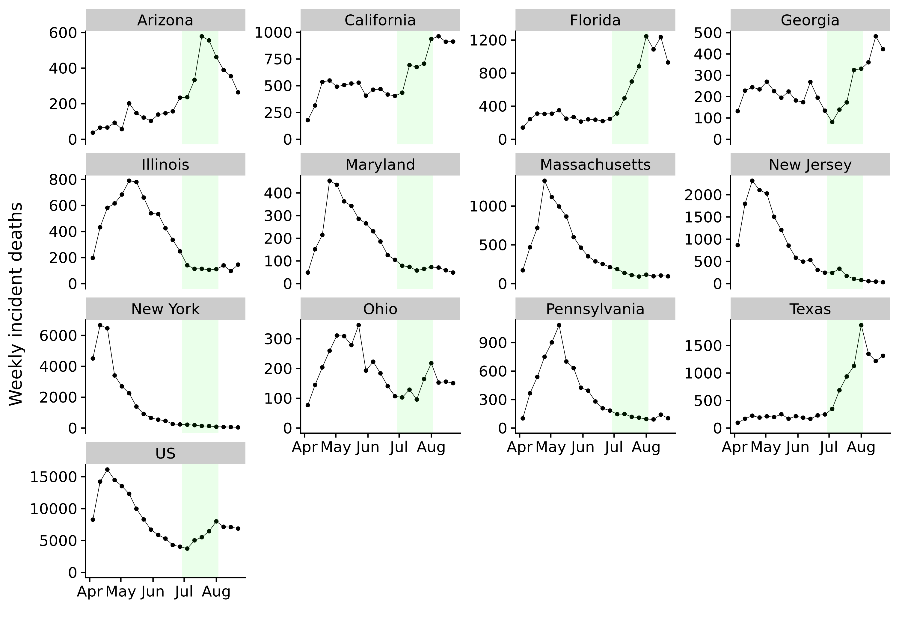
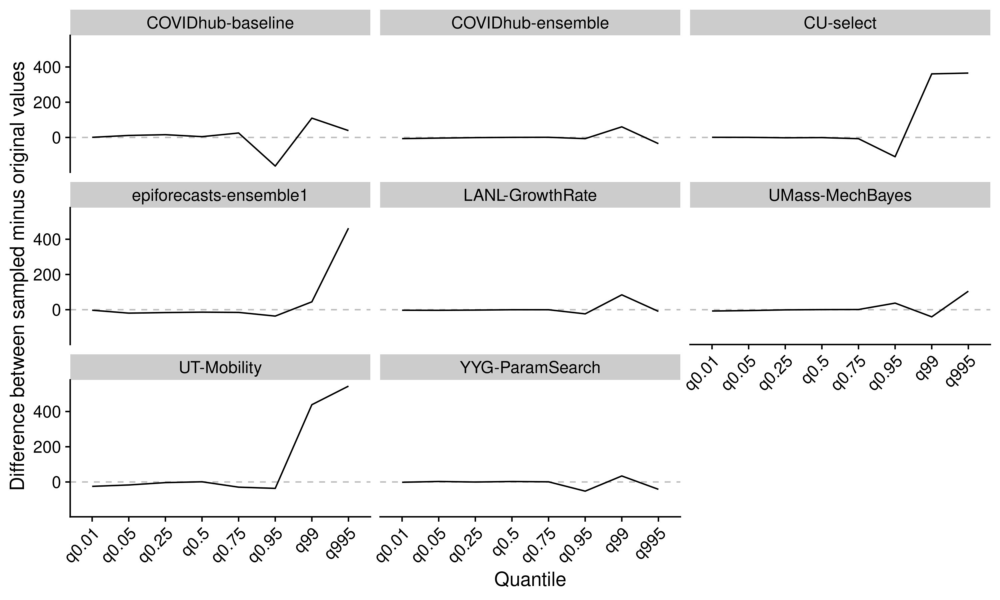

# Data and forecasting models {#background-data}

After Chapters \@ref(evaluation) and \@ref(model-aggregation) have described the theoretical foundations of model evaluation and model aggregation, this chapter provides some context and background for the model evaluation in Chapter \@ref(results). We first describe the Forecasting Hub in more detail and offer a first look at the data. We then give a brief overview of the different forecasting models. 

## Introduction to the COVID-19 Forecast Hub and overview of the data

The COVID-19 Forecast Hub [@umass-amherstinfluenzaforecastingcenterofexcellenceCovid19forecasthubOrg2020] is a collaboration between the U.S. Centers for Disease Control and Prevention (CDC), academic research groups led by Professor Nicholas Reich at the University of Massachussets Amherst, and different industry partners. Starting on April 13, the consortium collected weekly forecasts for all US states and territories from research teams around the world. Forecasts were submitted every Monday in a probabilistic format. The predictive distribution was represented by the median and eleven prediction intervals ranging from a 10% prediction interval to a 98% prediction interval^[The following 23 quantiles were recorded: `c(0.01, 0.025, seq(0.05, 0.95, by = 0.05), 0.975, 0.99)`.]. Forecasts were made for one to (at least) four week ahead horizons of targets like daily or weekly deaths and case numbers. Out of these targets, we focus only on weekly death incidences. 

Eight models were chosen from all Forecast Hub models in a way that attempts to reflect the variety of models submitted to the Hub. Among these models also was the 'epiforecasts-ensemble1' model that was submitted by the working group at the London School of Hygiene and Tropical Medicine that co-supervised this work. The forecasts we analysed were made between June 22nd 2020 and August 3rd 2020 in twelve different US states as well as nationwide. As the ensemble models need at least one week of past data to estimate weights, only forecasts between June 29th and August 3rd were evaluated. Dates and locations were chosen to obtain a complete set of predictions with no missing forecasts for any location or time point. While this isn't strictly necessary, it avoids downstream complications with model aggregation and evaluation that are beyond the scope of this thesis. 
The ground truth data is provided by the Center for Systems Science and Engineering (CSSE) at Johns Hopkins University [@dongInteractiveWebbasedDashboard2020]. Table \@ref(tab:overview) at the end of this chapter gives an overview of the dates, locations and models included. Figure \@ref(fig:us-data) shows observed deaths in all thirteen locations. The time period analysed is highlighted in green. We can see that the evolution of deaths exhibits quite different dynamics across different locations. In states like Illinois, Maryland or Massachusetts, deaths were mostly constant or falling. In others, like Arizona, Florida or Texas, deaths showed a strong upwards trend. Data issues have been corrected for the state of New Jersey. On June 25th, New Jersey started counting probable deaths as well and increased their death count by 1 854 probable cases. These cases were apparently later redistributed to previous days. We can see the effects of this reporting issue in the forecasts of the COVIDhub-baseline model, where we observe spikes in the forecasts for New Jersey and the US nationwide in Figures \@ref(fig:predictions-baseline) in the Appendix.

``` {r us-data, echo = FALSE, out.width = "95%", fig.cap = "Observed deaths in all thirteen locations. Weeks for which predictions were evaluated are highlighted in green."}



```

## An overview the different forecast models

The models analysed in-depth in the next chapter vary substantially in the way they generate predictions. This section therefore gives a quick overview of the different model types. This overview should not be thought of as an exhaustive discussion, but is merely intended as a short primer that allows us to mentally place the COVID-19 Forecast Hub models in broad categories. The information used to inform this overview is taken from the descriptions provided by the research teams themselves^[Model descriptions were uploaded by the teams on [github.com/reichlab/covid19-forecast-hub/tree/master/data-processed](https://github.com/reichlab/covid19-forecast-hub/tree/master/data-processed). The descriptions were accessed on July 8th 2020. As descriptions on github were updated whenever the model changes, this overview may therefore not be entirely accurate for all models over the entire history of past submissions included in the analysis.]. 

Among the most widely used models in epidemiology are so-called compartmental models^[See e.g. @brauerCompartmentalModelsEpidemiology2008 for an extensive overview.]. These divide the overall population into different compartments and model the flow between them. The basic compartments are *Susceptible* (S), *Infectious* (I) and *Recovered* (R), giving these models the name SIR models. The flow from one compartment to the other is usually modeled using a set of differential equations. Compartmental models help to model specific characterisitcs of people in different compartments. For example, People in the *Susceptible* compartment can be infected, while those who are in the *Recovered* compartment are assumed to be immune against further infection. Compartmental models are therefore able to model the depletion of susceptibles as the epidemic progresses. Usually, a compartment called *Exposed but not infectious* (E) is added to model incubation periods, giving these model the name SEIR models. Additional compartments can be included ad libitum to model other aspects of the disease dynamic. 

Most models submitted to the Forecast Hub were SEIR compartmental models. Three models analysed here belong to that category: UMass-MechBayes, YYG-ParamSearch and CU-select. UMass-MechBayes^[See [github.com/dsheldon/covid](https://github.com/dsheldon/covid).] is a Bayesian model build from a classical SEIR compartmental model. The model is fit independently to each state and allows its parameters to vary over time. The YYGParamSearch model^[See [covid19-projections.com](https://covid19-projections.com) and   [github.com/youyanggu/covid19_projections](https://github.com/youyanggu/covid19_projections).] adds an additional machine learning layer to a classical SEIR model to learn optimal hyperparameters for the model. Some of the parameters like the infectious period are shared across locations, but most parameters like the mortality from Covid-19 or the effective reproduction number $R_t$ are determined per state. The effective reproduction number $R_t$ is a common parameter in epidemiological models and denotes the average number of people each infected person will infect in turn^[See e.g. @nishiuraEffectiveReproductionNumber2009 or @coriNewFrameworkSoftware2013 for an in-depth discussion]. This parameter varies over time, for example depending on changes in behaviour or official counter measures put in place. The CU-select model^[See [blogs.cuit.columbia.edu/jls106/publications/covid-19-findings-simulations/](https://blogs.cuit.columbia.edu/jls106/publications/covid-19-findings-simulations/).] is a SEIR model that is augmented by human insight. The Columbia University regularly submits a range of projections under different scenarios. For the CU-select model they always hand-pick the one they believe is most plausible. 

Another common approach is to model the evolution of the pandemic using a time-varying growth rate. Based on the assumption that the spread of a disease is exponential in nature it is intuitive to estimate future case numbers by modeling the growth rate. The LANL-GrowthRate model, and to a certain extent the epiforecasts-ensemble1, follow this approach. The LANL-GrowthRate model is a two component model. The first component models the number of infections using a time-varying growth parameter that connects present (or future) infections to earlier infections and the number of susceptibles. In a second step, this infections get mapped to reported deaths by assuming a fraction of infections likely to die. The epiforecasts-ensemble combines the growth rate approach with classical time series modeling^[See for example @hyndmanrobjForecastingPrinciplesPractice2019 for an in-depth overview of different models and approaches.]. It consists of three submodels that were aggregated using first an equally weighted quantile average and later a quantile regression average. The three submodels were two time series models and an $R_t$-based prediction model. The two times eries models were generated using the forecastHybrid package [@R-forecastHybrid]. The package automatically selects an Autoregressive Integrated Moving Average (ARIMA) model or a State Space model with appropriate error, trend and seasonality (ETS model). One of the epiforecasts-ensemble1 time series models included current cases as a lagged predictor, while the other was based on deaths only. The third model was generated using the R packages `EpiSoon` [@R-EpiSoon], `EpiNow` [@R-EpiNow], and later `EpiNow2` [@R-EpiNow2]. `EpiSoon` takes in reported cases to estimate the trajectory of $R_t$. This trajectory is then forecasted into the future using `forecastHybrid` and transformed back to incidences using the renewal equation @coriNewFrameworkSoftware2013 that models futures cases as a weighted sum of past cases times $R_t$. These three models are fit independently to each location. 

A third possibility is to model deaths more directly in terms of a regression framework. This the approach chosen by the UT-Mobliity model [@woodyProjectionsFirstwaveCOVID192020]) that employs a Bayesian negative binomial regression model. One of the major predictors used is GPS mobility data provided by a company called SafeGraph. This data is used to compute measures of social distancing that are ultimately fed into the regression model.

In order to provide a sensible baseline to compare models against, the Forecast Hub created the COVIDhub-baseline model. This model basically assumes that incidences will be the same as in the past and models the uncertainty around this estimate according to the distribution of past changes in incidences. More precisely, forecasts for incidences are generated in the following way: The time series of all past incidences is taken and first differences are formed. These first differences, as well as the negative of these incidences are then used further along. From this vector of past changes, samples are drawn to get a predictive distribution of future changes. A predictive distribution for future incidences is then obtained by adding these samples to the last observed incidence. The predictive distribution is then shifted to enforce that the mean of the distribution equals the last observed value. Incidences below zero are truncated, and quantiles are obtained from the samples. 

In addition to the models described above, four model ensembles were analysed. One of these ensembles, the COVIDhub-ensemble was an ensemble created by the Forecast Hub itself using a quantile average approach. This ensemble was formed by taking the arithmetic mean of the corresponding quantiles from all eligible models. Models were deemed eligible if they passed some general sense checks, for example that cumulative forecasts were not decreasing over time. The number of models included varies from state to state as not all teams submitted forecasts for all locations. The other three ensembles were formed from the above described eight original models. 

The mean-ensemble is a simple equally weighted quantile average of all original models. All models included in the mean-ensemble are therefore also included in the COVIDhub-ensemble. The mean-ensemble therefore serves as an important control. Any performance difference between the two ensembles can be attributed to the effect of the selection of models included for the analysis. 

The qra-ensemble is formed based on the two last weeks of data using the methodology outlined in Chapter \@ref(model-aggregation). The qra-ensemble takes all past forecasts for which we have observations into account. It is therefore created using one and two-week-ahead forecasts. For the first evaluation date, June 29th, only one week of past data was used to inform the ensemble weights. Two weeks of past data were chosen as a sensible default to avoid overfitting. Chapter \@ref(results), however, also provides a sensitivity analysis that explores other choices. 

The crps-ensemble was also formed using two weeks of past data. But in order to make model aggregation possible, forecasts had to be transformed first. While the CRPSensemble approach described in Chapter \@ref(model-aggregation) is based on predictive samples, the Forecast Hub only stores predictive distributions in a quantile forecast. We therefore fit a separate gamma distribution to every set of predictive quantiles. The gamma distribution was chosen for its simplicity and reasonably good fit. The family of Metalog distributions described by @keelinMetalogDistributions2016 where tested as an alternative in the context of a sensitivity analysis described in Chapter \@ref(results). The fitted distributions were subsequently used to obtain 1 000 predictive samples per forecast. We then estimated weights based on the predictive samples and created a mixture distribution by random sampling from the individual model samples with probability equal to the estimated weights. The samples drawn for the mixture model were then again used to create quantiles. This approach is not ideal as it is bound to lose information, but overall showed acceptable results. Figure \@ref(fig:difference-true-sampled) shows the difference between quantiles from the actual predictive distributions submitted to the Forecast Hub and sample quantiles obtained by random sampling from a gamma distribution fitted to the same forecasts. This figure includes all forecasts for all locations, forecast dates and quantiles at once. It therefore does not show the full picture, but suggests that the approach works reasonably for most quantiles of the predictive distribution. Only for higher quantiles can we see substantial deviations. As we argue in Chapter \@ref(results), these outer quantiles exert only a minor influence on overall performance as measured by the Weighted Interval Score. As `stackr` currently does not support multiple forecast horizons, we chose a two week forecast horizon to optimise for. This effectively meant that the crps-ensemble could not use as much data as the qra-ensemble, since forecasts from the previous week did not yet have matching observations and therefore only the two-week-ahead forecasts from two weeks ago could be used. Again, other possible choices for these parameters are explored in Chapter \@ref(results). 

``` {r difference-true-sampled, echo = FALSE, out.width = "95%", fig.cap = "Comparison of actual quantiles and the quantiles that were recovered by first fitting a gamma distribution to the quantiles and obtaining samples from that distribution."}



```

```{r overview, echo=FALSE}
df <- readRDS("../visualisation/chapter-2-background-data/table-overview.RDS")
options(knitr.kable.NA = '')
knitr::kables(
  list(
    knitr::kable(df[,2], 
                 booktabs = TRUE, 
                 bottomrule = "", 
                 linesep = ""),
    knitr::kable(df[, 3:4], 
                 booktabs = TRUE, 
                 bottomrule = "", 
                 linesep = ""), 
    knitr::kable(df[, 1], 
                 booktabs = TRUE, 
                 bottomrule = "", 
                 linesep = "")
    ), 
  format = "latex",
  caption = 'An overview of the dates (left), models (middle) and dates (right) included in the analysis.') 
```

