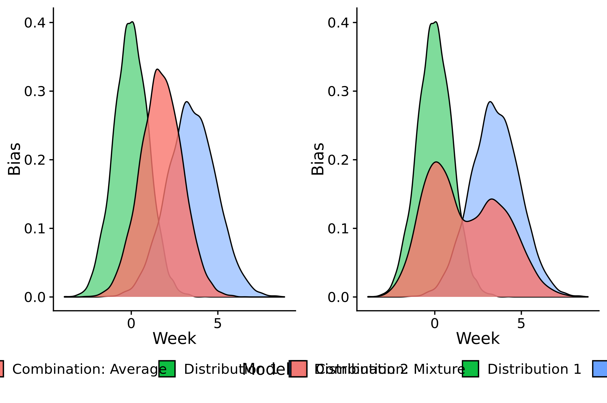

# Model aggregation {#model-aggregation}

The following chapter gives an introduction to the idea behind the formation of model ensembles and presents several approaches to aggregate models to ensembles.  

## Theoretical idea

Usually, a single forecasting model is not able to capture the nuances and full complexity of the true data-generating process. Forecasting models tend to get some things right and others wrong. The important thing to note is that different forecasting models normally get different things wrong. This fact allows us to increase predictive performance by aggregating individual models. 

As an illustrative example, let us consider $K$ different models that make predictions $\hat{y}_1, \dots, \hat{y}_k, \dots \hat{y}_K$ for an unknown true value $y$. In a very simplified manner, let us assume that all models make a random error, $\epsilon_k$ such that predictions can be expressed as $\hat{y}_k = y + \epsilon_k$. Every single model will be biased ($\epsilon$ has zero probability of being exactly zero, even if $\mathbb{E}(\epsilon) = 0$). However, if prediction errors are independent and have expectation zero, then $\hat{y}_{\text{ensemble}} = \frac{1}{K} \sum_{k = 1}^{K} \hat{y}_k = \frac{1}{K} \sum_{k = 1}^{K} (y + \epsilon_k) = y + \frac{1}{K} \sum_{k = 1}^{K} \epsilon_k$ will converge to the true value $y$ for an increasing number of models. This is the idea behind the simple mean ensemble. In practice, prediction errors of different models are seldom completely independent, but are instead often correlated. This may reduce the effectiveness of model aggregation. 

As stated above, model aggregation also only makes sense if we believe our models to be correct, i.e. if we expect $\mathbb{E}(\epsilon_k) = 0$. We may therefore want to exclude models we believe are incorrect from the ensemble. However, in many circumstances this decision will not be clear cut. We could therefore, for example, opt to give less weight to models that have performed poorly in the past and more weight towards those that performed well. This is the idea behind weighted ensembles. 

The last two paragraphs implicitly assumed that models are aggregated by taking a weighted average of the model predictions. While this is one option, it is not the only one. As we are dealing with probabilistic forecasts and predictive distributions, we can also work with a mixture distribution instead of merely averaging the corresponding quantiles of the two distributions. In principle, the average seems more appropriate if we believe that all models predict the same thing and we are looking for the optimal candidate. The mixture may be more appropriate if we believe that our models reflect different possible scenarios and are uncertain, which of these scenarios will occur. Figure \@ref(fig:average-mixture) highlights the difference between these two possibilities to combine distributions. 


DISTINCTION VERTICAL AND HORIZONTAL COMBINATION OF CDFs


``` {r average-mixture-example, echo = FALSE, fig.cap = "Two different ways of combining two predictive distributions (based on predictive samples). The left is a mixture distribution generated by taking random samples with equal probability from the two distributions. The right is a quantile average that was generated by taking the pairwise mean of the sorted vectors of the predictive samples from the two distributions."}



```

In the following, two different ensemble formation strategies will be presented. The Quantile Regression Average (QRA) is an ensemble strategy suited for quantile forecasts that determines optimal weights for a weighted average. The CRPS ensemble is based on predictive samples and determines optimal weights for a mixture distribution. 

## The Quantile Regression Average ensemble

The QRA is an ensemble strategy build upon the weighted interval score presented in Chapter \@ref{evaluation}. 

Consider a forecast made for observation $i, i = 1, \dots, n$ by one model $k, k = 1, \dots, K$ at different quantile levels $\tau_t, t=1,\dots, T$. The corresponding quantile prediction for observation i from model k at quantile level t is denoted $q_ikt$. 

The ensemble prediction at quantile level $t$, $q_{i, \text{ensemble},t}$ is then a weighted average of the predictions of the individual models: 

$$q_{i,\text{ensemble}, t} = \sum_k^K = \alpha_k \cdot q_{ikt}$$, 
where $\alpha_k$ is the weight given to model $k$. The weights are constrained to be non-negative and to sum up to one. To get an optimal ensemble, we are looking for the combination of weights that, across all quantile levels, produce an ensemble which minimises the weighted interval score over past observations. The optimisation problem can be denoted as follows: 

CORRECT INDICES

$$\mathop{\text{arg min}}_{\alpha_j, j=1,\dots,p} \sum_{k=1}^r \sum_{i=1}^n \psi_{\tau_k} \bigg(y_i - \sum_{j=1}^p \alpha_j q_{ijk} \bigg) $$
where $\psi_{\tau_k}$ denotes the weighted interval score at quantile level $\tau_k$. 

This optimisation problem can be extended in a number of ways. E.g. one can estimate different weights for different quantile levels or one can incorporate additional constraints, e.g. that quantiles not cross. All this functionality is conveniently bundled in the quantgen package CITATION. 


## The CRPS ensemble

MAKE INDICES CORRESPOND TO OTHER CHAPTERS IN THE FORMULAS

While the QRA uses the weighted interval score as a loss function, we can also use the CRPS as a basis for an ensemble formation approach. The major conceptual advantage of using CRPS and predictive samples is that we can create a mixture distribution instead of a simple average. The approach described in the following is a version of stacking (see Yao). Stacking is, in theory, superior to other aggregation techniques if the true data-generating distribution is not included in the ensemble distributions. While other strategies like Bayesian Model Averaging and QRA eventually converge to putting all their weights to the single model that is closest to the true data-generating distribution, stacking is able to combine information from all models to form an optimal ensemble. 

This CRPS ensembling approach was developed in collaboration with Yuling Yao from the Columbia University in New York and is implemented in the R package `stackr`. The following method overview is based on work written by Yuling Yao and edited by me that for the `stackr` vignette. 

As stated in Equation \@ref{eq:} in Chapter \@ref{evaluation}, the CRPS for a predictive distribution with finite first moment and the corresponding true value $y$ is given by 
$$crps(F,y)=\mathbb{E}_X|X-y|- \frac{1}{2}\mathbb{E}_{X,X^\prime}|X-X^\prime|.\tag{1}$$
Let us assume we have data from $T$ time points $t = 1, \dots, T$ in $R$ regions $r = 1, \dots, R$. Observations are denoted $y_{tr}$. Predictive samples are generated from $K$ different models $k = 1, \dots, K$. For every observation $y_{tr}$ the $S$ predictive samples $s = 1, \dots, S$ are denoted $x_{1ktr}, \dots, x_{Sktr}$. 

Let us first look at the CRPS for one observation and one predictive model before deriving the CRPS of a mixture of all models. Based on the predictive samples, we can compute the CRPS of the $k$-th model for the observation $y_{tr}$ at time $t$ in region $r$ as

\begin{align}
 \widehat {\text{crps}}_{ktr} &= \widehat {\text{crps}}(x_{1ktr}, \dots, x_{Sktr},y_{tr}) \\
 &= \frac{1}{S} \sum_{s=1}^S  |x_{sktr}-y_{tr}| - \frac{1}{2S^2} \sum_{s, j=1}^S |x_{sktr}- x_{jktr}|
\end{align}

<!-- $$ \widehat {\text{crps}}_{ktr}= \widehat {\text{crps}}(x_{1ktr}, \dots, x_{Sktr},y_{tr})= \frac{1}{S} \sum_{s=1}^S  |x_{sktr}-y_{tr}| - -->
<!-- \frac{1}{2S^2} \sum_{s, j=1}^S |x_{sktr}- x_{jktr}|. \tag{2}$$ -->

Now we want to aggregate predictions from these $K$ models. When the prediction is a mixture of the $K$
models with weights $w_1, \dots, w_s$, the CRPS can be expressed as

\begin{align}
 \widehat {\text{crps}}_{\text{ensemble}, tr} (w_1, \dots, w_K) 
 =& \frac{1}{S} \sum_{k=1}^K w_k  \sum_{s=1}^S |x_{skt}-y_t| \\
 &- \frac{1}{2S^2}  (\sum_{k=1}^K   \sum_{k, k'=1 }^K w_k w_{k'}   \sum_{s, j=1}^S |x_{skt}- x_{jk't}| )
\end{align}


<!-- $$ \widehat {\text{crps}}_{\text{ensemble}, tr} (w_1, \dots, w_K) = \frac{1}{S} \sum_{k=1}^K w_k  \sum_{s=1}^S |x_{skt}-y_t| - -->
<!-- \frac{1}{2S^2}  (\sum_{k=1}^K   \sum_{k, k'=1 }^K w_k w_{k'}   \sum_{s, j=1}^S |x_{skt}- x_{jk't}| ). \tag{3}$$ -->


once and store them for all weight values in the optimization. 

The overall CRPS for the mixture of all models for all observations can then simply be obtained by summing up the individual CRPS contributions from the different pairs of observations and predictions over all regions and time points. For the purpose of ensemble optimisation, we can extend this framework by assigning different weights to different time points and regions. This makes sense for example if we want to assign less weight to older observations because we believe they are less characteristic of the current and future dynamics. Similarly, we might want to give more or less weight to certain regions. Mathematically we can introduce a time-varying weight $\lambda_1, \dots, \lambda_T$, e.g. $\lambda_t = 2-(1-t/T)^2$ to penalize earler estimates. Likewise  we can introduce a region-specific weight $\tau_r$. 

To obtain the CRPS weights we finally solve a quadratic optimization:

\begin{align}
 &\min_{w_1, \dots, w_K} \sum_{t=1}^T  \sum_{r=1}^R\lambda_t\tau_r  \widehat {crps}_{\text{ensemble}, tr} (w), \\
  &s.t. ~{0\leq w_1, \dots, w_K \leq 1, \sum_{k=1}^K w_k=1}. 
\end{align}

In `stackr`, this is implemented using `optimization` CORRECT THIS in Stan. To speed up computation, the terms $\sum_{s=1}^S |x_{skt}-y_{tr}|$, $\sum_{s, j=1}^S |x_{sktr}- x_{jktr}|$, and $\sum_{s, j=1}^S |x_{sktr}- x_{jk'tr}|$ are only computed once for all $k, k'$ pairs. 
