# Results - evaluation and aggregation of Covid-19 death forecasts {#results}

Chapters \@ref(evaluation) and \@ref(model-aggregation) have introduced the tools we need for model evaluation and model aggregation. Chapter \@ref(results) will now apply these instruments to the Forecast Hub with the goal of better understanding their behaviour. 

The majority of this chapter will deal with the evaluation of the eight models described in Chapter \@ref(background-data) as well as the three different ensembles of the eight original models. This evaluation is as much about understanding model performance in the Forecast Hub as it is about understanding the tools used for evaluation themselves. The chapter will therefore digress at times to look at additional things like how different metrics correlate. A large part of model assessment is visual in nature - the chapter will therefore involve a lot of discussion of visual representations of different evaluation aspects. The evaluation will follow the general structure proposed in Chapter \@ref(evaluation): First the forecasts will be visually inspected. Afterwards, the attention will turn to the summarised scores and metrics, followed by a detailed look at calibration (including bias, coverage and PIT histograms) and sharpness. A mixed-effects model of the weighted interval score will help to summarise the conclusions from the model evaluation. WHERE TO PUT THE MIXED MODEL? 

The evaluation is followed by a more detailed look at the ensemble models that will discuss some specific aspects in more detail. These include a look at ensemble weights over time as well as analysis of different ensemble alternatives. REPHRASE THIS. 

The chapter will conclude with a brief sensitivity analysis that serves as a quick check of the plausibility of the inferences made throughout the chapter. 


<!-- The chapter will examine the performance of   -->


<!-- One of the original eight models is itself an ensemble of all models submitted to the Forecast Hub - this ensemble shall serve as a reference point against which we can compare our three ensembles.  -->

<!-- ## Evaluation of model performance -->

<!-- The following section is structured as follows:  -->
<!-- - first look at the data and the projections directly -->
<!-- - numerical grading of models using the weighted interval score -->
<!-- - look at calibration and sharpness to understand in which systematic ways models fail or succeed -->

## Forecast visualisation

In order to get a general sense for how the models do we shall start with a look at the projections versus the actual data. Figure \@ref(fig:models-us) gives an overview of the projections for one and four week ahead forecasts for the United States as a whole. Plots for other locations can be seen in the APPENDIX. From a brief look we can see that most models generally do a good job at capturing the dynamic one week ahead into the future. For four-week-ahead predictions, performance seems to deteriorate significantly. The mean-ensemble, the crps-ensemble and the UMass-MechBayes model seem to do a consistently good job at one and four week ahead predictions. The UT-Mobility looks good for one week ahead (except for the last time point), but performs poorly four weeks ahead. The LANL-GrowthRate model seems rather off regardless of the horizon. 

``` {r models-us, echo = FALSE, out.width = "100%", fig.cap = "One week ahead forecasts for the US from all models"}

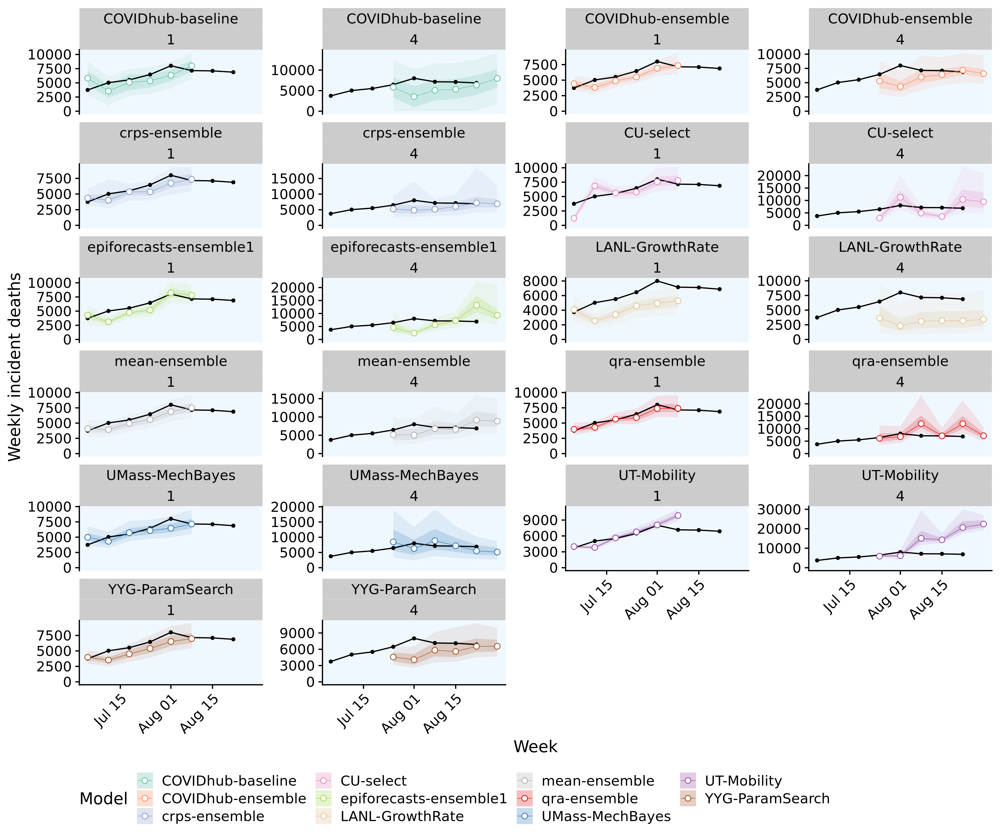

```


## Summarised scores

We next turn to the aggregated scores from the different metrics and proper scoring. These help us to summarise the complexity and nuances of overall model performance with a few numbers. They are therefore a sensible starting point before going deeper into assessing model calibration and sharpness. 

Figure \@ref(fig:coloured-summarised-scores) shows the summarised scores for all eleven models from the metrics presented in Chapter \@ref(evaluation). 
<!-- Table \@ref(tab:sum-scores) shows the summarised scores for all eleven models from the metrics presented in Chapter \@ref(evaluation).  -->

<!-- ```{r sum-scores, echo=FALSE, results='asis'} -->
<!-- df <- readRDS("../visualisation/chapter-5-results/ -->
<!--                      summarised_scores.rds") -->

<!-- options(knitr.kable.NA = '') -->
<!-- knitr::kable( -->
<!--   df,  -->
<!--   caption = 'Evaluation metrics for all models, aggregated over all forecast dates, horizons and locations', -->
<!--   booktabs = TRUE)  -->
<!-- ``` -->
``` {r coloured-summarised-scores, echo = FALSE, out.width = "100%", fig.cap = "Colour coded summary of scores. Neutral / optimal values are shown in white, too low values in blue and too high values in red"}

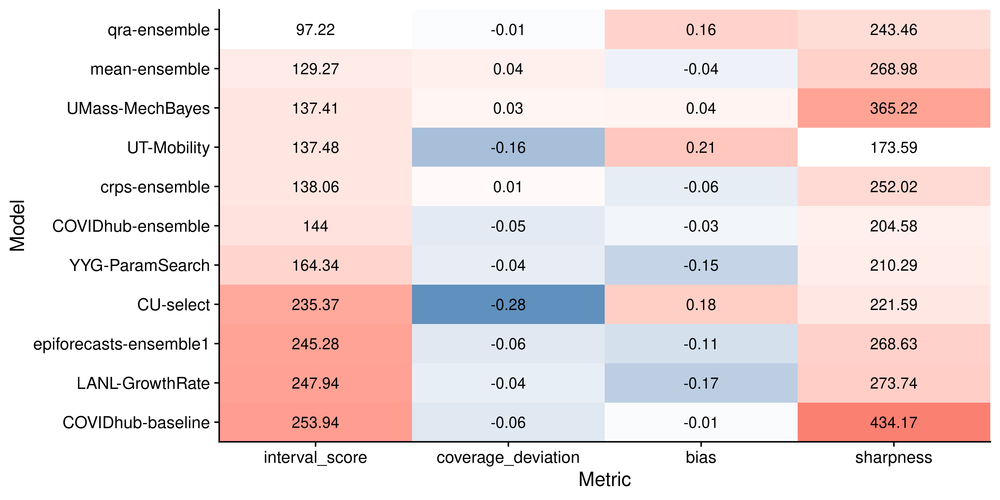

```
We can see that our quick visual ranking largely corresponds to the perfomance as judeged by the weighted interval score. The ensembles and UMassMechBayes rank at the top, while LANL-GrowthRate and UT-Mobility are ranked at the bottom. We don't, however, see the full picture from these aggregate scores. The epiforecasts-ensemble1, for example, does far worse than the UMass-MechBayes, even though both have similar values for coverage deviation, bias, absolute bias and sharpness. Absolute bias is included in Figure \@ref(fig:coloured-summarised-scores), as bias is aggregated over both positive and negative values and can therefore be misleading. We can see that the ranking is slightly different if we apply a log transformation to the weigthed interval score. This suggests that the average weighted interval score is heavily influenced by extreme values. 


### Correlation between metrics

To get a clearer understanding of how the different metrics relate, it seems sensible to look at the correlation between different metrics. Figure \@ref(fig:correlation-map) shows the correlation matrix. This matrix also included log interval score and log sharpness, as both have very heavy tails and outliers. We can see that sharpness seems to have a surprisingly large influence on the weighted interval score. This may well be a feature of the weighted interval score. It cannot, however, be ruled out that the sharper models analysed here simply do better for other unknown reasons. 

We can also see that bias and coverage deviation correlate strongly, which makes intuitive sense. A large absolute bias will lead to a lower empirical coverage which in turn results in a negative value for coverage deviation since coverage deviation is calculated as the difference between empirical coverage and desired nominal coverage. It is quite surprising to see, however that the correlation is nearly perfect and that coverage deviation and sharpness do not seem to correlate at all. 

Other weightings for the weighted interval score may yield different relative influences of the other metrics. It could therefore be sensible to adapt the weights, e.g. to get a stronger influence of the central intervals. This, however, is beyond the scope of this thesis. When interpreting the correlation, it is also important to note that the correlation  matrix doesn't show 'bias' and 'calibration' as abstract concepts. Rather, it shows how the actual metrics chosen to measure bias and calibration correlate with the WIS - these may not actually cover all of what we would like them to cover. 

``` {r correlation-map, echo = FALSE, out.width = "100%", fig.align = "center", fig.cap = "Correlation between the different metrics "}

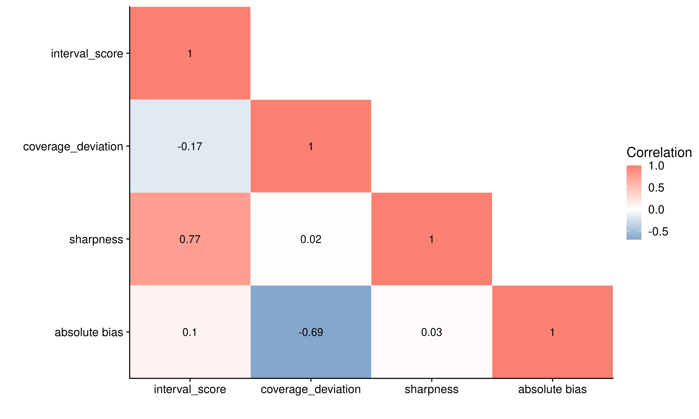

```

Figure \@ref(fig:correlation-plot) shows a full correlation plot with all univariate and bivariate distributions. We can clearly see on the diagonal that sharpness and weighted interval score (WIS) have heavy tails. We can make some other interesting observations: A positive coverage deviation (i.e. covering too much by stating too wide prediction intervals) is still associated with a lower WIS in the models analysed. We also see that while absolute bias and coverage deviation correlate with WIS, the variance is still immense. 

``` {r correlation-plot, echo = FALSE, out.width = "100%", fig.align = "center", fig.cap = "Correlation plot that shows bivariate scatter plots for all evaluation metrics."}

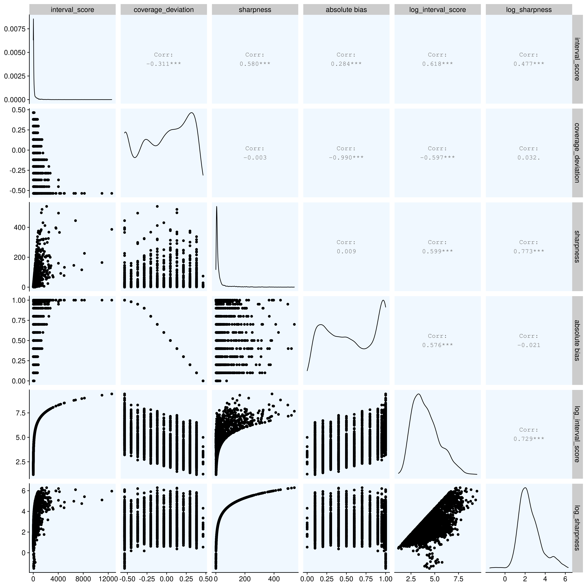

```


Table \@ref(tab:regression-wis-metrics) shows a quick regression of the log weighted interval score on absolute bias, coverage deviation and sharpness. All regressors have been standardised, so the effect size should be interpreted in terms of standard deviations. Coverage deviation and sharpness have the expected sign while absolute bias does not. As we have seen in Figure \@ref(fig:correlation-map) bias and coverage deviation do correlate strongly, which might make estimation harder. Also for some reason it might be that coincidentally upwards biased models still performed well overall. 

HOW DO I EXPLAIN THIS? MAYBE JUST DROP THE REGRESSION ALTOGETHER??

``` {r regression-wis-metrics-code, eval = FALSE}
lm(log_scores ~ abs_bias_std + coverage_deviation_std + log_sharpness_std, 
   data = unsummarised_scores) 

```


```{r regression-wis-metrics, echo = FALSE}
library(magrittr)
unsum_scores <- readRDS("../visualisation/chapter-5-results/scenario-baseline/unsummarised_scores.rds") %>%
  dplyr::mutate(log_scores = log(interval_score),
                abs_bias_std = (abs(bias) - mean(abs(bias))) / sd(abs(bias)),
                coverage_deviation_std = (coverage_deviation -
                                            mean(coverage_deviation)) /sd(coverage_deviation),
                log_sharpness_std = (log(sharpness) - mean(log(sharpness)))/sd(log(sharpness)),
                sharpness_std = (sharpness - mean(sharpness))/sd(sharpness)) %>%
  dplyr::filter(is.finite(log_scores))


lm(log_scores ~ abs_bias_std + coverage_deviation_std + log_sharpness_std, data = unsum_scores) %>%
  summary()
  broom::tidy() %>%
  knitr::kable(caption = 'Regression of the log weighted interval score on the (standardised) absolute bias, coverage deviation and sharpness. ',
  booktabs = TRUE)

```


### Scores by subgroups

Proceeding further we can break down the performance by different subgroups such as states,  forecast horizons, and interval ranges to obtain a better understanding of what drives differences in the overall model scores. Figure \@ref(fig:heatmap-performance) gives an overview of the model performance as judged by the WIS for every state. The colour indicates the overall rank that the model achieved in a given state. States are sorted from highest average interval score to lowest to illustrate contributions from different states. When averaging over different states, the overall weighted interval score is heavily influenced by few very large values. Large WIS values are most common in states with high case numbers (as small relative errors translate to large absolute deviations) and for larger horizons (as uncertainty grows). 

MAYBE PLOT OF AVERAGE WIS VS NUMBER OF CASES OR / AND HORIZON

``` {r heatmap-performance, echo = FALSE, out.width = "100%", fig.cap = "Heatmap with the average of the weighted interval score over all horizons, states and forecast dates. The colouring indicates the rank of the model per state"}

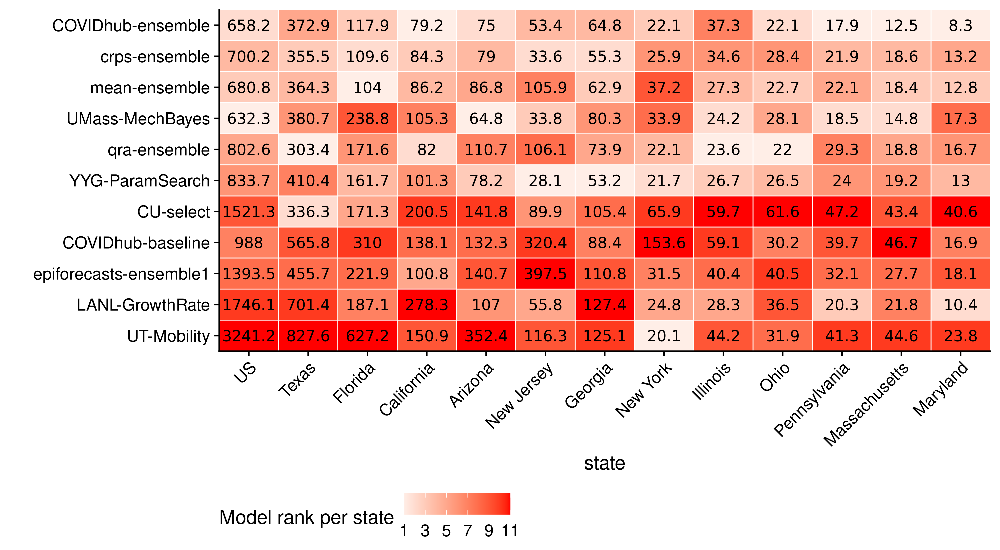

```

Figure \@ref(fig:heatmap-performance-horizon) shows performance over horizons instead of states. The colouring now indicates how much higher a score is relative to the score achieved for one-week-ahead forecasts by the model. Models are again sorted from lowest to highest average weighted interval score. The plot highlights how much general model performance is affected by the accuracy of long term forecasts rather than short term forecasts. The qra-ensemble for example does very well for one-week-ahead forecasts, but its performance deteriorates substantially further ahead into the future. 

``` {r heatmap-performance-horizon, echo = FALSE, out.width = "100%", fig.cap = "Heatmap with the average of the weighted interval score across all states and forecast dates. The colouring indicates how much higher a score is relative to the lowest average score achieved by a model"}

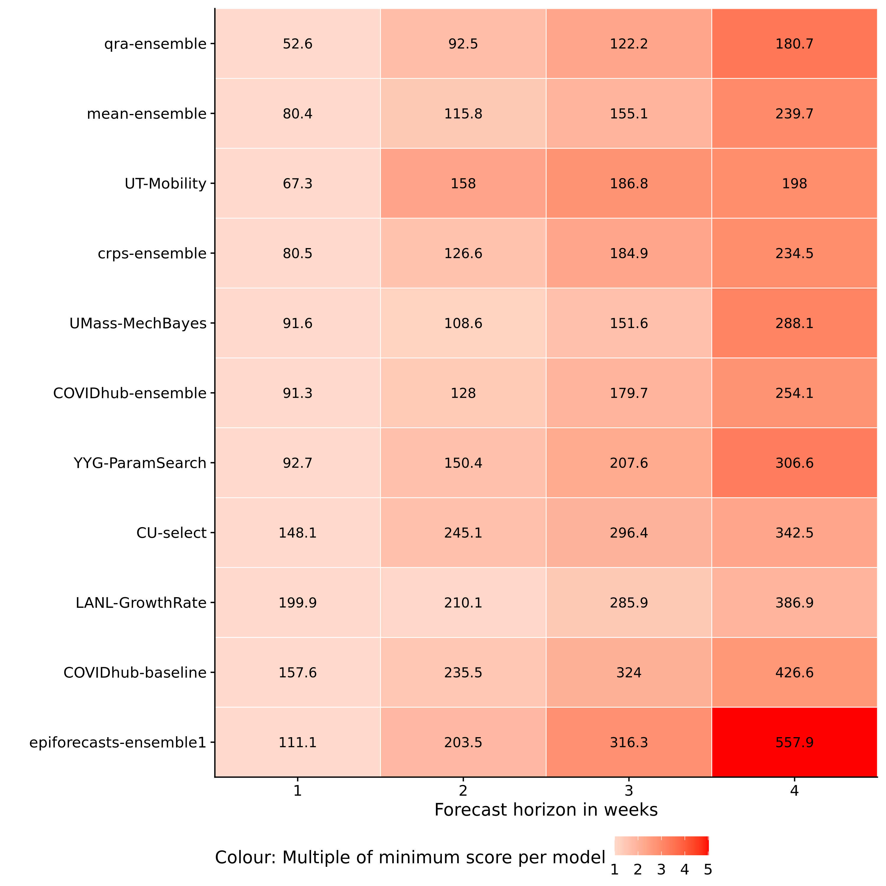

```

To understand the composition of the weighted interval score better we can also look at the contributions from different interval ranges to the overall WIS. Figure \@ref(fig:scores-ranges) shows that the WIS as implemented here seems to be more strongly influenced by the inner prediction intervals (small interval range) than the outer intervals (large range). Note again that other weightings are possible for the weighted interval score. 

``` {r scores-ranges, echo = FALSE, out.width = "100%", fig.cap = "Interval scores across all states and forecast dates and horizons for different interval ranges"}

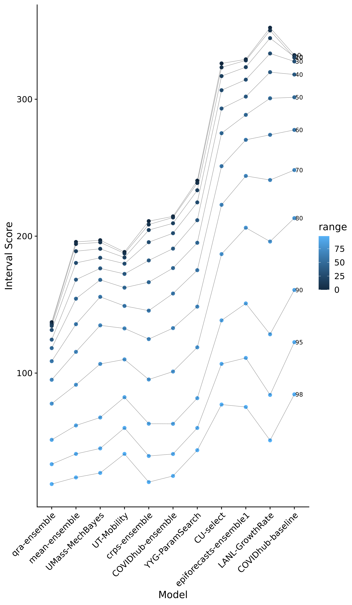

```

After having examined the aggregated scores we can now move to visualise and analyse calibration and sharpness in detail. 

## Assessing Calibration

### Bias

Just as we did with in Chapter \@ref(evaluation), we start our analysis of calibration with bias. For the purpose of model improvement it seems most useful to compare the evolution of bias over time with the actual predictions and observations. With the help of this comparison we can obtain insights regarding the particular situations that cause models to biased or not. While this is of course unfeasible to do for all eleven models, Figure \@ref(fig:bias-ensemble) shows one-week-ahead predictions and  bias for the three ensemble models in the six locations with the highest average WIS. We see that all models make very similar predictions. The qra-ensemble seems to have a slight tendency for higher bias values, but this is hard to infer just from looking at the plots.
All models seems to have some difficulties with picking up rapid changes in trends. This is especially pronounced in Texas. We can see that models seem to overpredict when deaths are increasing (Arizona, Texas) and seem to underpredict when cases are decreasing (New Jersey, last two weeks in Arizona). 

Looking at the plot we can digress a bit and make a second unrelated observation regarding the crps-ensemble model: Plots of New Jersey (and maybe Florida) show that the model sometimes produces very large spikes in uncertainty. This can probably be attributed to the loss of precision that results from the sampling in the crps model aggregation progress. If we look back at the PLOT IN CHAPTER MODEL AGGREGATION, we can probably attribute this to the loss of precision due to sampling. We saw IN THE PLOT that samples from the gamma distribution tend to have much larger tails than the actual distribution. 


``` {r bias-ensemble, echo = FALSE, out.width = "100%", fig.cap = "Observations and predictions (top) as well as bias (bottom) for the YYG-ParamSearch model in the six states that exhibited the largest absolute bias."}

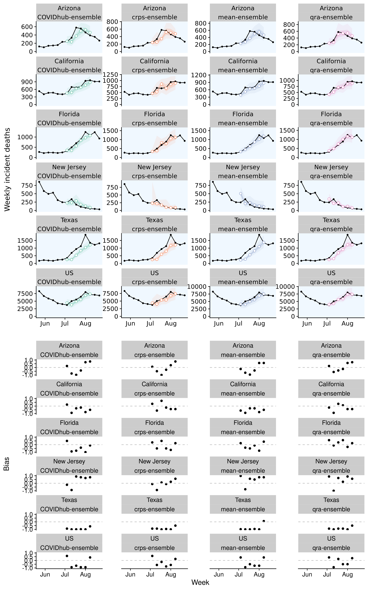

```

#### Bias by subgroups

horizons, states

Figure \@ref(fig:bias-all) shows bias for all models over different forecast horizons. We see that absolute bias tends to be a bit larger for greater horizons (though maybe not as much larger as expected) and that bias tends to be a slightly larger for worse ranked models. Overall, however, no really clear picture emerges. 

``` {r bias-all, echo = FALSE, out.width = "100%", fig.cap = "Bias for all models and different horizons. The black dot denotes the median bias, the black square the mean bias and different colour shadings show the 20, 40, and 90 percent intervals of all observed quantile values. Models are again ordered according to their overall performance by WIS."}

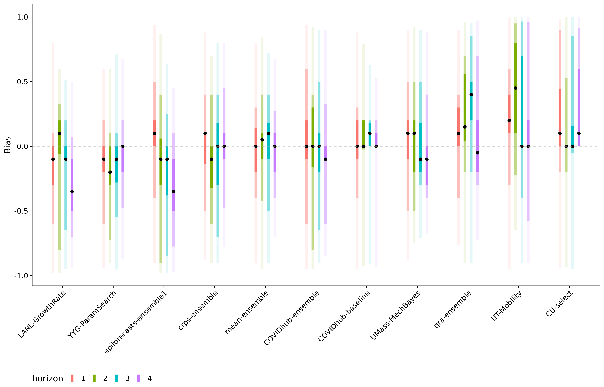

```

BIAS IN DIFFERENT STATES? 

### Coverage

We next turn to examine coverage. Figure \@ref(fig:interval-coverage-all) shows the empirical interval coverage for all eleven models. We see that some models (especially CU-select and UT-mobility) have problems with calibration. The COVIDhub-baseline model is an interesting case. While the aggregated coverage deviation score in Figure \@ref(fig:coloured-summarised-scores) looked very good, we can now conclude from this plot that the COVIDhub-baseline is not well calibrated. It instead is covering too much by its inner prediction intervals, but too little by its outer intervals. The epiforecasts-ensemble1, the qra-ensemble and especially the COVIDhub-ensemble seem to do best in terms of interval coverage. Looking only at interval coverage plots, however, does not tell us where the lack of coverage comes from. 
``` {r interval-coverage-all, echo = FALSE, out.width = "100%", fig.cap = "Coverage of the prediction intervals across all locations and forecast dates"}

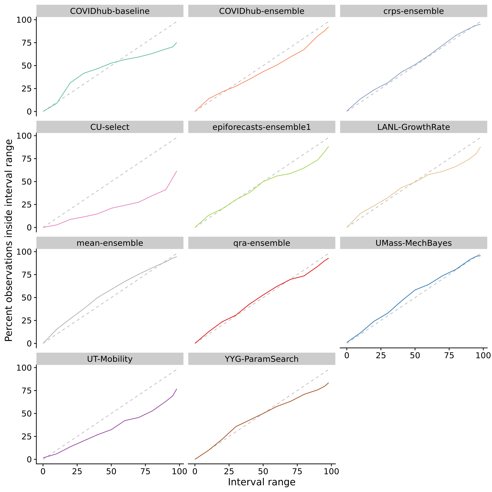

```

Figure \@ref(fig:quantile-coverage-all) therefore goes into more detail and shows quantile coverage, i.e. the proportion of predictions lower than the true value for each quantile of the model predictions. This makes it possible to see whether a lack of coverage in a certain interval range is more a problem of the lower or the upper bounds of the interval range. For the epiforecasts-ensemble1, for example, we could see a lack of coverage in the outer prediction intervals in Figure \@ref(fig:interval-coverage-all). With the help of the quantile coverage plot we can now see that the problem lies in the upper, rather than the lower bounds. It seems that the epiforecasts-ensemble1 did well in quantifying uncertainty below the median, but was underpredicting the likelihood of extreme events above the median. This quantile coverage visualisation also allows us to reexamine the bias component of calibration again. We can for example see that the UT-Mobility and qra-ensemble, which exhibit an upward bias (compare \@ref(fig:coloured-summarised-scores)), are moved to the left of the diagonal, while e.g. the YYG-ParamSearch or the LANL-GrowthRate model, which are downward biased, are moved to the right. 

<!-- An interesting extension to this thesis might be to compare the currently chosen bias metric with bias measured in terms of quantile deviation. The latter would of course not work with individual observations, but only on an aggregate level on which coverage can be evaluated. NOT SURE ABOUT THE LAST TWO SENTENCES -->


<!-- We can also see a slight discrepancy between the plot and the numerical values, as the YYG-ParamSearch model (bias: -0.13) looks about the same or even a bit further away from the diagonal than the qra-ensemble (bias: +0.21), even though the latter exhibits more absolute bias. This then of course brings up the question which of the ways to look at it is the 'better' one.  -->

``` {r quantile-coverage-all, echo = FALSE, out.width = "100%", fig.cap = "Coverage of the prediction intervals across all locations and forecast dates"}

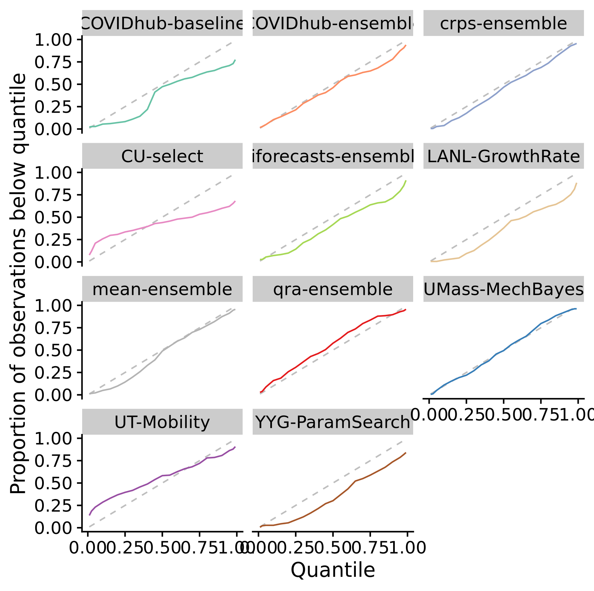

```

One major advantage this type of visualisation has over PIT histograms is that we can easily compare different models in a single plot. Figure \@ref(fig:coverage-ensemble) exemplifies this for the ensemble models. It is obvious taht the COVIDhub-ensemble did best in terms of interval as well as quantile coverage. The crps-ensemble and the mean-ensemble have a slightly too high interval coverage, which we confirms what we have already seen in the summarised scores in Figure \@ref(fig:coloured-summarised-scores). Looking at the quantile coverage plot (on the right) we can see clearly see that the qra-ensemble model is the most biased of all ensemble models. It is therefore maybe surprising to see the model looks quite well in terms of interval coverage (on the left). We can explain this discrepancy by taking sharpness into account. In Figure \@ref(fig:coloured-summarised-scores) we could see that the COVIDhub-ensemble was much sharper than the other three ensembles which were about equally sharp. For the mean-ensemble and the crps-ensemble the increased width of the prediction intervals for the translated into a positive coverage deviation, while for the qra-ensemble it only mitigated the effect the increased bias would have had on interval coverage. This discrepancy between quantile and interval coverage, however, highlights again that interval coverage only shows one kind of calibration. Good interval coverage is a necessary condition, but not sufficient to prove good calibration. In general, it seems that the quantile plot (right) visually correlates better with overall model performance as judged by WIS. We should therefore look at the quantile coverage plot rather than the interval coverage plot if we were to choose only one. 

``` {r coverage-ensemble, echo = FALSE, out.width = "100%", fig.cap = "Interval coverage (left) and quantile coverage (right)"}
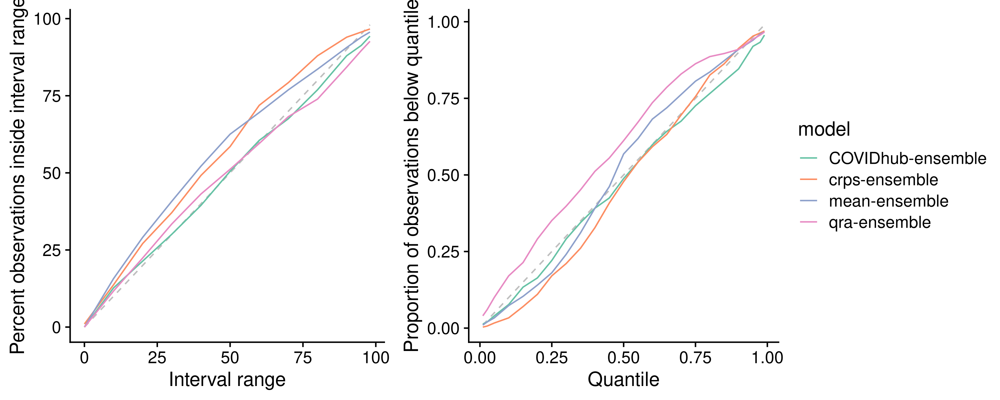

```

#### Coverage by subgroups

We can again look at coverage in different subgroups to get a better understanding for how the models and the metrics behave. We might for example want to ask how coverage changes over different prediction horizons, as this could give an indication of how well we far into the future we can confidently make predictions. Figures \@ref(fig:interval-coverage-horizon) and \@ref(fig:quantile-coverage-horizon) show the interval and quantile coverage over different prediction horizons. We can generally see that coverage generally tends to deteriorate at least slightly with increasing forecast horizons for many models. WORK ON THIS INTERPRETATION OR MAYBE JUST MOVE THE PLOTS TO THE APPENDIX.  

``` {r interval-coverage-horizon, echo = FALSE, out.width = "100%", fig.cap = "Coverage of the prediction intervals across all locations and forecast dates over different horizons"}

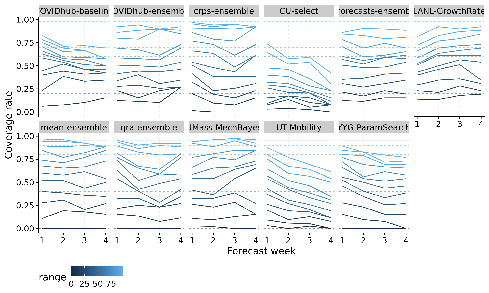

```

``` {r quantile-coverage-horizon, echo = FALSE, out.width = "100%", fig.cap = "Coverage of the prediction intervals across all locations and forecast dates over different horizons"}

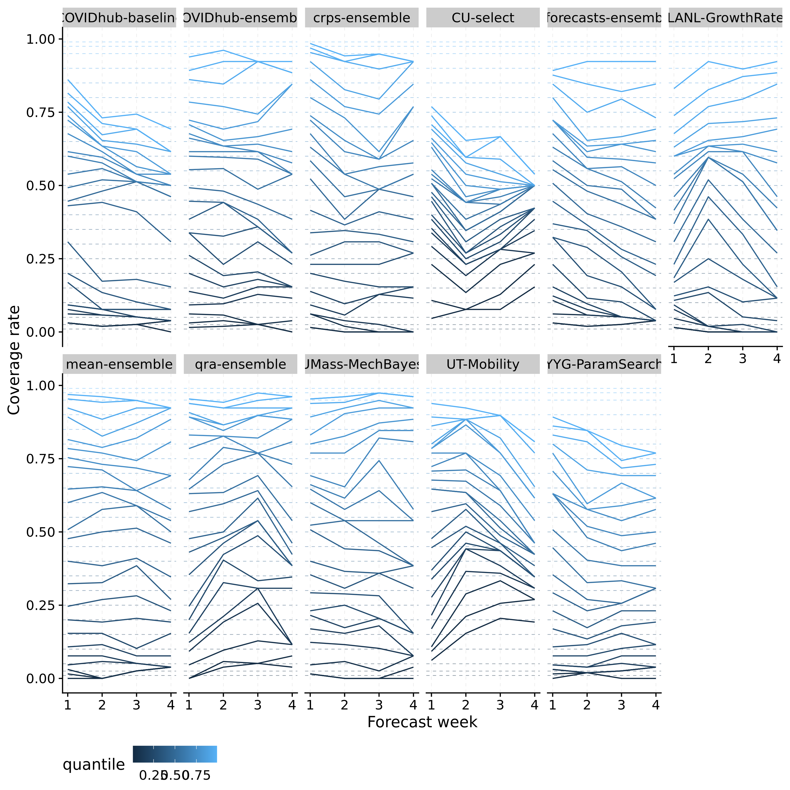

```

As before, we may also be interested in how different ranges contribute to overall coverage deviation.  \@ref(fig:coverage-deviation-range) therefore shows coverage deviation by range. MAYBE THIS PLOT IS NOT SO INTERESTING AND I SHOULD DROP IT. A MAYBE MORE INTERSTING PLOT COULD BE COVERAGE DEVIATION BY QUANTILE - THIS WOULD GIVE A MAYBE NICE VISUALISATION OF BIAS.

``` {r coverage-deviation-range, echo = FALSE, out.width = "100%", fig.cap = "Coverage deviation for different ranges"}

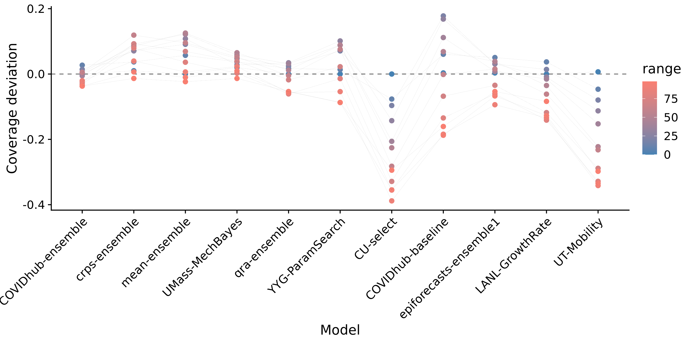

```

Coverage deviation by state is interesting as it gives us some feeling for how hard different states are to forecast. Figure \@ref(fig:coverage-deviation-states) shows the deviation by state. We see that some states are very prone to over- and underprediction. While better performing models tend to be more right we see that all models fail significantly in states like Texas. Figure \@ref(fig:pred-texas) shows one-week-ahead predictions and observed values in Texas. Surprisingly, all models are unable to keep up with the change in trend. 

``` {r coverage-deviation-states, echo = FALSE, out.width = "100%", fig.cap = "Coverage deviation for different ranges"}

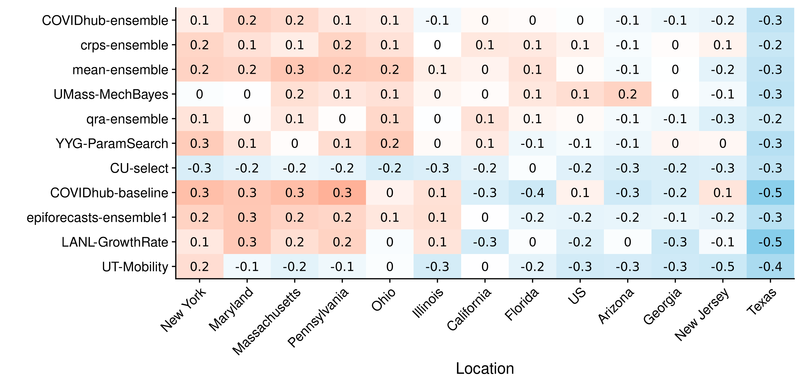

```
``` {r pred-texas, echo = FALSE, out.width = "100%", fig.cap = "One week ahead predictions and observed values in Texas"}

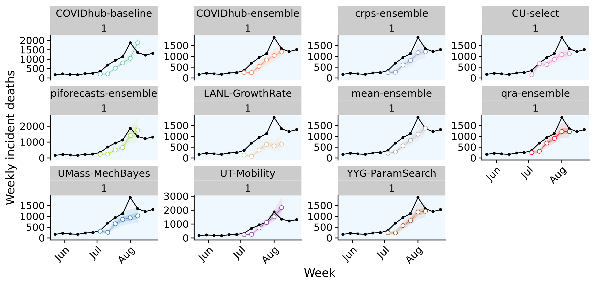

```
### PIT histograms

In addition to looking at coverage plots, we can also approach calibration through PIT histograms. Figure \@ref(fig:all-pit-plots) shows the PIT histograms for all eleven models. We can immediately see that the Anderson-Darling test for uniformity is rejected for all models. While some models are indeed severely miscalibrated (as seen before in the coverage plots), we may probably also conclude that the Anderson-Darling test has limited value for most practical purposes of model comparison. PIT histograms are arguably somewhat hard to interpret for many readers. However, they provide a very good way to succinctly summarise different aspects of calibration and show again a lot of the things previously observed in other plots. We can for example see again the bias in the qra-ensemble and the YYG-ParamSearch model. Or we can recognise the hump shape corresponding to the positive coverage deviation of the crps-ensemble and the mean-ensemble (the predictions are wider than they actually need be). We will, however, not revisit all these aspects again, but instead turn to sharpness now. 

``` {r all-pit-plots, echo = FALSE, out.width = "100%", fig.cap = "PIT histograms for all models. Samples were obtained by first fitting a gamma distribution to the set of quantiles. Note that the PIT plots shown here don't have the same scale on the y-axis, which make them easier to read on their own, but a bit harder to compare. "}

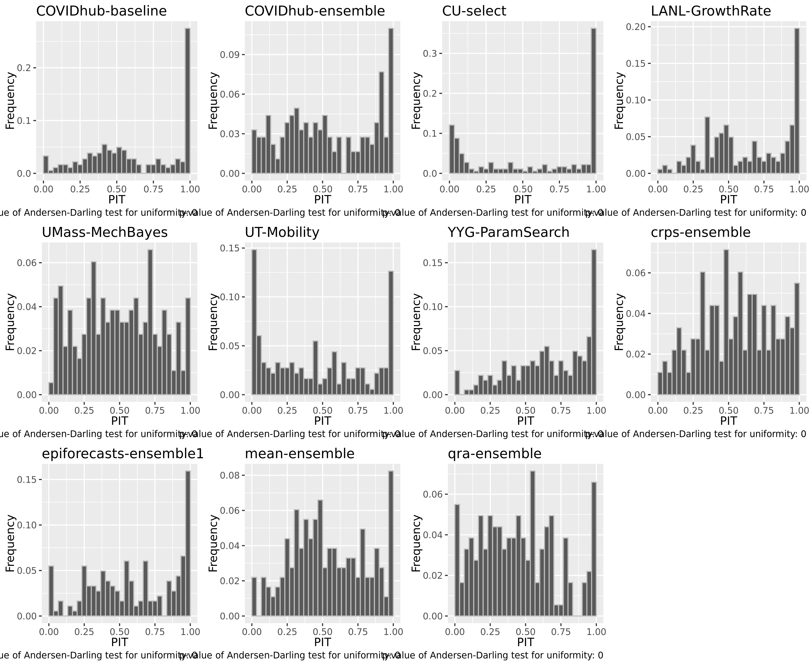

```

## Assessing sharpness

INTRODUCION TO SECTION

In order to understand the individual model better it is again most helpful to plot sharpness next to predictions. Figure \@ref(fig:sharpness-crps-ensemble) does this for the crps-ensemble model for one-week-ahead predictions. Only one of the ensemble models is shown as all four make very similar forecasts. We can see that sharpness does not really follow a clearly identifiable pattern. It is much larger, of course, in locations like the US as a whole that have many more cases. But we cannot really see the ensemble model consistently adapting to past mistakes. Ideally, we would want a model to make wider predictions whenever predictions and observations do not match (for example, when the trend changes) and narrower ones when past predictions and observations have matched. Unfortunately, none of the original PLOT IN APPENDIX models really seems to exhibit that kind of behaviour and the ensemble is not able to mitigate this shortcoming. Instead we see rather random looking changes in sharpness (see e.g. Arizona, US). 

``` {r sharpness-crps-ensemble, echo = FALSE, out.width = "100%", fig.cap = "Sharpness over different horizons. "}

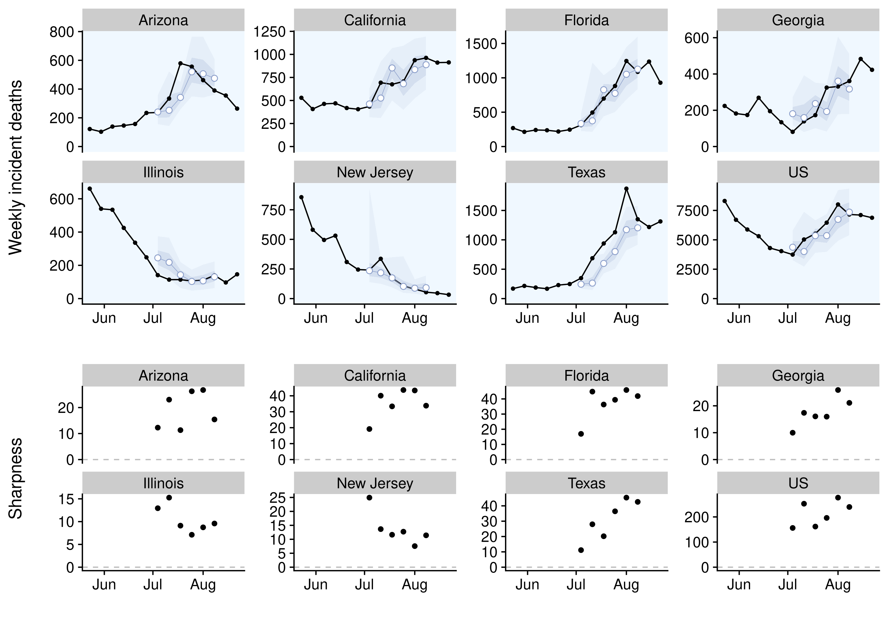

```

In order to get a better feeling for differences in model behaviour we can again try and compare sharpness in different subgroups. Figure \@ref(fig:sharpness-horizons) shows sharpness over different horizons for all eleven models. This visualisation shows that prediction intervals tends to grow with increasing forecast horizons for almost all models. This provides a simple sanity check, as we should expect prediction intervals to grow with uncertainty. Only CU-select and LANL-GrowthRate fail this check as their median sharpness does not increase over all horizons. For the better performing models we mostly see a moderate increase with the only exception of UMass-MechBayes among the top performers. Comparing this with WIS over horizon (see Figure \@ref(fig:heatmap-performance-horizon)) we can conclude that this lack of sharpness for four-week-ahead forecasts is indeed accompanied by a worse weighted interval score. We can now also conclude that it is this lack of sharpness for four-week-ahead-predictions that cause UMass-MechBayes to rank among the bottom in terms of average sharpness (compare again Figure \@ref(fig:coloured-summarised-scores)). 

``` {r sharpness-horizons, echo = FALSE, out.width = "100%", fig.cap = "Sharpness over different horizons. "}

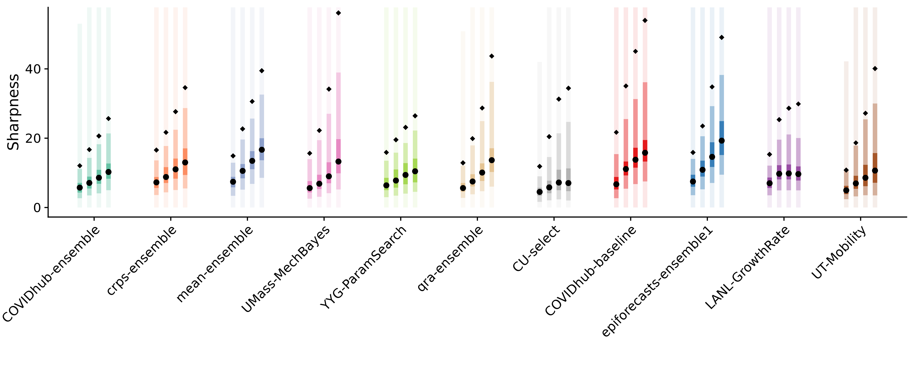

```
Looking at sharpness separated by different interval ranges allows us again to discern the contributions to overall sharpness from individual prediction intervals. Figure \@ref(fig:scores-ranges) the contributions from inner and outer prediction intervals for all eleven models. It generally seems that 50% intervals tend to contribute most to sharpnes, while neither narrow intervals near the median nor the tails of the predictive distribution seem to make large contributions. 

``` {r sharpness-ranges, echo = FALSE, out.width = "100%", fig.cap = "Sharpness across all states and forecast dates and horizons for different interval ranges"}

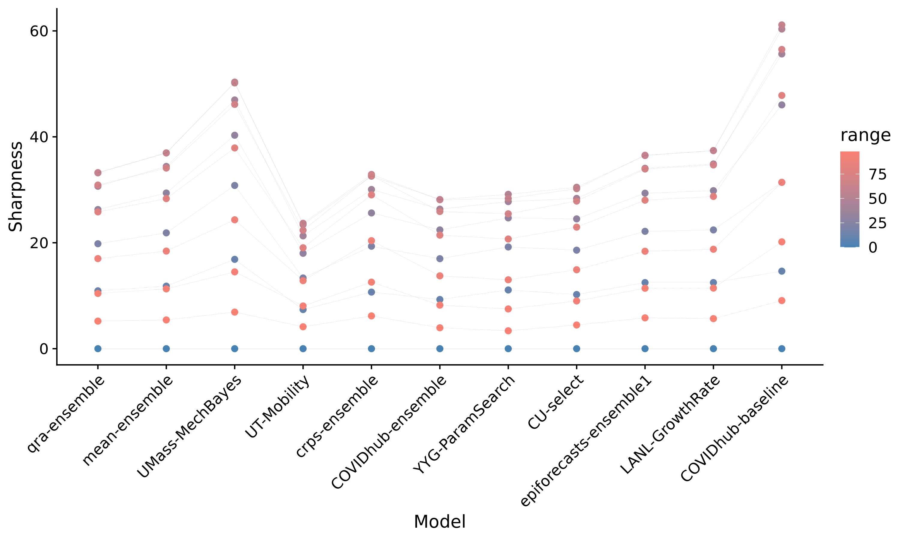

```
Visualising sharpness for different states is again a way to see how different states vary in the sharpness they permit as well as how consistetnly models do in terms of sharpness. Figure \@ref(fig:sharpness-ensemble) shows sharpness for every model and ensemble. We clearly see that average sharpness is largely dominated by sharpness in the US as a whole. We can also observe that some models (e.g. COVIDhub-ensemble, YYG-ParamSearch, CU-select) consistently tend towards sharper forecasts, while other models vary a lot across regions. 

``` {r sharpness-ensemble, echo = FALSE, out.width = "100%", fig.cap = "Sharpness of the ensemble models in different states. The shading indicates how much higher a certain sharpness value is compared to the minimum value achieved in that state."}
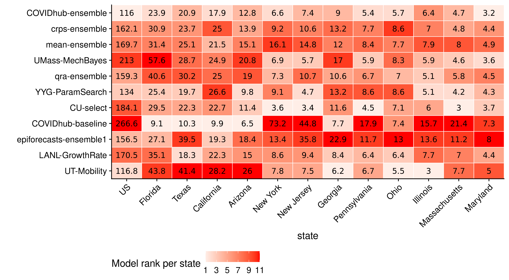

```

SECTION SUMMARY? 


## Model evaluation in a regression framework

To complement the analysis presented above we can look at evaluation in a regression. This is a natural next steps towards model selection that in principle allows us to make a better founded decision for or against a specific model to choose for future predictions. It is also very helpful for the case in which we do not have a complete set of predictions. If a certain research group for example misses a submission or does not submit forecasts in all states, then we can better mitigate this in a regression framework than by merely averaging over all available data. 

To that end we employ a mixed-effects model with fixed effects for models and horizons and random effects for states and forecast dates. The model formula looks as shown below. Interval scores are again log transformed to mitigate issues with the heavy tails of the original distribution. As a baseline we take the COVIDhub-ensemble model (the top performer). This helps us to discern whether models at the top can actually be distinguished and show significant performance differences. 

```{r random-effects-model-code, eval = FALSE}
fit <- lme4::lmer(log_scores ~ model + horizon + (1|state) + (1|forecast_date),
                  data = unsummarised_scores)

```

Table \@ref(tab:random-effects-model) shows the results from that regression. We can see that the regression confirms general tendencies observed before. The horizon, for example, has a highly significant positive effect on the weighted interval score. The overall ranking of model effects corresponds to the model ranking by log interval score presented in \@ref(fig:coloured-summarised-scores). This regression can of course be adapted. One possibility is to model an interaction between model and horizon to control for the fact that some models cope better or worse with increasing uncertainty. It also seems sensible to model horizon as a factor instead of a metric variable. If we were especially interested in performance over say a four-week-ahead horizon, we could then estimate a separate effect for every model at horizon four by looking at the combination of the model effect and the interaction. The regression outcome suggests a clear split between two groups of models in terms of perfomance. Models in the top group are roughly comparable, except for the mean ensemble (and maybe the qra-ensemble) which fare a bit worse. Note again that the regression was performed on log scores which changes the order with respect to untransformed scores. The mean-ensemble, for example looks worse according to log scores than it would otherwise have. This suggests that mean-ensemble avoids outliers, but does a bit worse on a typical forecast. 

```{r random-effects-model, message = FALSE, echo = FALSE, message=FALSE, results="as.is"}
library(kableExtra)

fit <- readRDS("../visualisation/chapter-5-results/scenario-baseline/random-effects-model.RDS")
fit %>%
  summary() %>%
  coef() %>% 
  as.data.frame() %>%
  knitr::kable(caption = 'Mixed model regression of the log weighted interval score on model, horizon (both fixed), state, and forecast date (both random)',
               format = "latex", 
               booktabs = TRUE) %>%
  kable_styling(latex_options="scale_down")

```

While the strength of this regression framework is its ability to aid with model selection, we can also use it to learn more about the effects of different locations and forecast dates. Figure \@ref(fig:random-effects) shows the estimated random effects from all different locations and forecast dates. We can see that location effects are much larger than forecast date effects. 

``` {r random-effects, echo = FALSE, out.width = "100%", fig.cap = "Random effects of the different locations (left) and forecast dates (right"}
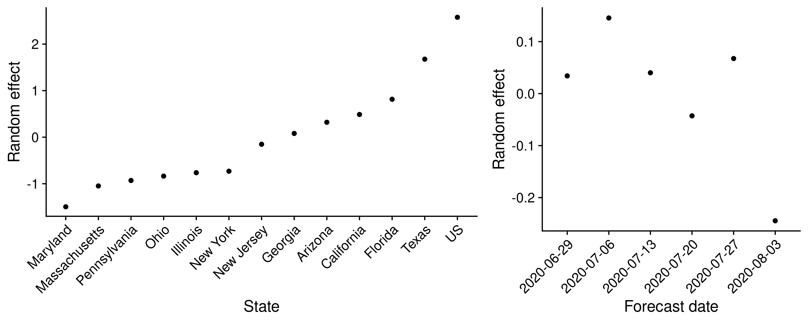

```

SECTION SUMMARY / TRANSITION

## Assessing ensemble performance

The following section will explore some aspects concerning the ensemble models in a bit more detail. These paragraphs will focus on the qra and the crps ensemble, as these are the ones of greatest interest. The first part will examine how ensemble member weights evolve over time for the two model aggregation approaches. The second part will then look at different variants of the qra and crps ensemble that alter the number of past observations to take into account or the horizon to optimise for. A regression framework will be used again to determine differences between the different ensemble variants. The COVIDhub-ensemble will here serve as a benchmark against which to compare the other ensembles. 

The mean-ensemble will not be discussed in more depth as it is not very interesting in terms of further investigation. Since its member models are all already included in the COVIDhub-ensemble model, performance differences between the mean-ensemble and the COVIDhub-ensemble can be fully attributed to the subselection of models from the Forecast Hub for this thesis. 

### Model weights over time

Looking at the how ensemble weights evolve over time can give us insights about how the ensembles work. Figure \@ref(fig:weights-time) visualises this evolution. We can see that both model aggregation approaches seem to 

``` {r weights-time, echo = FALSE, out.width = "100%", fig.cap = "Weights given to the different models in the ensemble over time"}

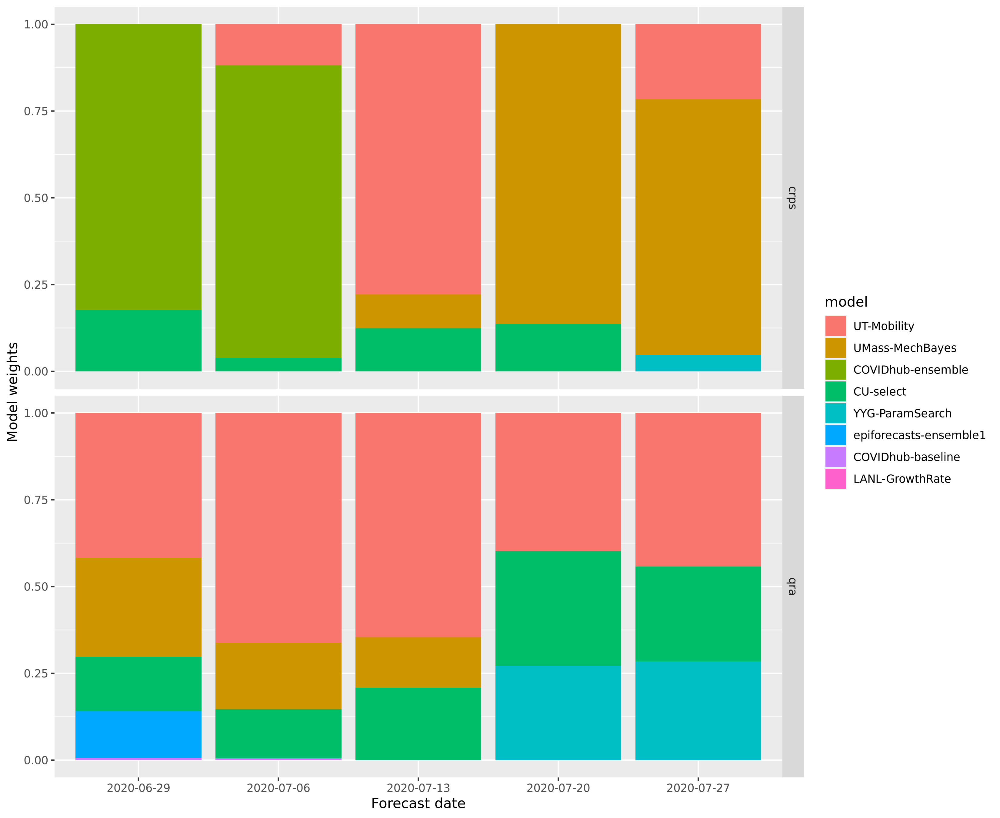

```

Figure \@ref(fig:weights-vs-scores) shows the weights over time against the performance of the models. We can see that both ensembles prefer to include similar models. We can also see that model inclusion is not necessarily only determined by overall performance. For example, the CU-select and UT-Mobility model are included in both ensembles and seem to add something of value even though they are not among the top performers. 

``` {r weights-vs-scores, echo = FALSE, out.width = "100%", fig.cap = "Weights given to the different models in the ensemble over time"}

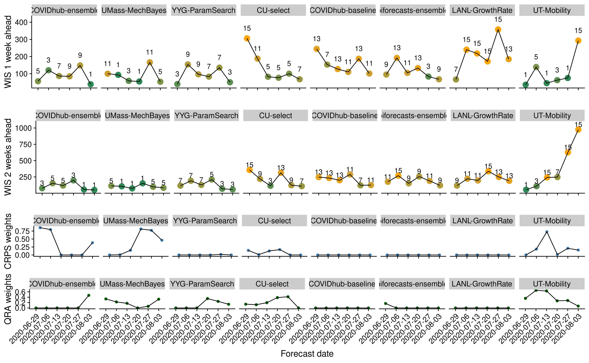

```


## Other ensemble variants

The ensemble variants above are a sensible default, but are of course not the only possible ensemble combination. This section therefore explores different ensembles with different parameters. The default was run with otpimisation based on the two last forecasts. The qra ensembles were now run with one to four weeks of past forecasts and were therefore called qra-ensemble-1 to qra-ensemble-4. The default used previously corresponds to qra-ensemble-2. For the crps-ensemble, an additional choice was made, namely the horizon on which to optimise. In contrast to the `quantgen` package, `stackr` currently only supports one horizon. The second number in the crps-ensemble name therefore indicates the horizon for which the crps was optimised. The default model corresponds to crps-ensemble-2-2. We can see from a comparison with \@ref(fig:coloured-summarised-scores) that aggregate scores for the crps-ensemble-2-2 model turn out slightly different. This can most certainly be explained by the fact that the crps-ensemble relies on random sampling. 
Figure \@ref(fig:ensemble-comparison) shows aggregate model performance for the different ensemble variants. No obvious picture emerges regarding the superiority of either qra or crps ensembles. There is, however, a couple of interesting patterns to observe. Firstly, crps-ensembles optimised only on one-week-ahead forecast horizon tend to do worst, while those optimised on three and especially two weeks do best. For the crps ensemble it seems that the forecast horizon matters more than the number of past forecasts included in the weighting. This is somewhat surprising given that qra-ensemble-1 is among the top performers. If we only ever include the past forecast, this of course implies that weighting can only be done on one-week-ahead forecasts. Normally, we would therefore expect the qra-ensemble-1 to perform similarly to crps-ensemble-1-1. We can also see that the qra-ensemble-4 and qra-ensemble-1 are top performers, while qra-ensemble-3 and qra-ensemble-2 are not. This casts doubt whether there is a clear best choice of the number of past observations to include. Additional analysis could be conducted by including arbitrary combinations of horizons in the qra optimisation instead of simply all available horizons. We also see that qra ensemble tend to overpredict, while crps ensembles tend to underpredict. This, however, may also be an artifact of the model aggregation process in which a gamma distribution gets fit to predictive quantiles. 

``` {r ensemble-comparison, echo = FALSE, out.width = "100%", fig.cap = "Weights given to the different models in the ensemble over time"}

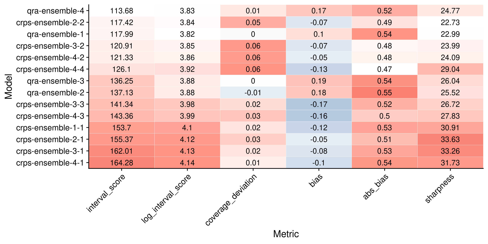

```

``` {r regression-ensemble, echo = FALSE}
fit <- readRDS("../visualisation/chapter-5-results/ensembles/scenario-baseline/random-effects-model-ensemble.RDS")
fit %>%
  summary() %>%
  coef() %>% 
  as.data.frame() %>%
    dplyr::arrange(-Estimate) %>%
  knitr::kable(caption = 'Mixed model regression of the log weighted interval score on model (fixed), state, and forecast date (both random)',
               format = "latex", 
               booktabs = TRUE) %>%
  kable_styling(latex_options="scale_down")

```


INTERESTING: WEIGHTS OVER TIME


ADD TO INTERPRETATION: The second thing to keep in mind is that the crps-ensemble implementation in this thesis entails fitting a gamma distribution to the set of predictive quantiles which is bound to lose some precision. It is therefore expected to the see the crps-ensemble perform worse and therefore rather surprising that it keeps up in performance with the other ensembles. 

## Sensitivity analysis

In order to test the validity and robustness of the results obtained, this section presents a small validity analysis. This analysis could of course be expanded greatly. 

Instead of looking at the whole time window, the three latest dates were successively removed. Figure \@ref(fig:senitivity) shows the summarised scores for all models in the four different scenarios. We can see XXX. 

``` {r senitivity, echo = FALSE, fig.show = "hold", out.width = "50%", fig.cap = "Weights given to the different models in the ensemble over time"}

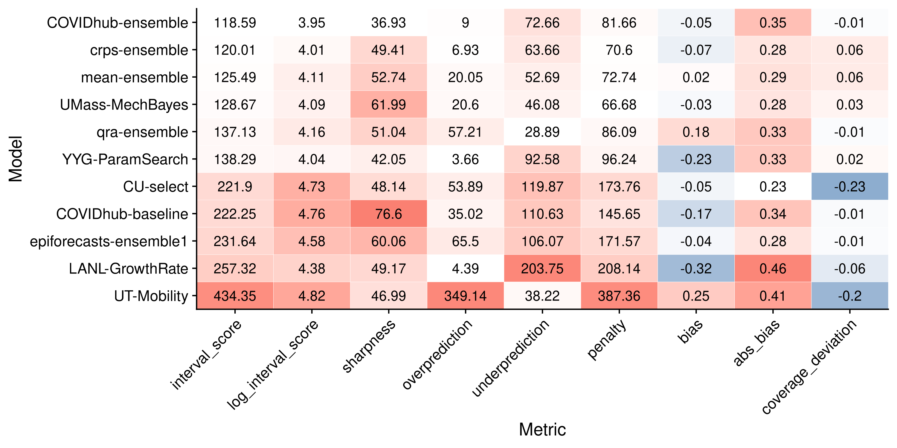
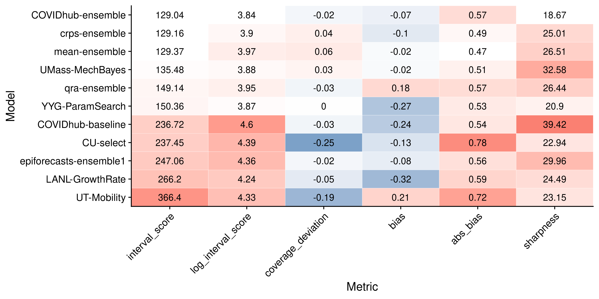
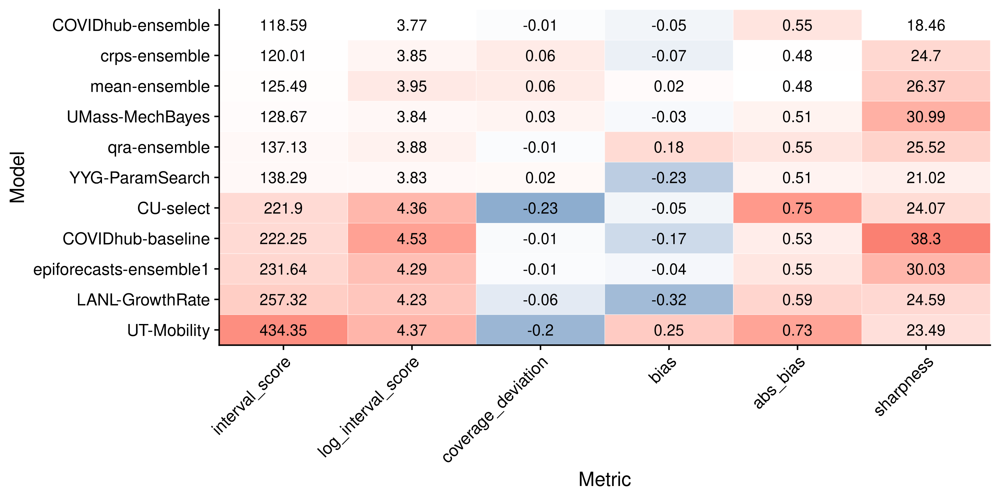
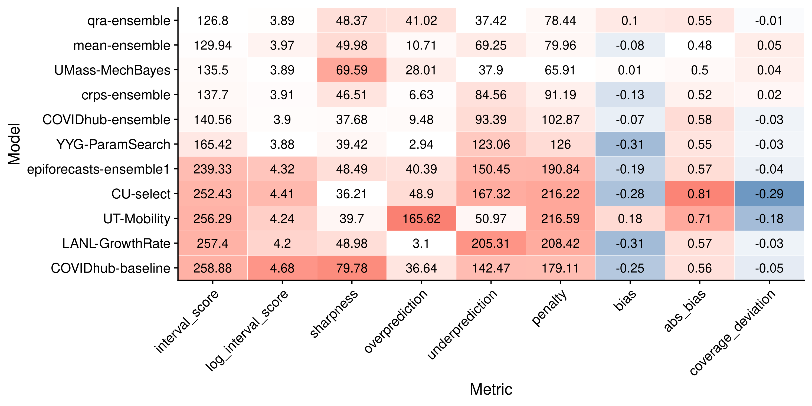
```

The same analysis is of course also interesting for the ensemble variants. Figure \@ref(fig:senitivity) therefore shows aggregated scores for all ensemble variants for the four different scenarios. REWORK INTERPRETATION. qra-ensemble-4 stays at the top consistently, it seems like qra is slightly outperforming crps. It still seems like crps-ensemble horizon 2 is best. 


``` {r senitivity-ensembles, echo = FALSE, fig.show = "hold", out.width = "50%", fig.cap = "Weights given to the different models in the ensemble over time"}


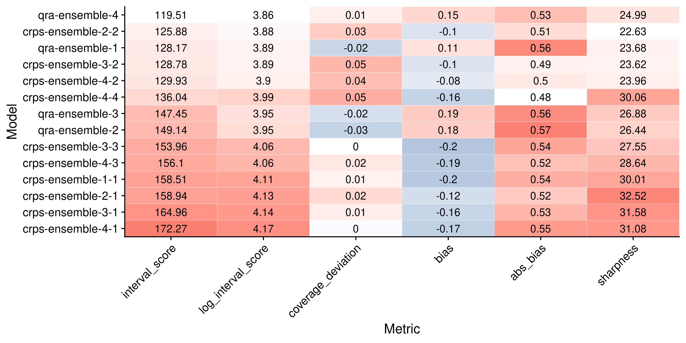
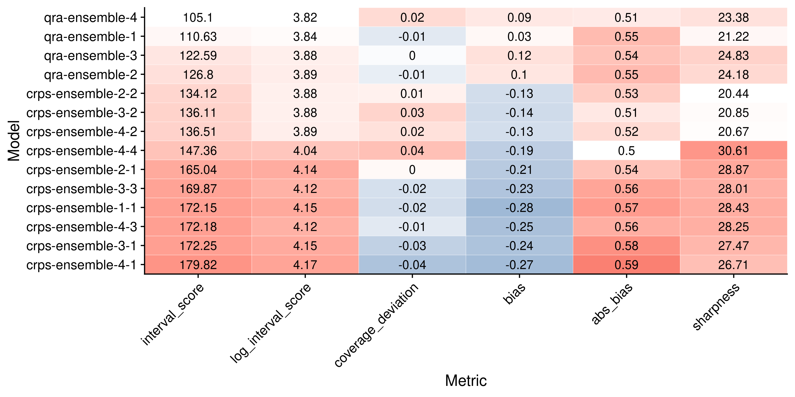
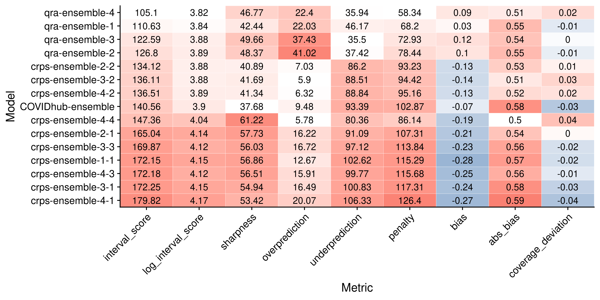
```


## Discussion / chapter summary

- Which states were easy to forecast? Which ones were hard to forecast? 
- exntension: dealing with missing forecasts
- sensitivity analysis: time included for ensemble weight estimation


<!-- old parts -->


<!-- In Figure \@fig(fig:coloured-summarised-scores) we could see that the qra-ensemble performs best by quite a margin. Figure \@ref(fig:heatmap-performance)  -->


<!-- shows that this the case because the qra-ensemble seems to perform well in the three most important locations (as judged by average WIS), while it doesn't excel in Pennsylvania, Massachusetts and Maryland.  -->


<!-- We see that the ensemble models do well which is of course expected (or at least hoped). Especially the qra-ensemble that learns weights from past observations performs well.  -->

<!-- The crps-ensemble does worse, but that as well is at least not unexpected. The crps ensemble implementation in this thesis entails fitting a gamma distribution to the set of predictive quantiles which is bound to lose a lot of precision. It is nevertheless a bit surprising just from this overview that the crps-ensemble does substantially worse regarding the WIS, even though it is only slightly less sharp but a lot less biased.  -->

<!-- We can clearly see that models seem to perform well or badly for different reasons. The COVIDhub-baseline model for example stands out for its lack of sharpness. The UT-mobility model predictions are very sharp, but they exhibit quite significant bias and a quite substantial fraction of true values falls out of the prediction its prediction intervals. Its good overall performance as judged by the weighted interval score (WIS) seems a bit puzzling at first glance, and we cannot yet tell what might serve to explain this.  -->

