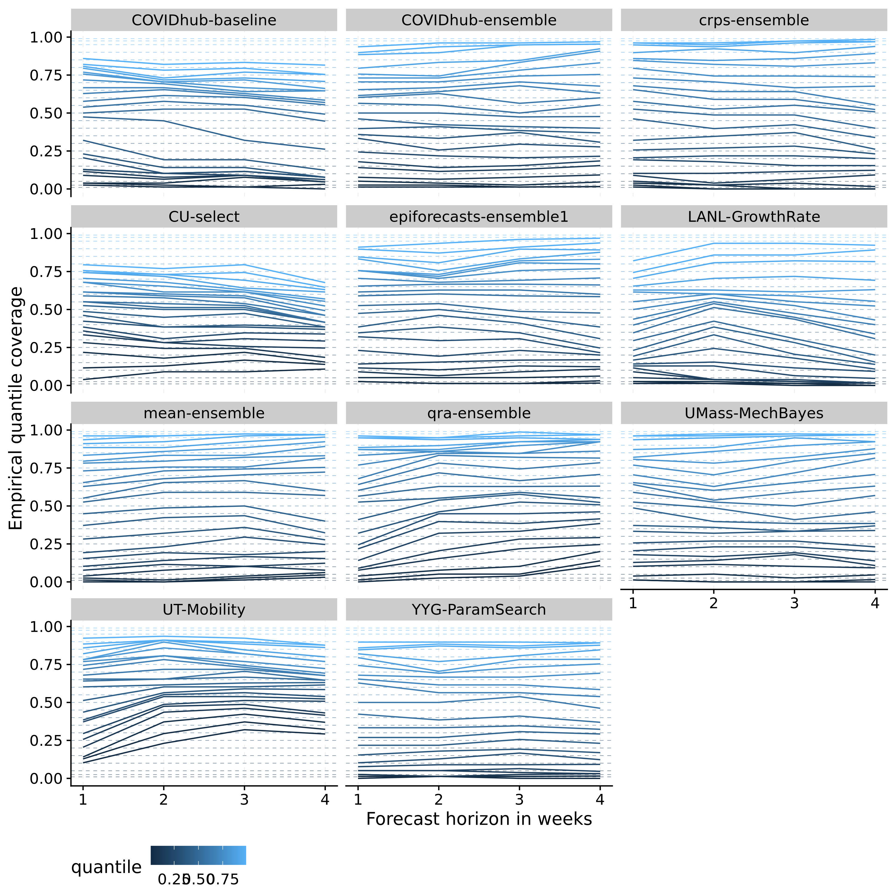

# Results - evaluation and aggregation of Covid-19 death forecasts {#results}

After Chapters \@ref(evaluation) and \@ref(model-aggregation) have laid out the theory behind model evaluation and model aggregation we can now apply these insights to the forecasts from the COVID-19 Forecast Hub. This chapter will examine the performance of the eight models (as described in Chapter \@ref(background-data)) from the Forecast Hub as well as three different ensembles of the eight original models. One of the original eight models is itself an ensemble of all models submitted to the Forecast Hub - this ensemble shall serve as a reference point against which we can compare our three ensembles. The following sections will first analyse model performance as a whole, followed by a more detailed discussion of the ensemble models. The general structure of the sections will follow the evaluation algorithm proposed in Chapter \@ref(evaluation). A brief discussion will conclude and summarise the results. 
WRITE THIS INTRODUCTION AGAIN AFTER STRUCTURE IS CLEAR

PURPOSE: UNDERSTAND THE SCORES BETTER


<!-- ## Evaluation of model performance -->

<!-- The following section is structured as follows:  -->
<!-- - first look at the data and the projections directly -->
<!-- - numerical grading of models using the weighted interval score -->
<!-- - look at calibration and sharpness to understand in which systematic ways models fail or succeed -->

## Forecast visualisation

In order to get a general sense for how the models do we shall first have a look at the projections versus the actual data. Figure \@ref(fig:models-us) gives an overview of the projections for one and four week ahead forecasts for the United States. Other states and horizons are omitted for the sake of clarity, but can be seen in the APPENDIX. From a brief look we can see that most models generally do a good job at capturing the dynamic one week ahead into the future. For four-week-ahead predictions, performance seems to deteriorate significantly. The mean-ensemble, the crps-ensemble and the UMass-MechBayes model seem to do a consistently good job at one and four week ahead predictions. The UT-Mobility looks good for one week ahead (except for the last time point), but performs poorly four weeks ahead. The LANL-GrowthRate model seems rather off regardless of the horizon. 

``` {r models-us, echo = FALSE, out.width = "95%", fig.cap = "One week ahead forecasts for the US from all models"}


```


## Summarised scores

Aggregated scores from the different metrics and proper scoring help us to summarise the complexity and nuances of overall model performance with a few numbers. They are therefore a sensible starting point before going deeper into assessing model calibration and sharpness. 

<!-- Table \@ref(tab:sum-scores) shows the summarised scores for all eleven models from the metrics presented in Chapter \@ref(evaluation).  -->


Figure \@ref(fig:coloured-summarised-scores) shows the same information in a colour-coded way. PROBABLY DROP THE UNCOLOURED TABLE?

<!-- ```{r sum-scores, echo=FALSE, results='asis'} -->
<!-- df <- readRDS("../visualisation/chapter-5-results/ -->
<!--                      summarised_scores.rds") -->

<!-- options(knitr.kable.NA = '') -->
<!-- knitr::kable( -->
<!--   df,  -->
<!--   caption = 'Evaluation metrics for all models, aggregated over all forecast dates, horizons and locations', -->
<!--   booktabs = TRUE)  -->
<!-- ``` -->


``` {r coloured-summarised-scores, echo = FALSE, out.width = "95%", fig.cap = "Colour coded summary of scores. Neutral / optimal values are shown in white, too low values in blue and too high values in red"}

knitr::include_graphics("../visualisation/chapter-5-results/coloured-summarised-scores.png")

```

We can see that our quick visual ranking largely corresponds to the weighted interval score ranking. The ensembles and UMassMechBayes rank at the top, while LANL-GrowthRate and UT-Mobility are ranked at the bottom. We don't, however, see the full picture from these aggregate scores. The epiforecasts-ensemble1, for example, does far worse than the UMass-MechBayes, even though both have similar values for coverage deviation, bias, absolute bias and sharpness. Absolute bias is reported in Figure \@ref(fig:coloured-summarised-scores), as bias is aggregated over both positive and negative values. We can see that the ranking is slightly different if we apply a log transformation to the weigthed interval score. This suggests that the average weighted interval score is dominated by extreme values. 


### Correlation between metrics

To get a clearer sense of how the different metrics relate, it seems sensible to look at the correlation between different metrics. Figure \@ref(fig:correlation-map) shows the correlation matrix. We can see that sharpness seems to have a surprisingly dominant influence on the weighted interval score. We can also see that bias and coverage deviation correlate strongly, which makes intuitive sense. A large absolute bias will lead to a lower empirical coverage which in turn results in a negative value for coverage deviation since 
$$\text{coverage deviation} = \text{empirical coverage} - \text{desired nominal coverage}$$. It is surprising to see, however that the correlation is nearly perfect and that coverage deviation and sharpness do not seem to correlate at all. Other weightings for the weighted interval score may yield different relative influences of the other metrics. It could therefore be sensible to adapt the weights, e.g. to get a stronger influence of the central intervals. This, however, is beyond the scope of this thesis. Note also that this correlation metric does not show how 'bias' and 'calibration' as abstract concepts correlate with the weighted interval score. Rather, it shows how the actual metrics chosen to measure bias and calibration correlate with the WIS - these may not actually cover all of what we would like them to cover. 

``` {r correlation-map, echo = FALSE, out.width = "95%", fig.align = "center", fig.cap = "Correlation between the different metrics "}

knitr::include_graphics("../visualisation/chapter-5-results/correlation-map.png")

```

Figure \@ref(fig:correlation-plot) shows a full correlation plot with all bivariate distributions. 

``` {r correlation-plot, echo = FALSE, out.width = "95%", fig.align = "center", fig.cap = "Correlation plot that shows bivariate scatter plots for all evaluation metrics."}

knitr::include_graphics("../visualisation/chapter-5-results/corr-plot.png")

```


Table \@ref(tab:regression-wis-metrics) shows a quick regression of the log weighted interval score on absolute bias, coverage deviation and sharpness. All regressors have been standardised, so the effect size should be interpreted in terms of standard deviations. Coverage deviation and sharpness have the expected sign while absolute bias does not. As we have seen in Figure \@ref(fig:correlation-map) bias and coverage deviation to correlate strongly, which might make estimation harder. Also for some reason it might be that coincidentally upwards biased models still performed well overall. 

HOW DO I EXPLAIN THIS? MAYBE JUST DROP THE REGRESSION ALTOGETHER??

``` {r regression-wis-metrics-code, eval = FALSE}
lm(log_scores ~ abs_bias_std + coverage_deviation_std + log_sharpness_std, 
   data = unsummarised_scores) 

```


```{r regression-wis-metrics, echo = FALSE}
library(magrittr)
unsum_scores <- readRDS("../visualisation/chapter-5-results/unsummarised_scores.rds") %>%
  dplyr::mutate(log_scores = log(interval_score),
                abs_bias_std = (abs(bias) - mean(abs(bias))) / sd(abs(bias)),
                coverage_deviation_std = (coverage_deviation -
                                            mean(coverage_deviation)) /sd(coverage_deviation),
                log_sharpness_std = (log(sharpness) - mean(log(sharpness)))/sd(log(sharpness)),
                sharpness_std = (sharpness - mean(sharpness))/sd(sharpness)) %>%
  dplyr::filter(is.finite(log_scores))


lm(log_scores ~ abs_bias_std + coverage_deviation_std + log_sharpness_std, data = unsum_scores) %>%
  broom::tidy() %>%
  knitr::kable(caption = 'Regression of the log weighted interval score on the (standardised) absolute bias, coverage deviation and sharpness. ',
  booktabs = TRUE)

```


### Scores by subgroups

Let us now try and break down the performance by different subgroups such as states and forecast horizons to obtain a better understanding of what drives differences in the overall model scores. Figure \@ref(fig:heatmap-performance) gives an overview of the model performance as judged by the WIS for every state. The colour indicates the overall rank that the model achieved in a given state. States are sorted from highest average interval score to lowest to illustrate contributions from different states. When averaging over different states, the overall weighted interval score is dominated by few very large values. Large WIS values are most common in states with high case numbers (as small relative errors translate to large absolute deviations) and for larger horizons (as uncertainty grows). 

MAYBE PLOT OF AVERAGE WIS VS NUMBER OF CASES OR / AND HORIZON

``` {r heatmap-performance, echo = FALSE, out.width = "95%", fig.cap = "Heatmap with the average of the weighted interval score over all horizons, states and forecast dates. The colouring indicates the rank of the model per state"}

knitr::include_graphics("../visualisation/chapter-5-results/heatmap-model-scores.png")

```

Figure \@ref(fig:heatmap-performance-horizon) shows performance over horizons instead of states. The colouring now indicates how much higher a score is relative to the score achieved for one-week-ahead forecasts by the model. Models are again sorted from lowest to highest average weighted interval score. RECHECK ORDER AGAIN. The plot highlights how much general model performance is affected by the accuracy of long term forecasts rather than short term forecasts. The qra-ensemble for example does very well for one-week-ahead forecasts, but its performance deteriorates further ahead into the future. 

``` {r heatmap-performance-horizon, echo = FALSE, out.width = "95%", fig.cap = "Heatmap with the average of the weighted interval score across all states and forecast dates. The colouring indicates how much higher a score is relative to the lowest average score achieved by a model"}

knitr::include_graphics("../visualisation/chapter-5-results/heatmap-model-scores-horizon.png")

```

We can also look at the contributions from different interval ranges to the overall weighted interval score. Figure \@ref(fig:scores-ranges) illustrates that the weighted interval score is more strongly influenced by the inner prediction intervals (small interval range) than the outer intervals (large range)

``` {r scores-ranges, echo = FALSE, out.width = "95%", fig.cap = "Interval scores across all states and forecast dates and horizons for different interval ranges"}

knitr::include_graphics("../visualisation/chapter-5-results/scores-by-range.png")

```

Let us now look at calibration and sharpness in detail. 


## Assessing Calibration

### Bias

Just as we did with in Chapter \@ref(evaluation), we start our analysis of calibration with bias. Figure \@ref(fig:bias-all) IS THIS A GOOD PLOT? shows bias for all models over different forecast horizons. We see that absolute bias tends to be a bit larger for greater horizons and that bias tends to be a bit larger for worse ranked models, but overall no overall no really clear picture emerges. 

``` {r bias-all, echo = FALSE, out.width = "95%", fig.cap = "Bias for all models and different horizons. The black dot denotes the median bias, the black square the mean bias and different colour shadings show the 20, 40, and 90 percent intervals of all observed quantile values. Models are again ordered according to their overall performance by WIS."}

knitr::include_graphics("../visualisation/chapter-5-results/bias-horizons.png")

```

For the purpose of model improvement, however, it would be useful to compare the evolution of bias over time with the actual predictions and observations. This could provide insights as to when models tend to biased or not. Figure \@ref(fig:bias-YYG) exemplifies this for the YYG-ParamSearch model. We can see that the model seems to have difficulties with picking up changes in trends. As death numbers were mostly starting to rise again during the time frame analysed here, this translates into a downward bias. As the bias in California (and to a certain extent in Georgia) suggests, this picture could have looked much different at another stage of the epidemic. 

``` {r bias-YYG, echo = FALSE, out.width = "95%", fig.cap = "Observations and predictions (top) as well as bias (bottom) for the YYG-ParamSearch model in the six states that exhibited the largest absolute bias."}


```


### Coverage

Figure \@ref(fig:interval-coverage-all) shows the empirical interval coverage for all different models. We see that especially CU-select and UT-mobility have problems with their interval coverage. The COVIDhub-baseline model seems to be covering too much by its inner prediction intervals, but too little by its outer intervals. While the aggregated coverage deviation score in Figure \@ref(fig:coloured-summarised-scores) looked acceptable, we can now conclude from this plot that the COVIDhub-baseline struggles a bit with calibration. The qra-ensemble and especially the COVIDhub-ensemble seem to do best in terms of coverage. Note that for the qra-ensemble this is maybe a little surprising as Figure \@ref(fig:coloured-summarised-scores) suggests the qra-ensemble has some issues with bias. Note again that empirical coverage only shows one kind of calibration and that good coverage is a necessary condition, but not sufficient to prove good calibration.

``` {r interval-coverage-all, echo = FALSE, out.width = "95%", fig.cap = "Coverage of the prediction intervals across all locations and forecast dates"}

knitr::include_graphics("../visualisation/chapter-5-results/interval-coverage-all.png")

```

Figure \@ref(fig:quantile-coverage-all) goes into more detail and shows the proportion of predictions lower than the true value for each quantile of the model predictions. This visualisation shows more information, but is also harder to interpret. Now the UMass-MechBayes model looks especially good, while the qra-ensemble seems less ideal than before. This quantile coverage representation allows us to investigate the bias component of calibration more precisely. We can for example see that the qra-ensemble which exhibits an upward bias (compare \@ref(fig:coloured-summarised-scores)) is moved to the left of the diagonal, while e.g. the YYG-ParamSearch, which is downward biased, is moved to the right. We can also see a slight discrepancy between the plot and the numerical values, as the YYG-ParamSearch model (bias: -0.13) looks about the same or even a bit further away from the diagonal than the qra-ensemble (bias: +0.21), even though the latter exhibits more absolute bias. This then of course brings up the question which of the ways to look at it is the 'better' one. A possible extension to this thesis could therefore be to analyse bias more closely in terms of quantile coverage deviation. 


``` {r quantile-coverage-all, echo = FALSE, out.width = "95%", fig.cap = "Coverage of the prediction intervals across all locations and forecast dates"}

knitr::include_graphics("../visualisation/chapter-5-results/quantile-coverage-all.png")

```

Another question of interest is how model calibration changes over prediction horizons, as this can give an indication of how well we far into the future we can confidently make predictions. Figure \@ref(fig:quantile-coverage-horizon) shows the quantile coverage over different prediction horizons. PLOT WITH INTERVAL COVERAGE IN APPENDIX?


We can generally see that coverage deterioarates with increasing forecast horizons for many models. 

Many models like the COVIDhub-baseline model or the YYG-ParamSearch model increasingly underpredict the true observed values. Others like the UT-Mobility model just seem to be overconfident for larger horizons. 
WORK ON THIS INTERPRETATION.

``` {r interval-coverage-horizon, echo = FALSE, out.width = "95%", fig.cap = "Coverage of the prediction intervals across all locations and forecast dates over different horizons"}

knitr::include_graphics("../visualisation/chapter-5-results/interval-coverage-horizons.png")

```

``` {r quantile-coverage-horizon, echo = FALSE, out.width = "95%", fig.cap = "Coverage of the prediction intervals across all locations and forecast dates over different horizons"}



```


 

``` {r coverage-deviation-range, echo = FALSE, out.width = "95%", fig.cap = "Coverage deviation for different ranges"}

knitr::include_graphics("../visualisation/chapter-5-results/coverage-deviation-by-range.png")

```


Figure \@ref(fig:coverage-deviation-states) shows the deviation by state. We see that some states are very prone to over- and underprediction. Nevertheless, better models tend to do better. 

``` {r coverage-deviation-states, echo = FALSE, out.width = "95%", fig.cap = "Coverage deviation for different ranges"}

knitr::include_graphics("../visualisation/chapter-5-results/heatmap-model-coverage.png")

```

### PIT histograms

Figure \@ref(all-pit-plots) shows the PIT histograms for all models. We can see that the Anderson-Darling test for uniformity is rejected for all models. We can take this as evidence that the models are all not perfectly calibrated, but we may probably also conclude that the Anderson-Darling test has limited value for most practical purposes of model differentiation. 

INTERPRETATION?!?

``` {r all-pit-plots, echo = FALSE, out.width = "95%", fig.cap = "PIT histograms for all models. Samples were obtained by first fitting a gamma distribution to the set of quantiles. "}

knitr::include_graphics("../visualisation/chapter-5-results/all-pit-plots.png")

```


## Assessing sharpness

INTRODUCION TO SECTION

Figure \@ref(fig:sharpness-horizons) is a stupid plot and should probably be replaced? 

Not much useful information apart from the fact that sharpness decreases with horizon

``` {r sharpness-horizons, echo = FALSE, out.width = "95%", fig.cap = "Sharpness over different horizons. "}


```


Figure \@ref(fig:scores-ranges) shows how different interval ranges contribute to the overall sharpness of a forecast (the sharpness value shown in Figure \@ref(fig:coloured-summarised-scores) is just the average). It generally seems that 50% intervals tend to contribute most to sharpnes, while neither narrow intervals near the median nor the tails of the predictive distribution seem to make large contributions. We also see again an overall trend that sharper models tend to do better (again with the slight exception of the top three models). 

``` {r sharpness-ranges, echo = FALSE, out.width = "95%", fig.cap = "Sharpness across all states and forecast dates and horizons for different interval ranges"}

knitr::include_graphics("../visualisation/chapter-5-results/sharpness-by-range.png")

```


## Regression analysis 

One possibility to try and make sense of the results is to estimated a mixed-effects model for the weighted interval score. 

A simple model is this: 


```{r random-effects-model-code, eval = FALSE}
fit <- lme4::lmer(log_scores ~ model * horizon + (1|state) + (1|forecast_date),
                  data = unsummarised_scores)

```


```{r random-effects-model, message = FALSE, echo = FALSE}
fit <- readRDS("../visualisation/chapter-5-results/random-effects-model.RDS")
fit %>%
  summary() %>%
  coef() %>%
  knitr::kable(caption = 'Mixed model regression of the log weighted interval score on model, horizon (both fixed), state, and forecast date (both random)',
  booktabs = TRUE)

```

Figure \@ref(fig:random-effects-locations) shows the random effects from the locations

``` {r random-effects-locations, echo = FALSE, out.width = "95%", fig.cap = "Random effects of the different locations"}


```
Figure \@ref(fig:random-effects-date) shows the random effects from the forecast dates. We see they are much smaller. 

``` {r random-effects-date, echo = FALSE, out.width = "95%", fig.cap = "Random effects of the different forecast dates"}


```


## Assessing ensemble performance

We now want to look more closely at the ensemble models to learn more about their behaviour. 


Most of the evaluation is already included in the analysis above. 


The following section will explore the ensemble models in a bit more detail. While the ensemble models were already included in the analysis above, some nuances will be highlighted again. 

Two things have to be kept in mind when looking at the ensemble models: First, the mean ensemble is of course itself a subset of the COVIDhub-ensemble. The COVIDhub-ensemble is itself a mean ensemble of all submitted and eligible models. Therefore the only difference we see in performance between the mean-ensemble and the COVIDhub-ensemble is due to the selection of models for this analysis. If models included here perform better on average, then we should expect the mean ensemble to outperform the COVIDhub-ensemble model. As Figure \@ref(fig:coloured-summarised-scores) shows this is not the case. The second thing to keep in mind is that the crps-ensemble implementation in this thesis entails fitting a gamma distribution to the set of predictive quantiles which is bound to lose some precision. It is therefore expected to the see the crps-ensemble perform worse and therefore rather surprising that it keeps up in performance with the other ensembles. 

### Additional details to forecast visualisation, bias, coverage, sharpness

Figure \@ref(fig:bias-ensemble) plots the observations and predictions, as well as bias, in the six locations with the highest WIS. We see that all models make very similar predictions. The qra-ensemble seems to have a slight tendency for higher bias values, but this is hard to infer just from looking at the plots. 

``` {r bias-ensemble, echo = FALSE, out.width = "95%", fig.cap = "Bias of the ensemble models"}
knitr::include_graphics("../visualisation/chapter-5-results/bias_ensemble.png")

```

Figure \@ref(fig:coverage-ensemble) shows interval and quantile coverage for all ensemble models. Looking at the quantile plot (on the right) we can now see the bias more pronounced in the qra-ensemble model. The COVIDhub-ensemble exhibits very good interval as well as quantile coverage. The crps-ensemble and the mean-ensemble have a slightly too high interval coverage. Interestingly though, the crps-ensemble looks somewhat downward biased in the quantile plot. Going back to Figure \@ref(coloured-summarised-scores), however, we hardly see any bias on the aggregate level. This may again warrant more investigation into different possible bias metrics. Visually, it seems, that the distance from the diagonal in the quantile plot correlates better with overall model performance as judged by WIS than distance in the interval coverage plot on the left (COVIDhub-ensemble as the top performer, qra-ensemble as the worst among the ensembles). 

``` {r coverage-ensemble, echo = FALSE, out.width = "95%", fig.cap = "Interval coverage (left) and quantile coverage (right)"}
knitr::include_graphics("../visualisation/chapter-5-results/coverage_ensemble.png")

```

Figure \@ref(fig:sharpness-ensemble) shows sharpness for every model and ensemble. We can see that the mean-ensemble and the qra-ensemble model are less sharp than the other two models. Comparing with Figure @\ref(fig:coverage-ensemble) we can now explain why the qra-ensemble still seems to maintain almost perfect interval coverage even though it is biased. The mean-ensemble, which is less biased, has even more interval coverage. 

``` {r sharpness-ensemble, echo = FALSE, out.width = "95%", fig.cap = "Sharpness of the ensemble models in different states. The shading indicates how much higher a certain sharpness value is compared to the minimum value achieved in that state."}
knitr::include_graphics("../visualisation/chapter-5-results/heatmap-sharpness-ensemble.png")

```


### Model weights over time

Figure \@ref(fig:weights-time) shows the weights over time. 

``` {r weights-time, echo = FALSE, out.width = "95%", fig.cap = "Weights given to the different models in the ensemble over time"}

knitr::include_graphics("../visualisation/chapter-5-results/weights-time.png")

```

Figure \@ref(fig:weights-vs-scores) shows the weights over time against the performance of the models. We can see that both ensembles prefer to include similar models. We can also see that model inclusion is not necessarily only determined by overall performance. For example, the CU-select and UT-Mobility model are included in both ensembles and seem to add something of value even though they are not among the top performers. 

``` {r weights-vs-scores, echo = FALSE, out.width = "95%", fig.cap = "Weights given to the different models in the ensemble over time"}

knitr::include_graphics("../visualisation/chapter-5-results/weights-vs-wis.png")

```


## Sensitivity analysis
- change the dates we looked at - the variation is actually crazy...


## Discussion 

- Which states were easy to forecast? Which ones were hard to forecast? 
- would be good to have a plot / some analysis on how good the gamma fit for the CRPS actually works
- restriction due to inclusion of the epiforecasts-ensemble1 --> locations and dates
- exntension: dealing with missing forecasts
- sensitivity analysis: time included for ensemble weight estimation
- break up interval score in width part and miss penalty part


<!-- old parts -->


<!-- In Figure \@fig(fig:coloured-summarised-scores) we could see that the qra-ensemble performs best by quite a margin. Figure \@ref(fig:heatmap-performance)  -->


<!-- shows that this the case because the qra-ensemble seems to perform well in the three most important locations (as judged by average WIS), while it doesn't excel in Pennsylvania, Massachusetts and Maryland.  -->


<!-- We see that the ensemble models do well which is of course expected (or at least hoped). Especially the qra-ensemble that learns weights from past observations performs well.  -->

<!-- The crps-ensemble does worse, but that as well is at least not unexpected. The crps ensemble implementation in this thesis entails fitting a gamma distribution to the set of predictive quantiles which is bound to lose a lot of precision. It is nevertheless a bit surprising just from this overview that the crps-ensemble does substantially worse regarding the WIS, even though it is only slightly less sharp but a lot less biased.  -->

<!-- We can clearly see that models seem to perform well or badly for different reasons. The COVIDhub-baseline model for example stands out for its lack of sharpness. The UT-mobility model predictions are very sharp, but they exhibit quite significant bias and a quite substantial fraction of true values falls out of the prediction its prediction intervals. Its good overall performance as judged by the weighted interval score (WIS) seems a bit puzzling at first glance, and we cannot yet tell what might serve to explain this.  -->

