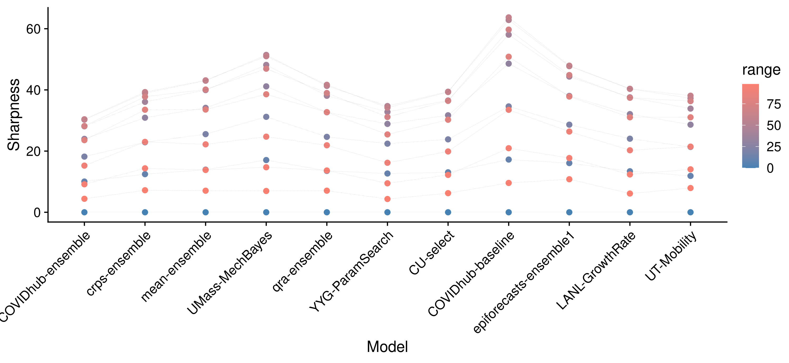
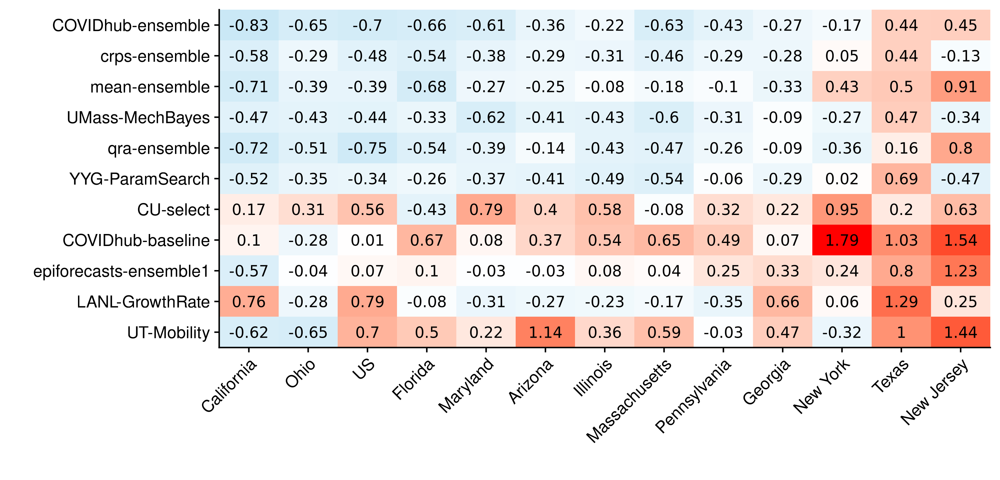
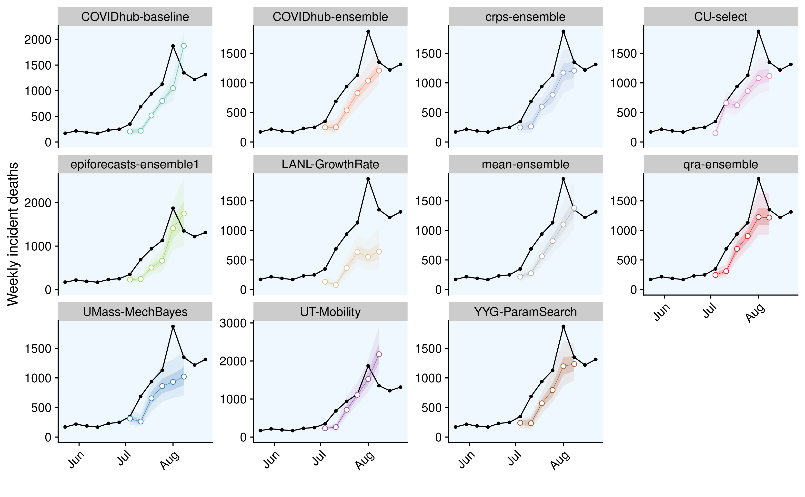
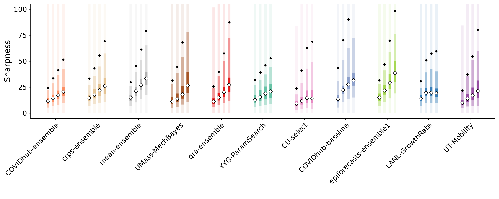

# Results - evaluation and aggregation of Covid-19 death forecasts {#results}

After chapters \@ref(evaluation) and \@ref(model-aggregation) have introduced the necessary tools for model evaluation and model aggregation, it is now time to apply these tools to the data introduced in Chapter Chapter \@ref(background-data). 

The overall goal of the model evaluation is to understand which models perform well and why. 

The structure of this Chapter largely follows the general structure proposed in Chapter \@ref(evaluation). 
At some times we digress to discuss additional aspects of interest. Examples: understanding the metrics better, looking at the ensemble models

The starting point of the analysis forms the visualisation of the forecasts and observed values. We then assess overall model performance to determine which models perform well and which less so. To that end we examine summarised scores and take a look at scores in terms of a mixed effects regression. This first analysis tells us which models perform well, but not why. In order to obtain an explanation, we subsequently analyse how the different metrics relate, what contributes to the performance measures and what drives differences in performance. We first examine correlations between the individual metrics. While this is not strictly necessary for the model evaluation, it provides us with a better understanding of the metrics we use. We then look at how different aspects of the predictive distribution contribute to different scores. This analysis focuses mainly on the weighted interval score (WIS) and breaks it down into its components, but we also look at how different ranges of the predictive distributions contribute to our measures of sharpness, calibration and overall performance. This again gives us a deeper understanding of the metrics, but is also a first step towards finding out what drives overall performance. We then look at the main external factors and especially the characteristics of the different locations that drive performance differences. After having analysed the properties of the metrics and external factors that drive differences in scores, we then look at the innate model properties that explain performance differences. We look at different aspects of calibration and sharpness in detail that help us to explain performance differences as well as hint to ways in which the models could be improved. 

The evaluation is followed by a more detailed look at the ensemble models that will discuss some specific aspects in more detail. These include a look at ensemble weights over time as well as analysis of different ensemble alternatives. REPHRASE THIS. 

The chapter will conclude with a brief sensitivity analysis that serves as a quick check of the plausibility of the inferences made throughout the chapter. 


Procedure: 

1) get a feeling for the data --> visualisation
2) get a ranking, e.g. if we wanted to make a quick decision
    --> summarised score
    --> regression
    
3) understand the metrics and what really drives them
    --> look at correlation between scores
    --> look at contributions from missing / too little sharpness
    --> look at contribution from individual ranges
    --> correlation between WIS and case numbers / WIS and horizons?
    --> contributions from states / 
    
4) understand what drives differences in performance 
    --> different states: which were the ones that models did badly in? 
    --> different horizons? when? interaction with states? 
    
5) understand individual models and how to improve them
    --> calibration
    --> sharpness

summary: do I find characteristics of well / badly performing models? 


Interesting questions
- how do different ranges contribute to scoes
--> if a score is not good, what do we look for? 
which states were hard to forecast and why? 
do models do consistently well or badly? 
What do models get right? 
	- trend changes
	- changes in uncertainty? 
Drivers of the WIS
	correlation metrics
	scores at different ranges
	scores at different locations
	

## Forecast visualisation {#visualisation}

A natural first starting point for the evaluation process is to visualise the forecasts and the observations to get a sense of the data. This visualisation forms an important baseline and a background against which all later results should be compared. Figure \@ref(fig:models-us) shows one and four-week-ahead forecasts for the United States as a whole. Plots for other locations can be seen in the APPENDIX. Plots like the one shown in Figure \@ref(fig:models-us) give us a first impression for how the models perform. 

From a brief look we can for example see that most models generally captured the dynamic one week ahead into the future well. For four-week-ahead predictions, performance seems to have deteriorated significantly. We can already identify models that did well and others that do less well. The mean-ensemble, the crps-ensemble and the UMass-MechBayes model for example made consistently good forecasts at one and four week ahead predictions. The UT-Mobility model looks good for one week ahead (except for the last time point), but performed poorly four weeks ahead. The LANL-GrowthRate model seems rather off regardless of the horizon. 

``` {r models-us, echo = FALSE, out.width = "100%", fig.cap = "One week ahead forecasts for the US from all models. Models are sorted alphabetically."}

knitr::include_graphics("../visualisation/chapter-5-results/scenario-baseline/US-forecast-1-4-wk-ahead.png")

```

## Summarised scores and overall performance {#summarised-scores}

We start our formal model evaluation by assessing overall model performance. To that end, we first look at aggregated scores from the different metrics that help us to summarise all the complexity and nuances in a few numbers. Afterwards, we use a regression framework to determine differences between models. This regression framework is not only helpful in terms of model selection, but also provides a starting point to determine the key factors that drive differences in overall model scores. 

Figure \@ref(fig:coloured-summarised-scores) shows the summarised scores for all eleven models from the metrics presented in Chapter \@ref(evaluation). Models are ordered according to the weighted interval score (WIS). This gives us a very concise overview of overall model performance. We can for example see a rather clear divide between the four ensembles, UMass-MechBayes and YYG-ParamSeach, and a second group less favourably ranked. This largely confirms the first visual impression obtained from Figure \@ref(fig:models-us). Note that model ranking is slightly different if we apply a log transformation to the WIS. This suggests that the average weighted interval score was substantially influenced by extreme values. We also see already that worse performing models tend to be more biased and to be either less calibrated or less sharp. 

``` {r coloured-summarised-scores, echo = FALSE, out.width = "100%", fig.cap = "Colour coded summary of scores. Neutral / optimal values are shown in white, too low values in blue and too high values in red. Overprediction and underprediction refer to the over- and underprediction penalty parts of the WIS. They are added together to form the column 'penalty' which again together with the 'sharpness' column sums up to the WIS. 'abs_bias' denotes the absolute bias. This was included, as the original bias summarises both positive and negative values and can therefore be misleading."}

knitr::include_graphics("../visualisation/chapter-5-results/scenario-baseline/coloured-summarised-scores.png")

```

To examine whether models are actually really signficantly different in their performance, we can use a mixed effects regression. This allows for a better founded decision in a model selection process, but also provides us more information about the main drivers of differences in weighted interval scores. In applications beyond this thesis, the regression framework is also very helpful in case of an incomplete set of predictions. If a certain research group for example misses a submission or does not submit forecasts in all states, then we can better mitigate this in a regression framework than by merely averaging over all available data. 

For our analysis, we employed a mixed-effects model with fixed effects for models and horizons and random effects for states and forecast dates. The model formula looks as shown below. Interval scores were log transformed to mitigate issues with heavy tails of the original distribution. As a baseline we took the COVIDhub-ensemble model (the top performer). This helps us to discern whether models at the top can actually be distinguished and show significant performance differences. 
```{r random-effects-model-code, eval = FALSE}
fit <- lme4::lmer(log_scores ~ model + horizon + (1|state) + (1|forecast_date),
                  data = unsummarised_scores)
```
Table \@ref(tab:random-effects-model) shows the results from that regression. We can see that the regression confirms general tendencies observed before. The overall ranking of model effects corresponds to the model ranking by log interval score presented in \@ref(fig:coloured-summarised-scores). The regression output suggests again a clear split between two groups of models in terms of performance. Models in the top group were roughly comparable, except for the mean ensemble and maybe the qra-ensemble which fared a bit worse. As expected, the horizon had a highly significant effect on the weighted interval score. 

```{r random-effects-model, message = FALSE, echo = FALSE, message=FALSE}
library(kableExtra)

fit <- readRDS("../visualisation/chapter-5-results/scenario-baseline/random-effects-model.RDS")
fit %>%
  summary() %>%
  coef() %>% 
  as.data.frame() %>%
  knitr::kable(caption = 'Mixed model regression of the log weighted interval score on model, horizon (both fixed), state, and forecast date (both random)')
# ,
#                format = "latex", 
#                booktabs = TRUE) %>%
#   kable_styling(latex_options="scale_down")

```
<!-- The mean-ensemble1 is interesting, because it looked much better when viewed in terms of the untransformed score, rather than log WIS. This suggests that mean-ensemble avoids outliers, but does a bit worse on a typical forecast.  -->

This regression approach can of course be adapted. We could for example include an interaction between model and horizon to control for the fact that some models cope better or worse with increasing uncertainty. It also seems sensible to model horizon as a factor instead of a metric variable. If we were especially interested in performance over say a four-week-ahead horizon, we could then estimate a separate effect for every model at horizon four by looking at the combination of the model effect and the interaction. 


## Examining the relationship between indivudal metrics

We now have a clear picture of overall model performance. In order to get a better understanding of what explains this picture, the following sections look at how the different metrics relate and what drives differences in scores. This section starts with examining the relationship between different metrics. 

Figure \@ref(fig:correlation-map) shows the correlation between all metrics. We can see that, as expected, the penalty and sharpness terms correlated very strongly with the weighted interval score, with the penalty having the strongest influence. . Bias and coverage deviation, as measured by the metrics described in Chapter \@ref(evaluation) seem to have had a weaker direct influence on the interval score. This is not necessarily a bad thing, it simply means that coverage deviation and bias measure things that the WIS does not capture directly. In this context it is important to note again that even though we do rely heavily on the WIS to assess performance, the WIS does not equal predictive performance, but is instead only one of many possible ways to measure it. As long as we follow the forecasting paradigm of maximising sharpness subject to calibration it does make sense to also take other measures into account. It is also interesting to see that absolute bias and coverage deviation were more strongly correlated with the log interval score than the original WIS. This makes sense if we think of the log WIS as less influenced by outliers. Coveragee deviation and 'bias' are also not very strongly affected by outliers. 

<!-- Bias, for example, broadly measures a similar thing like the over- and underprediction penalties do. It may, however, give you a clearer sense in terms of model improvement, as the percentage of values below or above the true value is not conflated with the actual width of the predictive intervals. Two models may have similar bias, but incur very different penalties, because one model is less sharp and even farther away from the observations. THINK ABOUT THIS AGAIN.  
It is therefore be useful to look at both aspects separately, but to understand how they interact. Note also that these correlations are influenced by the specific weighting, $\frac{\alpha}{2}$ chosen for the WIS and that other weights may yield different results. -->

<!-- We can also see that bias and coverage deviation correlate strongly, which makes intuitive sense. A large absolute bias will lead to a lower empirical coverage which in turn results in a negative value for coverage deviation since coverage deviation is calculated as the difference between empirical coverage and desired nominal coverage.  -->

``` {r correlation-map, echo = FALSE, out.width = "100%", fig.align = "center", fig.cap = "Correlation between the different metrics "}

knitr::include_graphics("../visualisation/chapter-5-results/scenario-baseline/correlation-map.png")

```

Figure \@ref(fig:correlation-plot) goes into even more detail and shows a full correlation plot with all univariate and bivariate distributions. We can clearly see on the diagonal that the WIS, as well as its components, have heavy tails. We can also make some other interesting observations: A positive coverage deviation (i.e. covering too much by stating too wide prediction intervals) is still associated with a lower WIS in the models analysed, even though a positive coverage deviation is also a form of miscalibration. This suggests that better models also tend to exhibit positive coverage deviation, but could be even better if they had narrower prediction intervals (i.e. increased sharpness). 

<!-- We also see that while absolute bias and coverage deviation correlate with WIS, the variance is still immense.  -->

``` {r correlation-plot, echo = FALSE, out.width = "100%", fig.align = "center", fig.cap = "Correlation plot that shows bivariate scatter plots for all evaluation metrics."}

knitr::include_graphics("../visualisation/chapter-5-results/scenario-baseline/corr-plot.png")

```

To discern the main determinants of the weighted interval score, we also ran a regression of the log weighted interval score on absolute bias, coverage deviation and sharpness and the penalty term. The result can be seen in Table \@ref(tab:regression-wis-metrics). All regressors have been standardised. We can see that all metrics had a strong and significant influence on the log WIS. The independent effects of 'sharpness' and 'coverage deviation' seem to have been especially pronounced. While not a definitive answer, this result supports the notion that it makes sense to take different metrics into account. 

``` {r regression-wis-metrics-formula, eval = FALSE}
fit <- lm(log_scores ~ abs_bias_std + coverage_deviation_std + sharpness_std + penalty_std,
   data = unsum_scores)
```


``` {r regression-wis-metrics, eval = FALSE}
fit <- readRDS("../visualisation/chapter-5-results/scenario-baseline/regression-wis.rds")

fit %>% 
   broom::tidy() %>% 
   knitr::kable(caption = 'Regression of the log weighted interval score on the (standardised) absolute bias, coverage deviation and penalty and sharpness.', 
                booktabs = TRUE)
```


## Identifying main contributors to the WIS

The last section has given us a better sense of how different metrics relate and has offered a first look at what aspects of the predictive distribution most strongly determine the interval scores. This section continues the analysis into what contributes to the weighted interval score. It first breaks the WIS down into its components, sharpness and penalties for over- and underprediction. Afterwards, it looks into how different ranges of the predictive distributions contribute to the different metrics and the WIS in particular. 

Figure \@ref(fig:wis-contributions) shows the WIS for all eleven models over different horizons, separated into its components sharpness, overprediction and underprediction. We immediately see that forecasts further ahead into the future incurred the largest WIS and therefore also had the largest impact on average WIS. We can also see that for most forecasts, the 'over-' and 'underprediction' constituted a bigger share of the overall WIS then 'sharpness'. This was especially true for less well performing models, while for the better performing models, the share of 'sharpness' relative to the overall WIS increased. This makes sense in the context of the forecasting paradigm where sharpness should become increasingly important once calibration is satisfied. We can also observe that most models obtained the majority of their penalties from underprediction. This is even true for models that according to Figure \@ref(fig:coloured-summarised-scores) exhibited no 'bias' or even a slight upward 'bias', like the mean-ensemble. This is not surprising given that seven out of thirteen locations, and especially the US as a whole, exhibited rising case numbers. Inaccuracies in one direction will be more severely punished than inaccuracies in the other. REWRITE THIS SENTENCE. 

``` {r wis-contributions, echo = FALSE, out.width = "100%", fig.align = "center", fig.cap = "Correlation plot that shows bivariate scatter plots for all evaluation metrics."}

knitr::include_graphics("../visualisation/chapter-5-results/scenario-baseline/wis-contributions.png")

```

To understand the the observed scores better we also looked at the contributions from different interval ranges to the different metrics. Figure \@ref(fig:scores-ranges) shows how different ranges of the predictive distributions contributed to overall WIS, sharpness, penalty, and coverage deviation. We can see that inner prediction intervals contribute most strongly, while outer intervals are less important. This can be explained by the weighting scheme of the interval score, as well as the fact that outer prediction intervals naturally incur less penalties from over- or underprediction. In terms of sharpness it seems that intervals around the 50% interval range have the strongest effect. Outer prediction intervals get weighted down, while inner intervals are too narrow to have a strong influence. In terms of coverage deviation, however, we see that problems in forecasts tend to be even more pronounced in the tails of the distribution, even though these tails matter less for WIS performance. 

``` {r scores-ranges, echo = FALSE, fig.show = "hold", out.width = "100%", fig.cap = "Story here: outer interval ranges are more wrong, but get weighted down"}

knitr::include_graphics("../visualisation/chapter-5-results/scores-by-range.png")
knitr::include_graphics("../visualisation/chapter-5-results/scenario-baseline/penalty-by-range.png")

knitr::include_graphics("../visualisation/chapter-5-results/coverage-deviation-by-range.png")

```


## Identifying external drivers of differences WIS

So far we have mostly analysed the behaviours of the different evaluation metrics and asked what are the most important contributors to the scores. In this section and the following one we want to examine what drives *differences* in WIS. This section identifies determinants other than the models themselves, while the next one examines individual model characteristics more closely. 

As a starting point, we can look again at the mixed-effects regression shown in Table \@ref(fig:REGRESSION). From the fixed effects estimates, we already know that the forecast horizon made a large difference in average scores. We can now go one step further and also analyse the estimated random effects from the regression. This is shown in Figure \@ref(fig:random-effects). We can see that forecast dates don't have a very strong effect, but that states do. This difference could be completely driven by differences in death numbers (remember the WIS is an absolute metric) or it could be due to variation in 'difficulty' in different states. The remainder of this section examines this more closely. 

``` {r random-effects, echo = FALSE, out.width = "100%", fig.cap = "Random effects of the different locations (left) and forecast dates (right"}
knitr::include_graphics("../visualisation/chapter-5-results/scenario-baseline/random-effects.png")

```

Figure \@ref(fig:wis-deaths) shows WIS from the different models on the y-axis versus deaths on the x-axis. The plot shows some variation in scores received by the models, but overall a very strong relationship is between average WIS and the number of deaths visible^[One could argue whether or not to include the US as a whole in this plot. On the one hand the overall US death numbers are closely related to the sum of death numbers from the twelve states analysed. On the other hand numbers were not identical as the majority of states was missing from the analysis. We could therefore also think of the US as just another very large state. We tried both options and found that the difference was very small in terms of the regression fit and the overall relationship observed.]. It therefore seems that most of the variation in observed interval scores in different states can be explained by the overall level of death numbers. It is still interesting to try and find which states were harder and easier to forecast. 

``` {r wis-deaths, echo = FALSE, out.width = "100%", fig.cap = "Story here: outer interval ranges are more wrong, but get weighted down"}

knitr::include_graphics("../visualisation/chapter-5-results/scenario-baseline/wis-vs-deaths.png")

```

One natural way would be to estimate difficulty as the difference between the interval scores actually observed in a state and the ones that would be expected from this relationship. To that end we fit the following regression to the log interval scores:

``` {r dfficulty-states-lm, eval = FALSE, message = FALSE}

fit <- lm(log(wis) ~ log(deaths), data = df)

```

Difficulty was then calculated as 
$$\text{difficulty}_{\text{location}} = \log(\text{WIS}) - (\beta_0 + (\text{intercept} + \beta_1 \cdot \log(\text{deaths}_{\text{location}}))$$
The results are shown in Figure \@ref(fig:dfficulty-states). We can see that indeed models consistently struggled with some states, but did well in others. Comparing this again to Figure \@ref(fig:us-data), however, we do not immediately see a clear picture emerge from this analysis. At least visually, for example, California looks harder to forecast than New Jersey. The states hardest to forecast according to Figure \@ref(fig:difficulty) still seem to be locations with high death numbers (the US as a whole as an exception). They include states with falling death numbers (New Jersey), states with rapidly increasing numbers (Texas) as well as states with very little change overall (New York). We can maybe explain New York as an outlier due to the high uncertainty and correspondingly high WIS of the COVIDhub-baseline model. Nevertheless we were not able to identify clear characteristics that correlate directly with how difficult a state is to predict. 

``` {r dfficulty-states, echo = FALSE, out.width = "100%", fig.cap = "Story here: outer interval ranges are more wrong, but get weighted down"}



```

We therefore also looked at coverage deviation by state to get a feeling for how much models were off in terms of calibration in different states. Figure \@ref(fig:coverage-deviation-states) shows this. We see that this corresponds a bit better to our intuition of how hard it is to forecast states. 
``` {r coverage-deviation-states, echo = FALSE, out.width = "100%", fig.cap = "Coverage deviation for different ranges"}

knitr::include_graphics("../visualisation/chapter-5-results/heatmap-model-coverage.png")

```

To complete the picture, Figure \@ref(bias-states) also shows 'bias' for the different states. We see that a substantial part of what makes states hard to predict is associated by a tendency among all models to over- or underpredict. 
``` {r bias-states, echo = FALSE, out.width = "100%", fig.cap = "Coverage deviation for different ranges"}

knitr::include_graphics("../visualisation/chapter-5-results/scenario-baseline/heatmap-model-bias.png")

```

To understand what is going on and what drives the dynamic it makes sense to look again at a plot of predictions vs. true values. This is unfortunately unfeasible to do for all states, but Figure \@ref(fig:pred-texas) exemplifies this by showing the one-week-ahead predictions and observed values in Texas. There, we can observe a rapidly changing trend that all models are unable to keep up with. 

``` {r pred-texas, echo = FALSE, out.width = "100%", fig.cap = "One week ahead predictions and observed values in Texas"}



```

## Understanding model characteristics that drive differences in WIS

The last section has looked into the main external drivers of differences in WIS. This section analyses characteristics inherent to the models themselves that explain differences in WIS. As a starting point we examine whether models perform substantially different in different locations, or whether models tend to perform conistently well or badly. We then look in detail at differences in Bias, Coverage, PIT histograms, Sharpness that serve to explain differences in performance. 

Figure \@ref(fig:heatmap-performance-states) shows the WIS of all eleven models in all thirteen locations. The shading indicates how much larger a score is than the lowest score achieved in that state. We see that models tended to perform rather consistently across locations. One exception is maybe the LANL-GrowthRate model that showed decent performance in a variety of smaller states^[The states that it did well in, New York, Illinois, Pennsylvania, Massachusetts and Maryland, were all states that exhibited rather flat or slightly declining behaviour.]. 

The following subsections look more closely into differences in calibration and sharpness that allow us to explain performance differences between the models. 

``` {r heatmap-performance-states, echo = FALSE, out.width = "100%", fig.cap = "Heatmap with the average of the weighted interval score over all horizons, states and forecast dates. The colouring indicates the rank of the model per state"}


```


### Looking closer at bias

Just as we did in Chapter \@ref(evaluation), we start our analysis of calibration with bias. While we have examined bias previously in this chapter, this was with the goal to detect differences in states that influence scores. In the following we look at bias to find differences in models. 

Figure \@ref(fig:bias-all) shows 'bias' as well as penalties from over- and underprediction for all models. Looking at 'bias' alone, see that better models seem to exhibit slightly less 'bias' and that predictions further ahead into the future seem a bit more 'biased'. But overall, no really clear picture emerges. If we also look at bias in terms of the over- and underprediction penalties incurred by the individual models, we clearly see that better models tend to avoid large penalties. If we compare this to Figures \@ref(fig:coloured-summarised-scores) and \@ref(fig:contributions-wis) we can clearly see the connection and trade-off between sharpness and misprediction penalties among the top performers. The UMass-MechBayes model, for example, largely avoids these penalties, but is also not very sharp. The COVIDhub-ensemble is much sharper, but also suffers more misprediction penalties. We also see a bit of a tension between both ways to measure bias. From the first plot, we would for example conclude that the COVIDhub-ensemble does very well in terms of 'bias'. From the second, we might draw that the model suffers from underprediction and that we could try and improve it by skewing it a bit upwards. 

INTERPRETATION Taking both plots together, a sensible conclusion would be that the model does well in terms of its
ADD MEAN TO THIS PLOT. 

``` {r bias-all, echo = FALSE, fig.show = "hold", out.width = "100%", fig.cap = "Bias for all models and different horizons. The black dot denotes the median bias, the black square the mean bias and different colour shadings show the 20, 40, and 90 percent intervals of all observed quantile values. Models are again ordered according to their overall performance by WIS."}


```

For the purpose of individual model improvement it seems most useful to compare the evolution of 'bias' over time with the actual predictions and observations. With the help of this comparison we can obtain insights regarding the particular situations that cause models to be biased or not. While this is of course unfeasible to do for all eleven models, Figure \@ref(fig:bias-ensemble) shows one-week-ahead predictions and  bias for the three ensemble models in the six locations with the highest average WIS. We see that all models make very similar predictions. The qra-ensemble seems to have a slight tendency for higher bias values, but this is hard to infer just from looking at the plots.
All models seems to have some difficulties with picking up rapid changes in trends. This is especially pronounced in Texas. We can see that models seem to overpredict when deaths are increasing (Arizona, Texas) and seem to underpredict when cases are decreasing (New Jersey, last two weeks in Arizona). 

``` {r bias-ensemble, echo = FALSE, out.width = "100%", fig.cap = "Observations and predictions (top) as well as bias (bottom) for the YYG-ParamSearch model in the six states that exhibited the largest absolute bias."}

knitr::include_graphics("../visualisation/chapter-5-results/bias_ensemble.png")

```


### Looking closer at coverage

We next turn to examine coverage. Figure \@ref(fig:coverage-all) shows the empirical interval and quantile coverage for all eleven models. The green shading indicates the areas of the plot that correspond to predictions which are further away from the median than they should, which mostly results in excessive coverage of the affected interval range. The interval coverage plots are especially good at giving us a first impression of overall model calibration.  In this regard, the COVIDhub-baseline model is an interesting example. While the aggregated coverage deviation score in Figure \@ref(fig:coloured-summarised-scores) looked very good, we can now immediately conclude that the COVIDhub-baseline model was not well calibrated. Interval coverage plots can, however, not tell us where a lack of coverage comes from exactly. The quantile coverage plots convey more information and can show us whether the issue is located in the lower or upper tails of the predictive distributions. If we look at the crps-ensemble for example, we see that it is consistently covering too much by its prediction intervals. The quantile coverage plot allows us to be more precise and say that the issue comes from the lower tails of the predictive distributions that tend to be too wide. 

The quantile coverage plots also allow us to reexamine the bias component of calibration again. We can for example see that the UT-Mobility and qra-ensemble, which exhibit an upward bias (compare \@ref(fig:coloured-summarised-scores)), are moved to the left of the diagonal, while e.g. the YYG-ParamSearch or the LANL-GrowthRate model, which are downward biased, are moved to the right. The COVIDhub-baseline model is again an interesting example, as it had a downward bias tendency, even though its median predictions were spot on. The line in the quantile coverage plot exactly crosses (0.5, 0.5), but Figure \@ref(fig:bias-all) shows that the model is still biased downwards on average and incurs more under- than overprediction penalties. 

We can, unsurprisingly, observe a general tendency for better performing models to also do much better in terms of interval and quantile coverage. Especially the COVIDhub-ensemble and the UMass-MechBayes models stand out, while models in the lower performance bracket look much less favourably. The only real exception to that pattern in Figure \@ref(fig:coverage-all) is the epiforecasts-ensemble1. It does look much better in terms of coverage than the other models that performed similarly well. 

``` {r coverage-all, echo = FALSE, out.width = "100%", fig.cap = "Coverage of the prediction intervals across all locations and forecast dates"}


```


One major advantage this type of visualisation has over PIT histograms is that we can easily compare different models in a single plot. Figure \@ref(fig:coverage-ensemble) exemplifies this for the ensemble models. It is obvious that the COVIDhub-ensemble did best in terms of interval as well as quantile coverage. The crps-ensemble and the mean-ensemble have a slightly too high interval coverage, which we confirms what we have already seen in the summarised scores in Figure \@ref(fig:coloured-summarised-scores). Looking at the quantile coverage plot (on the right) we can see clearly see that the qra-ensemble model is the most biased of all ensemble models. It is therefore maybe surprising to see the model looks quite well in terms of interval coverage (on the left). We can explain this discrepancy by taking sharpness into account. In Figures \@ref(fig:coloured-summarised-scores) and \@ref(fig:composition-wis) we could see that the COVIDhub-ensemble was much sharper than the other three ensembles which were about equally sharp. For the mean-ensemble and the crps-ensemble the increased width of the prediction intervals for the translated into a positive coverage deviation, while for the qra-ensemble it only mitigated the effect the increased bias would have had on interval coverage. This discrepancy between quantile and interval coverage, however, highlights again that interval coverage only shows one kind of calibration. Good interval coverage is a necessary condition, but not sufficient to prove good calibration. 

``` {r coverage-ensemble, echo = FALSE, out.width = "100%", fig.cap = "Interval coverage (left) and quantile coverage (right)"}


```

In some cases it can be interesting to also visualise calibration over states or the evolution of coverage over horizons. This can, for example, be an indicator of how far ahead into the future we can forecast. As these plots tend to be somewhat hard to interpret, we have omitted this analysis here, but included a plot of coverage over different horizons in the Appendix in Figure \@ref(fig:coverage-horizons).

### Looking closer at PIT histograms

In addition to looking at coverage plots, we can also approach calibration through PIT histograms. Figure \@ref(fig:all-pit-plots) shows the PIT histograms for all eleven models. We can immediately see that the Anderson-Darling test for uniformity is rejected for all models. Some of these models are indeed severely miscalibrated, as was shown before in the coverage plots. The Anderson-Darling test, however, seems again overly conservative and therefore only of limited value here for the practical purposes of model comparison. PIT histograms are arguably somewhat hard to interpret for many readers. However, they provide a very good way to succinctly summarise different aspects of calibration and show again a lot of the things previously observed in other plots. We can for example see again the bias in the qra-ensemble and the YYG-ParamSearch model. Or we can recognise the hump shape corresponding to the positive coverage deviation of the crps-ensemble and the mean-ensemble (the predictions are wider than they actually need be). We refrain from revisiting all these aspects again, but instead turn to sharpness now. 

``` {r all-pit-plots, echo = FALSE, out.width = "100%", fig.cap = "PIT histograms for all models. Samples were obtained by first fitting a gamma distribution to the set of quantiles. Note that the PIT plots shown here don't have the same scale on the y-axis, which make them easier to read on their own, but a bit harder to compare. "}

knitr::include_graphics("../visualisation/chapter-5-results/all-pit-plots.png")

```


### Looking at sharpness


We already discussed sharpness briefly when we looked at the overall composition of the WIS. Sharpness, we concluded, plays an increasing role in differentiating top performing models, while it is only a small part of overall WIS for those models that struggle with calibration. We now look at sharpness again more closely, both in terms of model comparison as well as in terms of model improvement. 

Figure \@ref(fig:sharpness-horizons) shows sharpness over different horizons for all eleven models. Prediction intervals tended to grow with increasing forecast horizons for almost all models. This provides a simple sanity check, as we should expect prediction intervals to grow with uncertainty. Only CU-select and LANL-GrowthRate somewhat failed this check as their median sharpness does not increase over all horizons. For the better performing models we mostly see a moderate increase with the only exception of UMass-MechBayes among the top performers that had substantial outliers in sharpness. Looking back at Figure \@ref(fig:contributions-wis), we see that this has indeed hurt the UMass-MechBayes model in terms of overall WIS performance. 

``` {r sharpness-horizons, echo = FALSE, out.width = "100%", fig.cap = "Sharpness over different horizons. "}



```
In order to understand and improve the individual model better it is again most helpful to plot sharpness next to predictions. Figure \@ref(fig:sharpness-crps-ensemble) does this for the crps-ensemble model for one-week-ahead predictions. We can see that sharpness does not really follow a clearly identifiable pattern. It is much larger, of course, in locations like the US as a whole that have many more cases. But we cannot really see the ensemble model consistently adapting to past mistakes. Ideally, we would want a model to make wider predictions whenever predictions and observations do not match (for example, when the trend changes) and narrower ones when past predictions and observations have matched. Unfortunately, none of the original PLOT IN APPENDIX models really seems to exhibit that kind of behaviour and the ensemble is not able to mitigate this shortcoming. Instead we see rather random looking changes in sharpness, e.g. in Arizona or in the US as a whole that do not seem to be informed by past errors. 

``` {r sharpness-crps-ensemble, echo = FALSE, out.width = "100%", fig.cap = "Sharpness over different horizons. for the CRPS ensemble model"}

knitr::include_graphics("../visualisation/chapter-5-results/scenario-baseline/sharpness-predictions-ensemble.png")

```


## Specific analysis of ensemble models

The past sections have provided a comprehensive evaluation of all eleven models, but have not devoted special attention to the analysis of the ensemble models. This section explores aspects specific to the ensembles. It focuses on the qra and the crps ensemble, as these are the ones of greatest interest for the purpose of this thesis. The first part examines how ensemble member weights evolve over time for the two model aggregation approaches. The second part then looks at different variants of the qra and crps ensemble varying the number of past observations to take into account or the horizon to optimise for. A regression framework is used again to determine differences between the different ensemble variants. 

The COVIDhub-ensemble and the mean-ensemble serve as a benchmark and a control for this analysis. The mean-ensemble is a control in the sense that all models in the mean-ensemble are also included in the COVIDhub-ensemble. If the mean-esemble had performed better than the COVIDhub-ensemble, then this would have indiciated that we had selected models that performed better than the average model submitted to the Forecast Hub. In this case, the crps- and qra-ensemble could have beaten the COVIDhub-ensemble by pure chance, by just randomly selecting models that performed better than the COVIDhub-ensemble. We should, on the other hand, hope for any ensemble not to perform significantly worse than the COVIDhub-ensemble, as it could then always improve performance by giving a weight of one to the COVIDhub-ensemble and therefore does not do optimally. 

Looking at the how ensemble weights evolve over time can give us insights about how the ensembles work. Figure \@ref(fig:weights-time) visualises this evolution. We can see that both model aggregation approaches seem to choose similar models for their ensembles and that qra weights seem to have stayed slightly more stable over time. It is interesting to see that both ensembles include models like the CU-select and the UT-Mobility models that are not among the top performers. 

``` {r weights-time, echo = FALSE, out.width = "100%", fig.cap = "Weights given to the different models in the ensemble over time"}

knitr::include_graphics("../visualisation/chapter-5-results/weights-time.png")

```

Figure \@ref(fig:weights-vs-scores) allows us to examine this in more detail and shows the weights over time against the WIS of the models. Performance is only shown for the first two horizons as these are the only ones that influence the ensembles. Note also that performance and weights are shown on the day of the forecast, so we should see a two-week delay between a forecast and the evaluation of the forecast for the ensemble formation. We see this delay for example on July 13th when the weight given to the UT-Mobility by the crps-ensemble suddenly jumps up two weeks after the model showed good performance. We can, however, also see that weaker models, like the CU-select model, are not only included because of evaluation delays. Instead, it seems they were able to add something of value to the ensembles even in spite of their problems. This strengthens the case for including diverse models into an overall ensemble. 

``` {r weights-vs-scores, echo = FALSE, out.width = "100%", fig.cap = "Weights given to the different models in the ensemble over time"}

knitr::include_graphics("../visualisation/chapter-5-results/weights-vs-wis.png")

```

So far we have looked at only one particular version of the crps- and the qra-ensemble with very specific parameter choices. For the purpose of a fair evaluation it makes sense to choose a sensible default instead of optimising the parameter settings in order to avoid overfitting. It is nevertheless interesting to see how other ensemble variants would have performed. This section therefore explores different ensembles with different parameters. 

For this analysis we ran the qra ensembles with one to four weeks of past forecasts. We call the models qra-ensemble-1 to qra-ensemble-4, where qra-ensemble-2 is equal to the default qra-ensemble used throughout this chapter. 

For the crps-ensemble, we also chose a forecast horizon to optimise for as `stackr` currently does not support multiple horizons. The second number in the crps-ensemble name therefore indicates the horizon for which the crps was optimised. The default model corresponds to crps-ensemble-2-2. Results slightly differ from the ones shown in Figure \@ref(fig:coloured-summarised-scores) as the model changes every run due to random sampling. Figure \@ref(fig:ensemble-comparison) shows aggregate model performance for the different ensemble variants. No obvious picture emerges regarding the superiority of either qra or crps ensembles. There is, however, a couple of interesting patterns to observe. Firstly, crps-ensembles optimised only on one-week-ahead forecast horizon tended to do worst, while those optimised on three and especially two weeks did best. For the crps ensemble it seems that the forecast horizon mattered more than the number of past forecasts included in the weighting. This is somewhat surprising given that qra-ensemble-1 (implying optimisation on one week ahead forecasts) is among the top performers. We would therefore expect the qra-ensemble-1 to perform similarly to crps-ensemble-1-1. We can also see that the qra-ensemble-4 and qra-ensemble-1 are top performers, while qra-ensemble-3 and qra-ensemble-2 are not. This casts doubt whether there is a clear best choice of the number of past observations to include.

``` {r ensemble-comparison, echo = FALSE, out.width = "100%", fig.cap = "Weights given to the different models in the ensemble over time"}

knitr::include_graphics("../visualisation/chapter-5-results/ensembles/scenario-baseline/coloured-summarised-scores.png")

```

``` {r regression-ensemble, echo = FALSE}
fit <- readRDS("../visualisation/chapter-5-results/ensembles/scenario-baseline/random-effects-model-ensemble.RDS")
fit %>%
  summary() %>%
  coef() %>% 
  as.data.frame() %>%
    dplyr::arrange(-Estimate) %>%
  knitr::kable(caption = 'Mixed model regression of the log weighted interval score on model (fixed), state, and forecast date (both random)',
               format = "latex", 
               booktabs = TRUE) %>%
  kable_styling(latex_options="scale_down")

```


INTERESTING: WEIGHTS OVER TIME

## Sensitivity analysis

In order to test the validity and robustness of the results obtained, this section presents a small validity analysis. This analysis could of course be expanded greatly. 

Instead of looking at the whole time window, the three latest dates were successively removed. Figure \@ref(fig:senitivity) shows the summarised scores for all models in the four different scenarios. We can see XXX. 

``` {r senitivity, echo = FALSE, fig.show = "hold", out.width = "50%", fig.cap = "Weights given to the different models in the ensemble over time"}

knitr::include_graphics("../visualisation/chapter-5-results/scenario-baseline/coloured-summarised-scores.png")
knitr::include_graphics("../visualisation/chapter-5-results/scenario-1/coloured-summarised-scores.png")
knitr::include_graphics("../visualisation/chapter-5-results/scenario-2/coloured-summarised-scores.png")

```

The same analysis is of course also interesting for the ensemble variants. Figure \@ref(fig:senitivity) therefore shows aggregated scores for all ensemble variants for the four different scenarios. REWORK INTERPRETATION. qra-ensemble-4 stays at the top consistently, it seems like qra is slightly outperforming crps. It still seems like crps-ensemble horizon 2 is best. 


``` {r senitivity-ensembles, echo = FALSE, fig.show = "hold", out.width = "50%", fig.cap = "Weights given to the different models in the ensemble over time"}

knitr::include_graphics("../visualisation/chapter-5-results/ensembles/scenario-baseline/coloured-summarised-scores.png")
knitr::include_graphics("../visualisation/chapter-5-results/ensembles/scenario-1/coloured-summarised-scores.png")
knitr::include_graphics("../visualisation/chapter-5-results/ensembles/scenario-2/coloured-summarised-scores.png")
knitr::include_graphics("../visualisation/chapter-5-results/ensembles/scenario-3/coloured-summarised-scores.png")
```


## Evaluation summary and limitiations

This chapter has presented a comprehensive model evaluation that was able to highlight a lot of important differences between models and problem with individual models. We found that ensemble models tended to perform very well and also found to of the three SEIR models among the top performers. Given the small number of models and observations, this should, however, be considered limited evidence. We found that better models were better calibrated and tended to be sharper and that these metrics were able to distinguish good from less ideal models. Some aspects, however, still remain unclear just from examining the metrics. This is partly owed to the fact that this chapter evaluated thirteen models at once, which makes it impossible to show all visualisations for all models in all different locations at different times. Depending on the aim of the evaluation, one could break the analysis down further and go into much more detail. Nevertheless, we may not be able to capture all nuances by only focussing on metrics and diagnostic plots. This seemed to be particularly true for the epiforecasts-ensemble1 model. 

If we look back at the summarised scores in Figure \@ref(fig:coloured-summarised-scores), we see a model that performs badly in terms of the interval score and its components, but rather well in terms of the other metrics. Apart from its penalty score, it looks roughly comparable with the UMass-MechBayes model. In Figure \@ref(fig:bias-all) it doesn't look particularly biased and in Figure \@ref(fig:coverage-all) it looks like it did well in terms of calibration. The model is not very sharp, but given the high penalties it already incurs it doesn't seem like increasing its sharpness would help to increase its performance. The high over- and underprediction penalties tell us that something is wrong, but unfortunately not what. This highlights again the importance of looking at plots of forecasts and observed values. Figure \@ref(fig:epiforecasts-enmsemble1) visualises one-week-ahead predictions in all thirteen locations. We see that the model tends to overpredict whenever death numbers are falling and underpredict whenever they are rising. We also see that the model tends to sometimes be wrong in a very unpredictable way. Especially forecasts for July 27th seem affected, where predictions as well as the uncertainty make a sudden unpredictable jump in many locations. This also underlines the importance of breaking down the evaluation in smaller subcategories as well as looking on the aggregate level. Had we plotted coverage of the epiforecasts-ensemble1 model in the individual states, we would have been able to diagnose some of these problems. 

``` {r epiforecasts-ensemble1, echo = FALSE, fig.show = "hold", out.width = "50%", fig.cap = "One-week ahead forecasts for the epiforecasts-ensemble1 model"}

knitr::include_graphics("../visualisation/chapter-5-results/scenario-baseline/APPENDIX-epiforecasts-ensemble1-forecasts.png")
```


