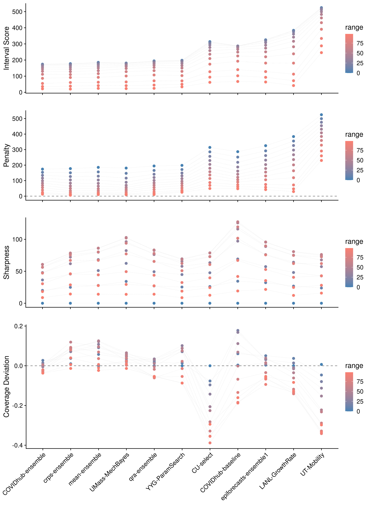
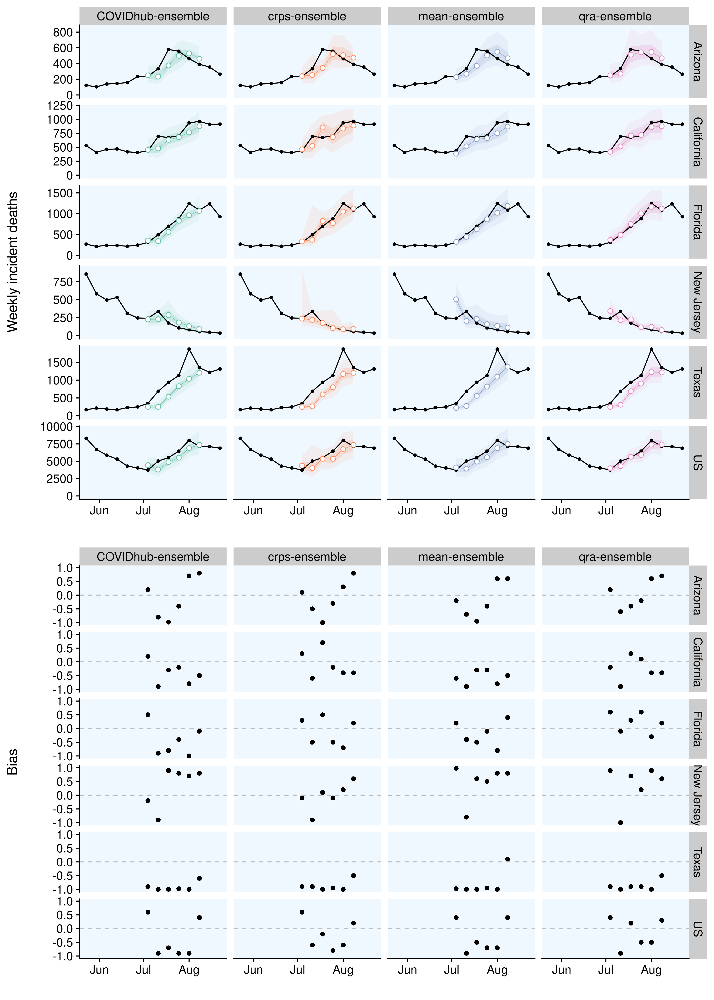
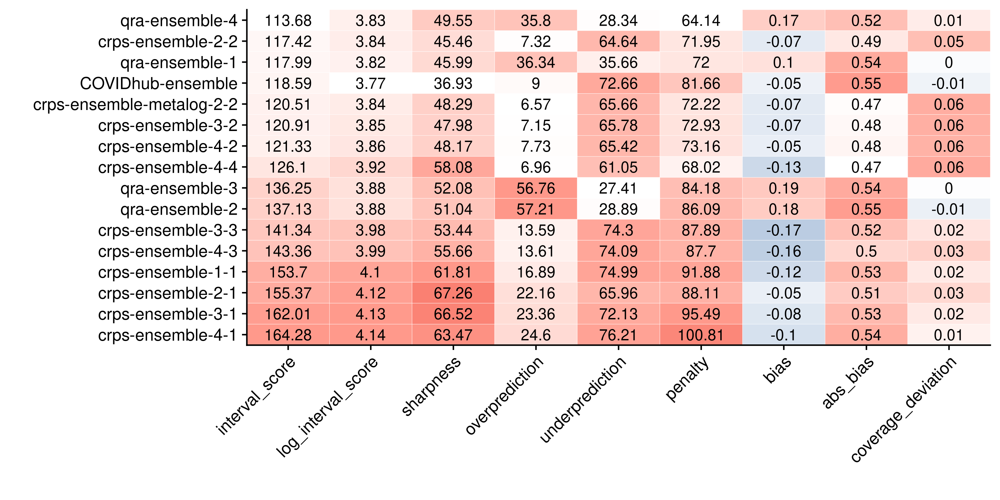

# Results - evaluation and aggregation of Covid-19 death forecasts {#results}

This chapter applies the tools presented in Chapters \@ref(evaluation) and \@ref(model-aggregation) to the data introduced in Chapter \@ref(background-data). We analyse the performance of the Forecast Hub models as well as the ensembles in detail to find out which models perform well and why. The structure of this chapter largely follows the general structure of the evaluation process proposed in Chapter \@ref(evaluation), at times digressing a bit further to discuss additional aspects of interest. The starting point of the analysis forms the visualisation of the forecasts in Section \@ref(visualisation). In Section \@ref(summarised-scores) we then assess overall model performance to determine which models perform well and which do not. To that end we examine summarised scores, as well as take a look at scores in terms of a mixed effects regression. We subsequently analyse how the metrics relate to each other, what contributes to the performance measures and what drives differences in performance. We first examine correlations between the individual metrics in Section \@ref(relationship). While this is not strictly necessary for the model evaluation, it provides us with a better understanding of the metrics themselves. Afterwards, in Section \@ref(contributors), we explore the main contributors to the various scores. This analysis focuses mainly on the Weighted Interval Score (WIS) and its components, but we also look at how different ranges of the predictive distributions contribute to our measures of sharpness, calibration and overall performance. In Section \@ref(external-drivers) we then look at the main external factors and especially characteristics of the locations that drive performance differences. After having analysed the properties of the metrics and external factors that drive divergences in scores, we examine the models themselves more closely. In Section \@ref(model-characteristics) we look at various aspects of calibration and sharpness in detail that help us to explain performance differences as well as hint to ways in which the models could be improved. The evaluation is followed by a discussion of the ensemble models in Section \@ref(ensemble-models) where we discuss some aspects specific to the ensembles in more detail. These include a look at ensemble weights over time as well as analysis of different ensemble alternatives. Finally, we present a small sensitivity analysis in Section \@ref(sensitivity) that serves to check the plausibility of the inferences made throughout the chapter. 


<!-- One final note on notation: Sometimes throughout this chapter it becomes necessary to distinguish abstract concepts like bias or sharpness from the actual metrics, also named *bias* or *sharpness*, that we use to measure these properties. We will therefore denote the metric in italic, and speak more broadly of the concept if we use terms like bias and sharpness.  -->


## Forecast visualisation {#visualisation}

A natural first starting point for the evaluation process is to visualise the forecasts and the observations to get a sense of the data. Figure \@ref(fig:models-us) shows one and four-week-ahead forecasts for the United States as a whole^[Plots for other locations can be seen in the Appendix, where visualisations for one-week-ahead predictions of all forecasts are provided.]. From a brief, look we can see that most models generally predicted death numbers adequately in the short term. For four-week-ahead predictions, performance seems to have deteriorated significantly. We can already identify differences between the candidates. The mean-ensemble, crps-ensemble and UMass-MechBayes model for example made consistently good forecasts at one and four week ahead predictions. The UT-Mobility model looks good for one week ahead (except for the last time point), but performed poorly with regards to longer-term forecasts. Predictions from the LANL-GrowthRate model seem rather off regardless of the horizon. 

``` {r models-us, echo = FALSE, out.width = "100%", fig.cap = "One week ahead forecasts for the US from all models. Observations are shown in black, median predictions ar marked by white points, ribbons show the 50 percent and 90 percent prediction intervals."}

knitr::include_graphics("../visualisation/chapter-5-results/scenario-baseline/US-forecast-1-4-wk-ahead.png")

```

## Summarised scores and overall performance {#summarised-scores}

We start our formal model evaluation by assessing overall model performance. To that end, we first look at aggregated scores from the different metrics that help us to summarise all the complexity and nuances in a few numbers. Afterwards, we present the results of mixed-effects regression used to determine differences between models. 

Figure \@ref(fig:coloured-summarised-scores) shows the summarised scores for all eleven models from the metrics presented in Chapter \@ref(evaluation). Models are ordered according to the Weighted Interval Score (WIS). Note that the model ranking was slightly different for log transformed values of the WIS. This suggests that the average Weighted Interval Score was substantially influenced by extreme values. This overview gives us a very concise summary of overall model performance. We can see a rather clear divide between two groups in terms of performance: the four ensembles, UMass-MechBayes and YYG-ParamSeach performed similarly well, whereas the second group was less favourably ranked. This largely confirms the first visual impression obtained from Figure \@ref(fig:models-us). We also see already that worse performing models tended to be more biased and to be either less calibrated or less sharp. 

``` {r coloured-summarised-scores, echo = FALSE, out.width = "100%", fig.cap = "Colour coded summary of scores. Neutral / optimal values are shown in white, too low values in blue and too high values in red. Overprediction and underprediction refer to the over- and underprediction penalty parts of the WIS. Summed together, they form the column 'penalty' which again together with the 'sharpness' column sums up to the WIS. The absolute bias was included as well, as the original bias included both positive and negative values and the average can therefore be misleading."}

knitr::include_graphics("../visualisation/chapter-5-results/scenario-baseline/coloured-summarised-scores.png")

```

To examine whether models were actually really significantly different in their performance, we employed a mixed-effects model with fixed effects for models and horizons and random effects for states and forecast dates. The model formula looks as follows: 
```
lmer(log_scores ~ model + horizon + (1|state) + (1|forecast_date)
```
Log Weighted Interval scores were used instead of the WIS to mitigate issues with heavy tails of the original distribution. As a baseline we took the COVIDhub-ensemble model (the top performer). This helped us to discern whether models at the top could actually be distinguished and show significant performance differences. 

Table \@ref(tab:random-effects-model) shows the results from that regression. We can see that the regression confirms general tendencies observed before. The overall ranking of model effects corresponds to the model ranking by log Interval Score presented in \@ref(fig:coloured-summarised-scores). The regression output suggests again a clear split between two groups of models in terms of performance. Models in the top group were roughly comparable and not significantly different from the COVIDhub-ensemble model, except for the mean ensemble and maybe the qra-ensemble which fared a bit worse. As expected, the horizon had a highly significant effect on the Weighted Interval Score. 

```{r random-effects-model, message = FALSE, echo = FALSE, message=FALSE}
fit <- readRDS("../visualisation/chapter-5-results/scenario-baseline/random-effects-model.RDS")
fit %>%
  summary() %>%
  coef() %>% 
  round(3) %>%
  as.data.frame() %>%
  dplyr::arrange(-Estimate) %>%
  knitr::kable(caption = 'Mixed model regression of the log Weighted Interval Score on model, horizon (both fixed), state, and forecast date (both random)', 
               format = "latex",
               linesep = "",
               booktabs = TRUE)
# ,
#                format = "latex", 
#                booktabs = TRUE) %>%
#   kable_styling(latex_options="scale_down")

```

This regression framework is not only helpful in terms of model selection, but also provides a starting point to determine the key factors that drive differences in overall model scores. This will be discussed later, when we examine the random effects from the regression output more closely. In applications beyond this thesis, the regression framework is also very helpful in case of an incomplete set of predictions. If a certain research group for example misses a submission or does not submit forecasts in all states, then we can better mitigate this in a regression framework than by merely averaging over all available data. The specific regression we used can of course be adapted. We could for example include an interaction between model and horizon to control for the fact that some models cope better or worse with increasing uncertainty. One could also model horizon as a factor instead of a metric variable. If we were, for example, especially interested in performance over a four-week-ahead horizon, we could then estimate a separate effect for every model at horizon four by looking at the combination of the model effect and the interaction. 


## Examining the relationship between individual metrics {#relationship}

Before we analyse the performance differences that became evident in the previous section, we take a closer look at how the various evaluation metrics relate. Figure \@ref(fig:correlation-map) shows the correlation between all metrics. We can see that, as expected, the penalty and sharpness terms correlated very strongly with the Weighted Interval Score. Penalty and WIS have the strongest correlation, and the overall penalty was again most strongly correlated with overprediction. Interestingly, penalty and sharpness were also positvely correlated. We should expect an increase in sharpness to lead to a decrease in penalties (as penalties only apply whenever an observation is outside the prediction interval). The fact that we see instead a positive correlation highlights that this analysis does not control for the performance level. Worse performing models evidently were less sharpn (i.e. had higher sharpness values) and also incurred more penalties at the same time. Bias and coverage deviation, as measured by the metrics described in Chapter \@ref(evaluation), had a weaker correlation with the Interval Score. This is an indication that coverage deviation and bias measure aspects that the WIS does not capture directly. Even though we do rely heavily on the WIS to measure performance, it is important to remind ourselves that the WIS does not in fact equal predictive performance, but is instead only one of many possible ways to measure it. As long as we follow the forecasting paradigm of maximising sharpness subject to calibration it does make sense to also take other measures into account. It is also interesting to see that absolute bias and coverage deviation were more strongly correlated with the log Interval Score than the original WIS. This makes sense if we think of the log WIS as less influenced by outliers, since coverage deviation and our bias metric also tend to be rather robust. Even if none of the prediction intervals covers the true value, coverage deviation and bias scores are bounded. The WIS, on the other hand, can take infinitely large values depending on how much the predicitve intervals have missed. 

<!-- Bias, for example, broadly measures a similar thing like the over- and underprediction penalties do. It may, however, give you a clearer sense in terms of model improvement, as the percentage of values below or above the true value is not conflated with the actual width of the predictive intervals. Two models may have similar bias, but incur very different penalties, because one model is less sharp and even farther away from the observations. THINK ABOUT THIS AGAIN.  
It is therefore be useful to look at both aspects separately, but to understand how they interact. Note also that these correlations are influenced by the specific weighting, $\frac{\alpha}{2}$ chosen for the WIS and that other weights may yield different results. -->

<!-- We can also see that bias and coverage deviation correlate strongly, which makes intuitive sense. A large absolute bias will lead to a lower empirical coverage which in turn results in a negative value for coverage deviation since coverage deviation is calculated as the difference between empirical coverage and desired nominal coverage.  -->

``` {r correlation-map, echo = FALSE, out.width = "100%", fig.align = "center", fig.cap = "Correlation between the different metrics "}


```

Figure \@ref(fig:correlation-plot) goes into even more detail and shows a full correlation plot with all univariate and bivariate distributions. We can clearly see on the diagonal that the distributions of the WIS, as well as its components, had heavy tails. We can also make another interesting observations: A positive coverage deviation (i.e. covering too much by stating too wide prediction intervals) was still associated with a lower WIS in the models analysed, even though a positive coverage deviation is in principle also a form of miscalibration. This suggests that better models also tended to exhibit positive coverage deviation. It also implies that these could have presumably performed even better had they had slightly narrower prediction intervals. 

<!-- We also see that while absolute bias and coverage deviation correlate with WIS, the variance is still immense.  -->

``` {r correlation-plot, echo = FALSE, out.width = "100%", fig.align = "center", fig.cap = "Correlation plot that shows bivariate scatter plots for all evaluation metrics."}

knitr::include_graphics("../visualisation/chapter-5-results/scenario-baseline/corr-plot.png")

```

To examine the main determinants of the Weighted Interval Score, we ran a regression of the log Weighted Interval Score on absolute bias, coverage deviation and sharpness and the penalty term. 
``` 
lm(log_scores ~ abs(bias) + coverage_deviation + sharpness + penalty)

```
The result can be seen in Table \@ref(tab:regression-wis-metrics). All regressors have been standardised, estimates should therefore be interpreted in terms of standard deviations away from the average values. We can see that all metrics had a strong and significant influence on the log WIS. This supports the idea to take multiple different metrics into account. The independent effects of 'sharpness' and 'coverage deviation' seem to have been especially pronounced. This makes sense in the context of the forecasting paradigm, but may as well just reflect the specific data set analysed here. 

``` {r regression-wis-metrics, echo = FALSE}
fit <- readRDS("../visualisation/chapter-5-results/scenario-baseline/regression-wis.rds")

fit %>% 
   broom::tidy() %>% 
   knitr::kable(caption = 'Regression of the log Weighted Interval Score on the (standardised) absolute bias, coverage deviation and penalty and sharpness.', 
                format = 'latex',
                linesep = "",
                booktabs = TRUE)
```


## Identifying main contributors to the WIS {#contributors}

The last section has given us a better sense of how different metrics relate and has offered a first look at what aspects of the predictive distribution most strongly determine the Interval Scores. This section continues the analysis into the main contributors of the various scores. We first split the WIS into its components: sharpness and the penalties for over- and underprediction. Afterwards, we look into how different ranges of the predictive distributions contribute to the different metrics and the WIS in particular. 

Figure \@ref(fig:wis-contributions) shows the WIS for all eleven models over different horizons, separated into its components sharpness, overprediction and underprediction. We immediately see that forecasts further ahead into the future received the largest WIS and therefore also had the largest impact on average WIS. We can also see that, especially for worse performing models, over- and underprediction penalties constituted a bigger share of the overall WIS than the sharpness component. For better performing models, the share of the sharpness component relative to the overall WIS increased. This makes sense in the context of the forecasting paradigm, where sharpness should become increasingly important once calibration is satisfied. We can also observe that most models incurred the majority of their penalties from underprediction. This is even true for models that according to Figure \@ref(fig:coloured-summarised-scores) exhibited no bias or even a slight upward bias, like the mean-ensemble. This underlines again that the bias metric behaves slightly different from the under- and overprediction component of the WIS. The former measures the innermost quantile that covered the true value. The latter measures the actual difference between predictions and observations and is therefore more sensitive to extreme values. It is therefore possible that inaccuracies in one direction get more severely punished than inaccuracies in the other, even if both types of inaccuracies appear equally often. 

``` {r wis-contributions, echo = FALSE, out.width = "100%", fig.align = "center", fig.cap = "Contributions to the Weighted Interval Score from its underpredictin (blue), overprediction (red) and sharpness (green) components."}

knitr::include_graphics("../visualisation/chapter-5-results/scenario-baseline/wis-contributions.png")

```

To understand the the observed scores better we also looked at the contributions from different interval ranges to the various metrics. Figure \@ref(fig:scores-ranges) shows these contributions to WIS, sharpness, penalty, and coverage deviation. We can observe that inner prediction intervals had the strongest influence on the WIS, while outer intervals mattered less important. This can be explained by the weighting scheme of the Interval Score, as well as the fact that outer prediction intervals naturally incur less penalties from over- or underprediction. In terms of sharpness it seems that intervals around the 50% interval range have the strongest impact. Outer prediction intervals get weighted down, while inner intervals are too narrow to have a strong influence. If we look at coverage deviation, however, we see that problems in forecasts tend to be even more pronounced in the tails of the distribution. These tails, however, matter less for the WIS as they receive only a small weight. 

``` {r scores-ranges, echo = FALSE, fig.show = "hold", out.width = "100%", fig.cap = "Weighted Interval Score (top), added penalties from over- and underprediction (second from top), sharpness component of WIS (third from top) and coverage deviatin (bottom) for all eleven models and different interval ranges. We can see that overall outer intervals contributed less to the total WIS."}



```


## Identifying external drivers of differences WIS {#external-drivers}

So far we have analysed the behaviours of the evaluation metrics and looked at the most important contributors to the scores. In this section and the following one we want to examine what drives differences in WIS. This section identifies determining factors other than the models themselves, while the next section examines individual model characteristics more closely. 

As a starting point, we look again at the mixed-effects regression shown in Table \@ref(tab:random-effects-model). From the fixed effects estimates, we already know that the forecast horizon made a large difference in average scores. We can now go one step further and also analyse the estimated random effects from the same regression model. These are shown in Figure \@ref(fig:random-effects). We can see that forecast dates did not have a very strong effect, but that states did. This difference between the states could have been completely driven by differences in death numbers or it could be due to variation in how difficult it was to forecast certain states. The remainder of this section examines this more closely. 

``` {r random-effects, echo = FALSE, out.width = "100%", fig.cap = "Random effect estimates for the different locations (left) and forecast dates (right)"}
knitr::include_graphics("../visualisation/chapter-5-results/scenario-baseline/random-effects.png")

```

Figure \@ref(fig:wis-deaths) shows deaths on the x-axis versus Weighted Interval Scores per model on the y-axis. The plot shows substantial variation in scores, but overall a very strong relationship between average WIS and the number of deaths is visible^[One could argue whether or not to include the US as a whole in this plot. On the one hand the overall US death numbers are closely related to the sum of death numbers from the twelve states analysed. On the other hand numbers were not identical as the majority of states was missing from the analysis. We could therefore also think of the US as just another very large state. We tried both options and found that the difference was very small in terms of the regression fit and the overall relationship observed.]. It therefore seems that most of the variation in observed Interval Scores between states can be explained by the overall level of death numbers. We nevertheless continued and tried to identify states that were particularly hard to forecast. 

``` {r wis-deaths, echo = FALSE, out.width = "100%", fig.cap = "Plot of the Weighted Interval Score achieved by the models per location versus the average death number in that location. The black diamonds mark the median WIS for that location."}


```

One natural way to estimate state difficulty is to measure it as the difference between the Interval Scores actually observed in a state and the ones that would be expected from this relationship. To that end we fit the following regression to the log Interval Scores:
``` 

lm(log(wis) ~ log(deaths))

```
Difficulty was then estimated as 
$$\text{difficulty}_{\text{location}} = \log(\text{WIS}) - (\beta_0 + \beta_1 \cdot \log(\text{deaths}_{\text{location}})$$
The results are shown in Figure \@ref(fig:dfficulty-states). We can see that indeed models consistently struggled with some states, whereas others seem to have been easier to predict than expected by the number of their deaths. Comparing this to the visualisation of the observations from all locations in Figure \@ref(fig:us-data), however, we do not immediately see a clear picture emerge from this analysis. At least visually, for example, California looks harder to forecast than New Jersey^[New Jersey mayb be somewhat special due to the data issues mentioned in chapter \@(data-background)], New York or Pennsylvania. States with the hardest difficulty estimates still include states with very diverse patterns and trends. Some experienced falling death numbers (New Jersey, Pennsylvania) or very change at all (New York^[New York may be potentially considered an outlier as well, as overall performance in New York was strongly influenced by the high uncertainty and correspondingly high WIS of the COVIDhub-baseline model.]), while others saw their death numbers rapidly increase (Texas). 


``` {r dfficulty-states, echo = FALSE, out.width = "100%", fig.cap = "Estimated difficulty per state. Difficulty was estimated as the difference between actual log WIS and log WIS expected based on the relationship between log WIS and the log of the average death number."}

knitr::include_graphics("../visualisation/chapter-5-results/scenario-baseline/difficulty-states-heatmap.png")

```

We also looked at coverage deviation as well as bias by state to get a feeling for how much models were off in terms of calibration across states. Figure \@ref(fig:coverage-deviation-states) shows coverage deviation and Figure \@ref(fig:bias-states) shows 'bias' for all models and locations. These analyses corresponded a bit better to our intuition of how hard it is to forecast states. Most of the states on the left in Figure \@ref(fig:coverage-deviation-states) were states with slightly falling death numbers and relatively smooth curves. If we compare this to Figure \@ref(fig:bias-states), we see that a substantial part of what made states hard to predict was associated by a tendency among all models to over- or underpredict. 

``` {r coverage-deviation-states, echo = FALSE, out.width = "100%", fig.cap = "Average coverage deviation for all models and all thirteen locations."}

knitr::include_graphics("../visualisation/chapter-5-results/heatmap-model-coverage.png")

```

``` {r bias-states, echo = FALSE, out.width = "100%", fig.cap = "Average bias for all models and all thirteen locations."}


```
To understand what drives the dynamic it makes sense to look again at the visualisation of observed deaths in Figure \@ref(us-data). We see that models exhibited the strongest downward bias in the locations that saw their numbers increase (Texas, Georgia, California, US, Florida, Ohio, Arizona) and the strongest upward bias in the states with falling death numbers (New Jersey, Maryland, New York, Pennsylvania). While this is unfeasible for all states, Figure \@ref(fig:pred-texas) shows the one-week-ahead predictions and observed values in Texas as a case study. We can observe that Texas experienced a rapidly changing trend that all models were unable to keep up with. One particular feature that might have made Texas even harder to forecast than for example Georgia, California or Ohio, is that death numbers were very stable in the weeks following the stark increase. On the other hand, a similar observation could be made for death numbers in Florida, but bias was less pronounced there than in Texas. One could also argue that we should have expected bias to be even higher in states like Ohio, Georgia or California where deaths were falling before the change in trend. While we can make plausible hypotheses, we ultimately have to acknowledge that is hard to draw definitive conclusions with limited knowledge of how predictions were generated. 


``` {r pred-texas, echo = FALSE, out.width = "100%", fig.cap = "One week ahead predictions and observed values in Texas"}

knitr::include_graphics("../visualisation/chapter-5-results/scenario-baseline/Texas-one-week.png")

```

## Understanding model characteristics that drive differences in WIS {#model-characteristics}

In the last section we have looked into the main external drivers of variation in WIS. This section analyses characteristics inherent to the models themselves that explain divergences in performance. As a starting point we examine whether models performed substantially different across locations, or whether models tended to perform conistently well or badly. We then look in detail at patterns in Bias, Coverage, PIT histograms, Sharpness that serve to explain performance differences. 

Figure \@ref(fig:heatmap-performance-states) shows the WIS of all eleven models in all thirteen locations. The shading indicates how much larger a score is than the lowest score achieved in that state. We see that models tended to perform rather consistently across locations. This may be an indicator that models tended to fail in very similar ways. At least, we can conclude that any relative strengths that models may have had were dwarfed by divergences in overall performance. The qra-ensemble, for example, with its tendency to overpredict did well in states like Texas or California that most models underpredicted. On the other hand, it did not perform exceptionally well in the US and in Florida, two locations which were also prone to underprediction. The YYG-ParamSearch model, which is downwards bias on average, does very well in some states with falling death numbers (New York, New Jersey, Illinois), but mediocre in others (Massachusetts, maybe Maryland). It also is the best performing model in Georgia, one of the states that showed consistent underprediction by all models. We can hypothesise that models like the qra-ensemble or the YYG-ParamSearch might have had a relative advantage in locations with certain characteristics, but it is hard to identify general patterns, as overall performance clearly dominates the picture. To investigate further, the following subsections look more closely into differences in calibration and sharpness between the mdoels. 

``` {r heatmap-performance-states, echo = FALSE, out.width = "100%", fig.cap = "Average Weighted Interval Score for all eleven models and all thirteen locations. The colouring indicates how much larger a score is than the lowest score achieved in that state."}

knitr::include_graphics("../visualisation/chapter-5-results/scenario-baseline/heatmap-model-scores.png")

```

### Bias

Just as we did in Chapter \@ref(evaluation), we started our analysis of model calibration by examining systematic over- or underprediciton. Where we previously looked at bias with the goal to explain variation across states, this section investigates bias in order to explore differences in the models. 

Figure \@ref(fig:bias-all) shows our bias metric as well as penalties from over- and underprediction for all models. Looking at the bias metric in the top panel of the figure, we see that models with lower overall WIS were also rather less biased. We also see a slight increase in bias for increasing foreacast horizons. If we also look at bias in terms of the over- and underprediction penalties incurred by the individual models, we clearly see that better models tended to avoid large penalties. In comparison with summarised scores and the contributions to overall WIS showin with Figures \@ref(fig:coloured-summarised-scores) and \@ref(fig:wis-contributions) we can clearly see the connection and trade-off between sharpness and misprediction penalties among the top performers. The UMass-MechBayes model, for example, largely avoided these penalties, but was also not very sharp. This trade-off between sharpness and prediction penalties is a general challenge forecasters face. The COVIDhub-ensemble was much sharper, but also suffered more misprediction penalties. We also see a bit of a tension between both ways to measure bias. From the first plot, we would for example conclude that the COVIDhub-ensemble did very well in terms of 'bias'. From the second, we might draw that the model suffered from underprediction and that we could try and improve it by skewing it a bit upwards. 

``` {r bias-all, echo = FALSE, fig.show = "hold", out.width = "100%", fig.cap = "Top: Bias for all models and different horizons. The black dot denotes the median bias, the black square the mean bias and different colour shadings show the 20, 40, and 90 percent intervals of all observed quantile values. Models are again ordered according to their overall performance by WIS. Bottom: Over- and underprediction penalties incurred by the different models. Underprediction penalties were shown as negative to make the illustration more intuitive."}


```

For the purpose of individual model improvement it seems most useful to compare the evolution of bias over time with the actual predictions and observations. With the help of this comparison we can obtain insights regarding the particular situations that cause models to be biased or not. While this is of course unfeasible to do for all eleven models, Figure \@ref(fig:bias-ensemble) shows one-week-ahead predictions and bias for the three ensemble models in the six locations with the highest average WIS. We see that all models made rather similar predictions. Even though differences were small, the qra-ensemble model looks slightly ahead in many (Arizona, California, maybe Texas) of the locations displayed with an upwards trend, but not all. Since these locations saw severe underprediction across all models, this might point towards a small relative advantage that the qra-ensemble enjoys in such locations. All models seem to have had similar difficulties with picking up rapid changes in trends. This was especially pronounced in Texas, as was discussed previously, but is also true for the other locations. We can also again see that models tended to overpredict when deaths were increasing (Arizona, Texas) and tended to underpredict when cases were decreasing (New Jersey, last two weeks in Arizona). 

``` {r bias-ensemble, echo = FALSE, out.width = "100%", fig.cap = "Observations and predictions (top) as well as bias (bottom) for the four ensemble models in the six states that exhibited the largest absolute bias."}



```


### Coverage

We next turn to examine coverage. Figure \@ref(fig:coverage-all) shows the empirical interval and quantile coverage for all eleven models. The green shading indicates the areas of the plot that correspond to excessive coverage, or correspondingly in the case of the quantile coverage to predictive quantiles which tend to be more extreme than they should. The interval coverage plots are especially good at giving us a quick impression of overall model calibration. In this regard, the COVIDhub-baseline model is an interesting example. While the aggregated coverage deviation score in Figure \@ref(fig:coloured-summarised-scores) looked very good, we can now immediately conclude that the COVIDhub-baseline model was not well calibrated.  Interval coverage provide a very good first impression, but cannot tell us where a lack of coverage comes from exactly. Quantile coverage plots are a bit harder to interpret, but they convey more information and can show us whether an issue is located in the lower or upper tails of the predictive distributions. With regards to the crps-ensemble for example, we see from the interval coverage plot that it was consistently covering too much by its prediction intervals. The quantile coverage plot allows us to be more precise and say that the issue arose from the lower tails of the predictive distributions that tended to be too wide. 

``` {r coverage-all, echo = FALSE, out.width = "100%", fig.cap = "Interval and quantile coverage for all models  across all locations and forecast dates"}

knitr::include_graphics("../visualisation/chapter-5-results/scenario-baseline/coverage-plots.png")

```

The quantile coverage plots also allow us to reexamine the bias component of calibration again. We can for example see that the UT-Mobility and qra-ensemble, which exhibited an upward bias (compare again the summarised scores in Figure \@ref(fig:coloured-summarised-scores)), are moved to the left of the diagonal, while e.g. the YYG-ParamSearch or the LANL-GrowthRate model, which were downward biased, are moved to the right. The COVIDhub-baseline model is again an interesting example, as it had a downward bias tendency, even though its median predictions were on average spot on^[Note again that this finding was heavily influenced by the selection of states for this analysis. Had we analysed a different set of locations, we might have come to different conclusions]. The line in the quantile coverage plot almost exactly crosses (0.5, 0.5), but Figure \@ref(fig:bias-all) shows that the model was nevertheless biased downwards on average and incurred more under- than overprediction penalties. 

We can, unsurprisingly, observe a general tendency that better performing models also showed better results in terms of interval and quantile coverage. Especially the COVIDhub-ensemble and the UMass-MechBayes models stand out in Figure \@ref(fig:coverage-all), while models in the lower performance bracket look much less favourably. The only real exception to that pattern is the epiforecasts-ensemble1. It does look much better in terms of coverage than other models that performed similarly well. To investigate further, one could examine calibration plots for the epiforecasts-ensemble1 model for every single location, but we omit this additional analysis here and instead show a plot of predictions versus observations in Figure \@ref(fig:epiforecasts-ensemble1). In the plot, we see that the model also exhibits a pattern of overprediction whenever death numbers were falling and underprediction whenever they were rising that results in the impression of a well calibrated model on an aggregate level. We also see that the model tended to sometimes be wrong in a very unpredictable way. Especially forecasts for July 27th seem affected, where predictions as well as the uncertainty made a sudden unpredictable jump in many locations. This again underlines the importance of breaking down the evaluation in smaller subcategories as well as looking on the aggregate level. 

``` {r epiforecasts-ensemble1, echo = FALSE, out.width = "100%", fig.cap = "One-week ahead forecasts for the epiforecasts-ensemble1 model"}

knitr::include_graphics("../visualisation/chapter-5-results/scenario-baseline/APPENDIX-epiforecasts-ensemble1-forecasts.png")
```

One major advantage this type of visualisation has over PIT histograms is that we can easily compare different models in a single plot. Figure \@ref(fig:coverage-ensemble) exemplifies this for the ensemble models. In terms of interval coverage (left in the plot), the COVIDhub-ensemble and the qra-ensemble did best, while the crps-ensemble and the mean-ensemble had a slightly too high interval coverage. These observations are in line with the summarised scores displayed in Figure \@ref(fig:coloured-summarised-scores). Looking on the right, we can clearly see the COVIDhub-ensemble also did best in terms of quantile coverage. Given its good interval coverage, it may be surprising to see that the qra-ensemble model was the most biased of all ensemble models. We can explain this discrepancy by taking sharpness into account: In Figures \@ref(fig:coloured-summarised-scores) and \@ref(fig:wis-contributions) we could see that the COVIDhub-ensemble was much sharper than the other three ensembles which were about equally sharp. For the mean-ensemble and the crps-ensemble the increased width of the prediction intervals translated into a positive coverage deviation, while for the qra-ensemble it only mitigated the effect the increased bias would have had on interval coverage. This slight discrepancy between quantile and interval coverage, highlights again that interval coverage only shows one kind of calibration. Good interval coverage is a necessary condition, but not sufficient to prove good calibration. 

``` {r coverage-ensemble, echo = FALSE, out.width = "100%", fig.cap = "Aggregated interval coverage (left) and quantile coverage (right) for all four ensemble models."}
knitr::include_graphics("../visualisation/chapter-5-results/coverage_ensemble.png")

```

In some cases it can be interesting to also visualise calibration over states or the evolution of coverage over horizons. This can, for example, be an indicator of how far ahead into the future we can forecast. As these plots tend to be somewhat hard to interpret, we have omitted this analysis here, but included a plot of coverage over different horizons in the Appendix in Figure \@ref(fig:coverage-horizons).

### PIT histograms

In addition to looking at coverage plots, we can also approach calibration through PIT histograms. Figure \@ref(fig:all-pit-plots) shows the PIT histograms for all eleven models. We can immediately see that the Anderson-Darling test for uniformity is rejected for all models. This suggests that all models were miscalibrated, but as discussed in Chapter \@ref(evaluation), the AD test may sometimes be overly conservative. For many of the models we indeed saw signs of severe miscalibration in the coverage plots in Figure \@ref(coverage-all). For others, like the COVIDhub-ensemble model, we may not want to reject calibration outright. Just on the basis of the AD test we can also not quantify miscalibration here. As all p-values are indistinguishably close to zero, the AD test is only of limited value here for the purpose of comparing models and differentiating betwen them. 

PIT histograms are arguably somewhat hard to interpret, but they provide a very good way to succinctly summarise different aspects of calibration in one plot. In contrast to coverage plots, they are able to convey an impression of the entire distribution of individual forecasts, instead of showing coverage on an aggregate level. This allows for a more holistic visualisation and an easier connection to overall performance. Let us take the epiforecasts-ensemble1 as an example. In the coverage plots shown previously, the model looked very well calibrated, apart maybe from the highest quantiles. In the PIT plots we also see a model that looks relatively well calibrated. We do however also see a large spike on the right that corresponds to situations were all predictions were below the observed value. These forecasts presumably led to the large underprediction penalties shown in Figure \@ref(bias-all). We can observe similar patterns in the PIT histograms for the COVIDhub-baseline, the CU-select


We can for example see again that the qra-ensemble and the YYG-ParamSearch model were biased, or we can recognise the hump shape corresponding to the positive coverage deviation of the crps-ensemble and the mean-ensemble (the predictions are wider than they actually need be). To avoid duplication, we refrain from revisiting all these aspects again, but stress again that PIT histograms can be a very useful way of looking at model calibration. 

``` {r all-pit-plots, echo = FALSE, out.width = "100%", fig.cap = "PIT histograms for all models. Samples were obtained by first fitting a gamma distribution to the set of quantiles. Note that the PIT plots shown here don't have the same scale on the y-axis, which make them easier to read on their own, but a bit harder to compare. "}

knitr::include_graphics("../visualisation/chapter-5-results/all-pit-plots.png")

```


### Sharpness

We already discussed sharpness briefly when we looked at the overall composition of the WIS. We concluded that sharpness plays an increasing role in differentiating top performing models, while it is only a small part of overall WIS for those models that struggle with calibration. We now look at sharpness again more closely, both in terms of model comparison as well as in terms of model improvement. 

Figure \@ref(fig:sharpness-horizons) shows sharpness over different horizons for all eleven models. As expected and intended, prediction intervals tended to grow with increasing forecast horizons, and therefore accounted for increasing uncertainty. Only CU-select and LANL-GrowthRate slightly failed this basic sanity check as their median sharpness did not increase over all horizons. For the better performing models we mostly observe a moderate increase^[For the UMass-MechBayes model we also observe substantial outliers in sharpness. Looking back at the breakdown of WIS into its components in Figure \@ref(fig:wis-contributions), we see that this has indeed hurt the UMass-MechBayes model in terms of overall WIS performance.]. We can also see that 

ABCHERE

For the CU-select, COVIDhub-baseline, epiforecasts-ensemble1, LANL-GrowthRate and UT-Mobility we obsere a lot of 

``` {r sharpness-horizons, echo = FALSE, out.width = "100%", fig.cap = "Sharpness for all models over different horizons. The black dot denotes the median sharpness, the black square the mean sharpness and different colour shadings show the 20, 40, and 90 percent intervals of all observed quantile values. Models are again ordered according to their overall performance by WIS. Values were capped at 110 to make models comparable."}

knitr::include_graphics("../visualisation/chapter-5-results/scenario-baseline/sharpness-horizons.png")

```
In order to understand and improve the individual model, it is again most helpful to plot sharpness next to predictions. Figure \@ref(fig:sharpness-crps-ensemble) shows this for the crps-ensemble model for one-week-ahead predictions. We can see that sharpness of the crps-ensemble model does not really follow a clearly identifiable pattern. As expected, it was much larger in locations like the US that saw more deaths on average. What we cannot see is the ensemble model consistently adapting in reaction to past mistakes. Ideally, we would want a model to make wider predictions whenever predictions and observations have not matched previously (for example, when the trend changes) and narrower ones when past predictions and observations have matched. Unfortunately, none of the original models really seems to have exhibited that kind of behaviour (compare the visualisations for one-week-ahead forecasts of all models in the Appendix) and the ensemble was not able to mitigate this shortcoming. Instead we see rather random looking changes in sharpness, e.g. in Arizona or in the national forecasts for the US that do not seem to be informed by past errors. 

``` {r sharpness-crps-ensemble, echo = FALSE, out.width = "100%", fig.cap = "Predictions (top) and sharpness (bottom) of the crps-ensemble model in different locations."}


```


## Specific analysis of ensemble models {#ensemble-models}

The past sections have provided a comprehensive evaluation of all eleven models, but have not devoted special attention to the analysis of the ensemble models. This section explores aspects specific to the ensembles. It focuses on the QRA and the CRPS ensemble, as these are the ones of greatest interest for the purpose of this thesis. The first part examines how ensemble member weights evolve over time for the two model aggregation approaches. The second part then looks at different variants of the QRA and CRPS ensemble varying the number of past observations to take into account or the horizon to optimise for. A regression framework is used again to determine differences between the different ensemble variants. 

The COVIDhub-ensemble and the mean-ensemble serve as a benchmark and a control for this analysis. The mean-ensemble is a control in the sense that all models in the mean-ensemble are also included in the COVIDhub-ensemble. If the mean-esemble had performed better than the COVIDhub-ensemble, then this would have indiciated that we had selected models that performed better than the average model submitted to the Forecast Hub. In this case, the crps- and qra-ensemble could have beaten the COVIDhub-ensemble by pure chance, by just randomly selecting models that performed better than the COVIDhub-ensemble. We should, on the other hand, hope for any ensemble not to perform significantly worse than the COVIDhub-ensemble, as it could always have improved its performance by giving a weight of one to the COVIDhub-ensemble. 

Looking at the how ensemble weights evolved over time can give us insights about how the ensembles work. Figure \@ref(fig:weights-time) visualises this evolution. We can see that both model aggregation approaches chose similar models for their ensembles and that QRA weights seem to have stayed slightly more stable over time. It is interesting to see that both aggregation techniques included models like CU-select and UT-Mobility in the ensemble, even though those were not among the top performers.Instead, it seems they were able to add something of value to the ensembles even in spite of their problems. 
``` {r weights-time, echo = FALSE, out.width = "100%", fig.cap = "Weights given to the different models in the two ensembles over time"}

knitr::include_graphics("../visualisation/chapter-5-results/weights-time.png")

```
Figure \@ref(fig:weights-vs-scores) allows us to examine this in more detail and shows the weights over time against the WIS of the models. Performance is only shown for the first two horizons as these were the only ones that influenced the ensembles. Note also that performance and weights are shown on the day of the forecast, so we should see a two-week delay between a forecast and the evaluation of the forecast for the ensemble formation. We see this delay for example on July 13th when the weight given to the UT-Mobility by the crps-ensemble suddenly jumped up two weeks after the UT-Mobility model showed good performance. We can, however, also see that the weaker models, like the CU-select model, were not only included because of evaluation delays. Rather, Figure \@ref(fig:weights-vs-scores) seems to confirm that even suboptimal models can play an important role in an ensemble. This strengthens the case for including diverse models into an overall ensemble. 

``` {r weights-vs-scores, echo = FALSE, out.width = "100%", fig.cap = "Performance (top) and weights in the two ensembles (bottom) of the eight orginal models over time. Colouring and the numbers in the top represent the model rank in terms of WIS among all the predictions from the original models made at that forecast date."}

knitr::include_graphics("../visualisation/chapter-5-results/weights-vs-wis.png")

```

So far we have looked at only one particular version of the crps- and the qra-ensemble with very specific parameter choices. For the purpose of a fair evaluation it makes sense to choose a sensible default instead of optimising the parameter settings in order to avoid overfitting. It is nevertheless interesting to see how other ensemble variants would have performed. This section therefore explores multiple ensemble variations with different parameter settings. An overview of the different variants explored is shown in Table \@ref(tab:ensemble-variants)

``` {r ensemble-variants}
df <- readRDS("../visualisation/chapter-5-results/scenario-baseline/ensemble-variants-table.RDS")

df %>%
  knitr::kable(caption = 'Overview of the ensemble variants tested',
               format = "latex", 
               linesep = "",
               booktabs = TRUE) %>%
  kableExtra::kable_styling(latex_options="scale_down")

```

For this analysis we ran the QRA ensembles with one to four weeks of past forecasts (called qra-ensemble-1 to qra-ensemble-4). The qra-ensemble-2 corresponds to the default qra-ensemble used throughout this chapter. For the crps-ensemble we also explored variants with one to four weeeks of past data included. As `stackr` currently does not support multiple horizons, we also varied the horizon we optimised four. The second number in the crps-ensemble name therefore indicates the horizon for which the CRPS was optimised. The default model corresponds to crps-ensemble-2-2. Results slightly differed from the ones shown in Figure \@ref(fig:coloured-summarised-scores) as the model changes every run due to random sampling. In addition to these variants, we also reran the crps-ensemble-2-2 model with a metalog distribution [@keelinMetalogDistributions2016] fitted to samples instead of a gamma distribution. The metalog distribution should in theory be more flexible and better able fit the distribution. Figure \@ref(fig:ensemble-comparison) shows aggregate model performance for the different ensemble variants. No obvious picture emerged regarding the superiority of either QRA or CRPS ensembles. There were, however, a couple of interesting patterns to observe. Firstly, crps-ensembles optimised only on one-week-ahead forecast horizon tended to do worst, while those optimised on three and especially two weeks did best. For the CRPS ensemble it seems that the forecast horizon mattered more than the number of past forecasts included in the weighting. This is somewhat surprising given that qra-ensemble-1 (implying optimisation on one week ahead forecasts) is among the top performers. We would therefore expect the qra-ensemble-1 to perform similarly to crps-ensemble-1-1. We can also see that the qra-ensemble-4 and qra-ensemble-1 were top performers, while qra-ensemble-3 and qra-ensemble-2 were not. This casts some doubt whether there is a clear best choice of the number of past observations to include. We can see that the metalog distribution did not perform better than the gamma distribution. 

``` {r ensemble-comparison, echo = FALSE, out.width = "100%", fig.cap = "Summarised scores for all ensemble variants explored."}



```

Table \@ref(tab:regression-ensemble) shows the results of a regression of the WIS on the different ensemble variants with the COVIDhub-ensemble model as the baseline. Given that estimates were not significant, we could distinguish the top performing qra-ensembles (one and four weeks of past data included) as well as the crps-ensembles optimised for two-week-ahead predictions from the COVIDhub-ensemble model. But again, we also see that none of the models was able to beat the COVIDhub-ensemble model. The qra-variants with two and three weeks of data and all other crps-ensembles did significantly worse, but we should not treat this as definitive evidence, given the limitied number of observations. Especially for the optimal amount of data to include in QRA ensembles, the observed pattern does not warrant strong conclusions. 


``` {r regression-ensemble, echo = FALSE}
fit <- readRDS("../visualisation/chapter-5-results/ensembles/scenario-baseline/random-effects-model-ensemble.RDS")
fit %>%
  summary() %>%
  coef() %>% 
  as.data.frame() %>%
  dplyr::arrange(Estimate) %>%
  knitr::kable(caption = 'Mixed model regression of the log Weighted Interval Score on model (fixed), state, and forecast date (both random)',
               format = "latex", 
               linesep = "",
               booktabs = TRUE) %>%
  kableExtra::kable_styling(latex_options="scale_down")

```


## Sensitivity analysis {#sensitivity}

In order to test the validity and robustness of the results obtained, this section presents a small sensitivity analysis. We looked at three different alternative scenarios. Scenario 1 simply removed the last time point from the evaluation. Scenario 2 removed the state New Jersey that has known data issues. Scenario 3 removed the last two evaluation time points as well as the US and New Jersey. Figure \@ref(fig:sensitivity) shows the summarised scores for the baseline as well as the other three scenarios. We can see that model rankings remained relatively stable across the different scenarios, which should increase the confidence in our findings. 

``` {r sensitivity, echo = FALSE, fig.show = "hold", out.width = "50%", fig.cap = "Summarised scores for all eleven models in the four different scenarios, 'baseline' (top left), '1' (top right), '2' (bottom left) and '3' (bottom right)"}

knitr::include_graphics("../visualisation/chapter-5-results/scenario-baseline/coloured-summarised-scores.png")
knitr::include_graphics("../visualisation/chapter-5-results/scenario-1/coloured-summarised-scores.png")
knitr::include_graphics("../visualisation/chapter-5-results/scenario-2/coloured-summarised-scores.png")
knitr::include_graphics("../visualisation/chapter-5-results/scenario-3/coloured-summarised-scores.png")
```

We also conducted a sensitivity analysis for the ensemble variants. Figure \@ref(fig:sensitivity-ensembles) shows aggregated scores for all ensemble variants for the four different scenarios. Results also seem relatively stable for the ensemble models. We can see that the qra-ensemble-4 consistently stayed at the top in terms of the Weighted Interval Score. The qra-ensemble-1 fared almost equally well, while the qra-ensemble-3 and qra-ensemble-4 lagged in performance. Only in scenario 3 were all QRA ensemble at the top. We should nevertheless be careful to conclude that one approach was superior to the other, given that many of the CRPS ensembles performed almost equally well. In terms of log WIS, differences were even smaller. The results weakly suggest that the QRA ensembles tended to exhibit slightly less variance in their performance across different parameters. But since we included more CRPS ensembles we should also expect more variation in their performance. The one observation that stands out the most is the strong difference between the qra-ensemble-1 and the crps-ensemble-1-1. 


``` {r sensitivity-ensembles, echo = FALSE, fig.show = "hold", out.width = "50%", fig.cap = "Summarised scores for the ensemble variants in the four different scenarios, 'baseline' (top left), '1' (top right), '2' (bottom left) and '3' (bottom right)"}


knitr::include_graphics("../visualisation/chapter-5-results/ensembles/scenario-1/coloured-summarised-scores.png")
knitr::include_graphics("../visualisation/chapter-5-results/ensembles/scenario-2/coloured-summarised-scores.png")
knitr::include_graphics("../visualisation/chapter-5-results/ensembles/scenario-3/coloured-summarised-scores.png")
```


