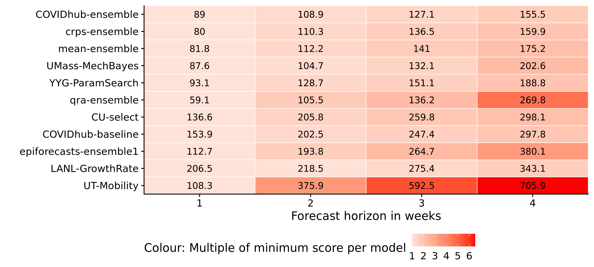

# Results - evaluation and aggregation of Covid-19 death forecasts {#results}

After Chapters \@ref(evaluation) and \@ref(ensemble) have laid out the theory behind model evaluation and model aggregation we can now apply these insights to the forecasts from the COVID-19 Forecast Hub. This chapter will examine the performance of the eight models (as described in Chapter \@ref(background-data)) submitted to the Forecast Hub as well as three different ensembles of the eight original models. One of the original eight models is itself an ensemble of all models submitted to the Forecast Hub - this ensemble shall serve as a reference point against which we can compare our three ensembles. The following sections will first analyse model performance as a whole, followed by a more detailed discussion of the ensemble models. A brief discussion will conclude and summarise the results. 


## Analysing model performance

The following section is structured as follows: 
- first look at the data and the projections directly
- numerical grading of models using the weighted interval score
- look at calibration and sharpness to understand in which systematic ways models fail or succeed


### Forecast visualisation

In order to get a general sense for how the models do we shall first have a look at the projections versus the actual data. Figure \@ref(fig:models-us) gives an overview of the projections for one and four week ahead forecasts just for the United States. We can see that most models generally do a good job at capturing the dynamic one week ahead into the future. For four-week-ahead predictions, performance seems to deteriorate significantly. APPENDIX: Plot with more states. 

``` {r models-us, echo = FALSE, fig.cap = "One week ahead forecasts for the US from all models"}

knitr::include_graphics("../visualisation/chapter-5-results/US-forecast-1-4-wk-ahead.png")

```


### Summarising perfomance through proper scoring rules

The weighted interval score allows us to summarise the complexity and nuances of overall model performance in one single number. We shall therefore take the weighted interval score as a starting point before going deeper into assessing model calibration and sharpness. Figure \@ref(fig:heatmap-performance) gives an overview of the model performance as judged by the WIS for every state. The colour indicates the overall rank that model achieved in a given state. States are sorted from highest average interval score to lowest to illustrate contributions from different states. Note that the average weighted interval score is dominated by large values. These tend to come from predictions made with a longer horizon for states with high numbers of cases.

``` {r heatmap-performance, echo = FALSE, fig.cap = "Heatmap with the average of the weighted interval score over all horizons, states and forecast dates. The colouring indicates the rank of the model per state"}

knitr::include_graphics("../visualisation/chapter-5-results/heatmap-model-scores.png")

```

Figure \@ref(fig:heatmap-performance-horizon) shows performance over horizons instead of states. The colouring now indicates how much higher a score is relative to the lowest average score achieved by the model. Models are again sorted from lowest to highest average weighted interval score. The plot highlights how much general model performance is affected by the accuracy of long term forecasts rather than short term forecasts. 

``` {r heatmap-performance-horizon, echo = FALSE, fig.cap = "Heatmap with the average of the weighted interval score across all states and forecast dates. The colouring indicates how much higher a score is relative to the lowest average score achieved by a model"}



```

Model XY seems to be doing best...

After having obtained of overall model performance we can now look at calibration and sharpness to get clearer picture of why models are performing well / badly. 

### Assessing Calibration

Figure \@ref(fig:interval-coverage-all) shows the empirical interval coverage for all different models. We see XXX INTERPRETATION

``` {r interval-coverage-all, echo = FALSE, fig.cap = "Coverage of the prediction intervals across all locations and forecast dates"}

knitr::include_graphics("../visualisation/chapter-5-results/interval-coverage-all.png")

```

Figure \@ref(fig:quantile-coverage-all) goes even more into deatils and shows the proportion of predictions lower than the true value for each quantile of the model predictions. 
We see XXX INTERPRETATION

``` {r quantile-coverage-all, echo = FALSE, fig.cap = "Coverage of the prediction intervals across all locations and forecast dates"}

knitr::include_graphics("../visualisation/chapter-5-results/quantile-coverage-all.png")

```

- plot calibration over states

THINK ABOUT SUMMING UP CALIBRATION AS A DIFFERENCE FROM ACTUAL COVERAGE

``` {r bias-all, echo = FALSE, fig.cap = "Coverage of the prediction intervals across all locations and forecast dates"}

knitr::include_graphics("../visualisation/chapter-5-results/bias-horizons.png")

```


- plot bias over horizons 
- plot bias over states


## Assessing ensemble performance

- detailed look at the ensemble models
e.g. calibration plots for different states just for the three ensembles


Which model perform well and why?

Which ensembling approaches perform well? 

Plot with weights over time


## Examining the three different model aggregation strategies

Table with performance of all ensembles over time

Calibration plot with all three (4) ensembles


## Discussion 

- Which states were easy to forecast? Which ones were hard to forecast? 
- would be good to have a plot / some analysis on how good the gamma fit for the CRPS actually works
- restriction due to inclusion of the epiforecasts-ensemble1 --> locations and dates
- exntension: dealing with missing forecasts
- sensitivity analysis: time included for ensemble weight estimation
- break up interval score in width part and miss penalty part

