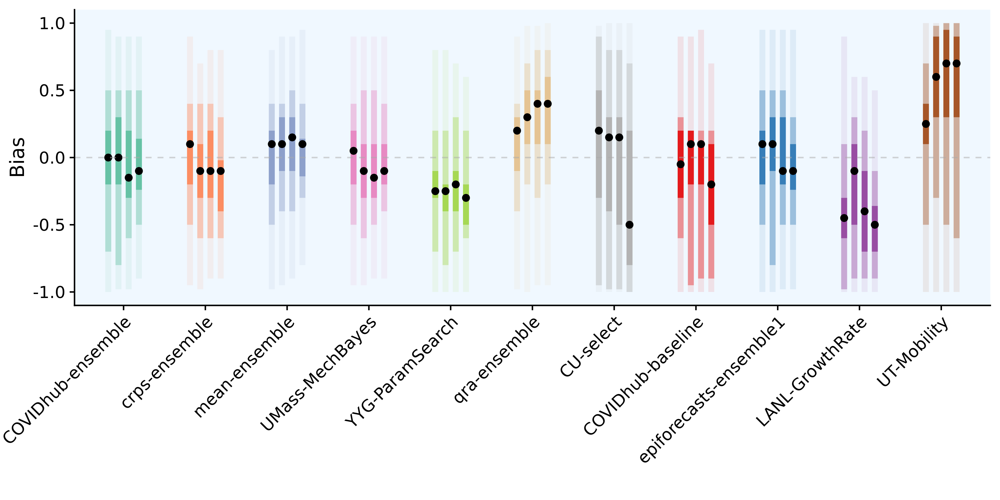
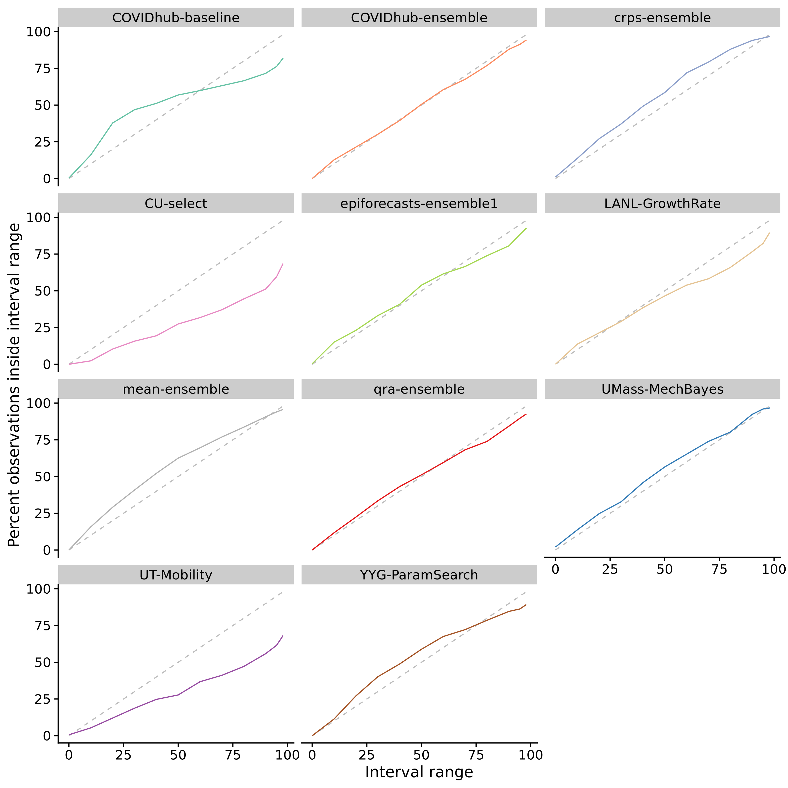
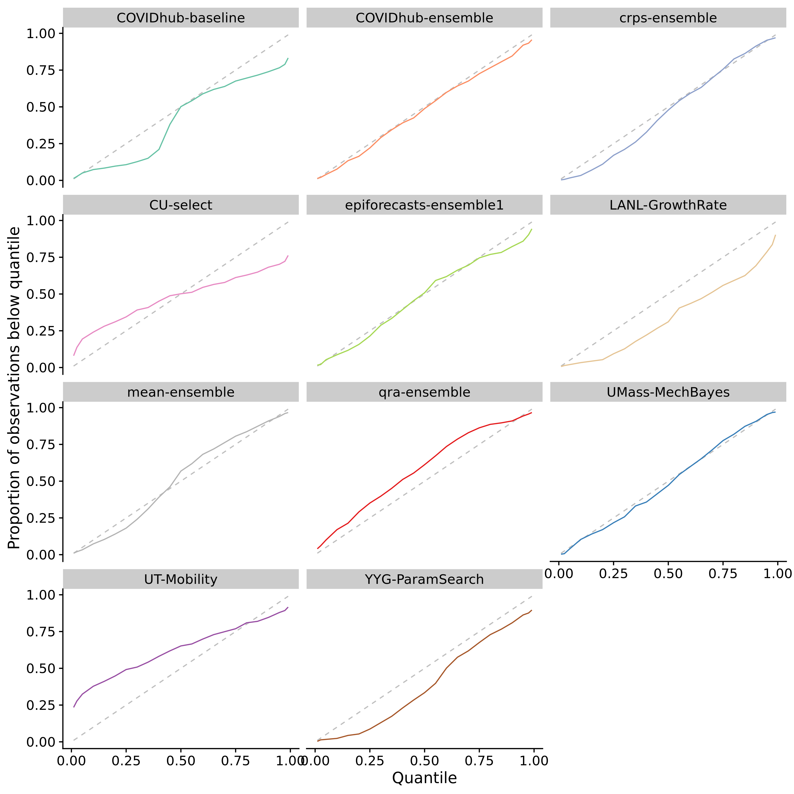
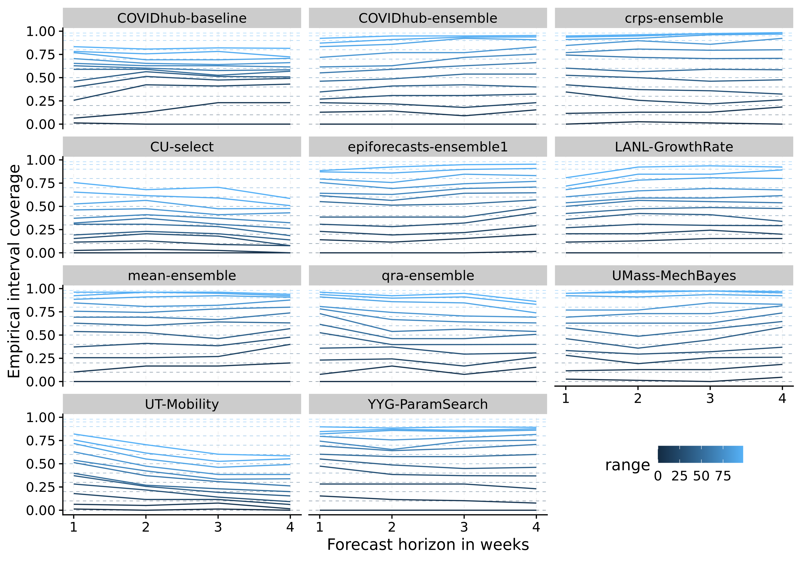
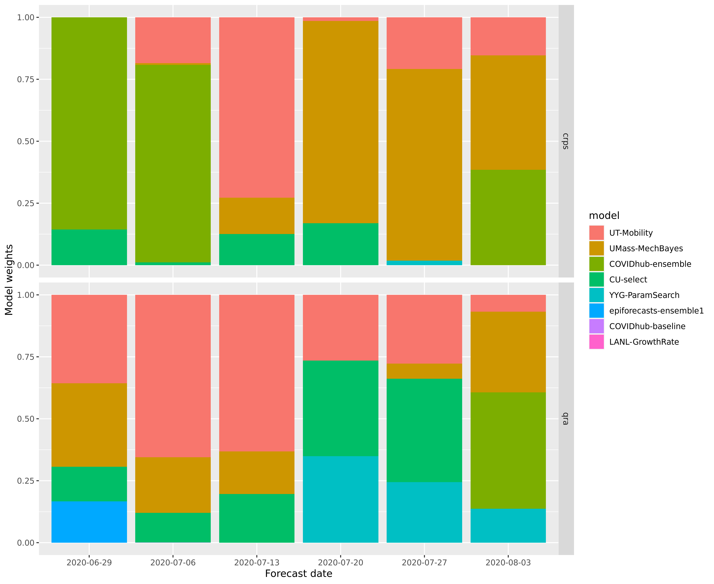

# Results - evaluation and aggregation of Covid-19 death forecasts {#results}

After Chapters \@ref(evaluation) and \@ref(model-aggregation) have laid out the theory behind model evaluation and model aggregation we can now apply these insights to the forecasts from the COVID-19 Forecast Hub. This chapter will examine the performance of the eight models (as described in Chapter \@ref(background-data)) from the Forecast Hub as well as three different ensembles of the eight original models. One of the original eight models is itself an ensemble of all models submitted to the Forecast Hub - this ensemble shall serve as a reference point against which we can compare our three ensembles. The following sections will first analyse model performance as a whole, followed by a more detailed discussion of the ensemble models. The general structure of the sections will follow the evaluation algorithm proposed in Chapter \@ref(evaluation). A brief discussion will conclude and summarise the results. 


<!-- ## Evaluation of model performance -->

<!-- The following section is structured as follows:  -->
<!-- - first look at the data and the projections directly -->
<!-- - numerical grading of models using the weighted interval score -->
<!-- - look at calibration and sharpness to understand in which systematic ways models fail or succeed -->

## Forecast visualisation

In order to get a general sense for how the models do we shall first have a look at the projections versus the actual data. Figure \@ref(fig:models-us) gives an overview of the projections for one and four week ahead forecasts for the United States. Other states are omitted for the sake of clarity, but can be seen in the APPENDIX. We can see that most models generally do a good job at capturing the dynamic one week ahead into the future. For four-week-ahead predictions, performance seems to deteriorate significantly. APPENDIX: Plot with more states. 

``` {r models-us, echo = FALSE, out.width = "95%", fig.cap = "One week ahead forecasts for the US from all models"}

knitr::include_graphics("../visualisation/chapter-5-results/US-forecast-1-4-wk-ahead.png")

```


## Summarised scores

Aggregated scores from the different metrics and proper scoring help us to summarise the complexity and nuances of overall model performance with a few numbers. They are therefore a sensible starting point before going deeper into assessing model calibration and sharpness. Table \@ref(tab:sum-scores) shows the summarised scores for all eleven models from the metrics presented in Chapter \@ref(evaluation). Figure \@ref(fig:coloured-summarised-scores) shows the same information in a colour-coded way. PROBABLY DROP THE UNCOLOURED TABLE?

```{r sum-scores, echo=FALSE, results='asis'}
df <- readRDS("../visualisation/chapter-5-results/
                     summarised_scores.rds")

options(knitr.kable.NA = '')
knitr::kable(
  df, 
  caption = 'Evaluation metrics for all models, aggregated over all forecast dates, horizons and locations',
  booktabs = TRUE) 
```


``` {r coloured-summarised-scores, echo = FALSE, out.width = "95%", fig.cap = "Colour coded summary of scores. Neutral / optimal values are shown in white, positive deviations in blue and positive deviations in red"}

knitr::include_graphics("../visualisation/chapter-5-results/coloured-summarised-scores.png")

```

We see that the ensemble models do well which is of course expected (or at least hoped). Especially the qra-ensemble that learns weights from past observations performs well. The crps-ensemble does worse, but that as well is at least not unexpected. The crps ensemble implementation in this thesis entails fitting a gamma distribution to the set of predictive quantiles which is bound to lose a lot of precision. It is nevertheless a bit surprising just from this overview that the crps-ensemble does substantially worse regarding the WIS, even though it is only slightly less sharp but a lot less biased. We can clearly see that models seem to perform well or badly for different reasons. The COVIDhub-baseline model for example stands out for its lack of sharpness. The UT-mobility model predictions are very sharp, but they exhibit quite significant bias and a quite substantial fraction of true values falls out of the prediction its prediction intervals. Its good overall performance as judged by the weighted interval score (WIS) seems a bit puzzling at first glance, and we cannot yet tell what might serve to explain this. 

### Correlation between metrics

To investigate this further it seems sensible to look at how the different scores and metrics correlate. Figure \@ref(fig:correlation-map) shows the correlation matrix. We can see that sharpness seems to have a surprisingly dominant influence on the weighted interval score. We can also see that bias and coverage deviation correlate strongly, which makes intuitive sense. A large absolute bias will lead to a lower empirical coverage which in turn results in a negative value for coverage deviation since 
$$\text{coverage deviation} = \text{empirical coverage} - \text{desired nominal coverage}$$. Other weightings for the weighted interval score may yield different relative influences of the other metrics. It could therefore be sensible to adapt the weights, e.g. to get a stronger influence of the central intervals. This, however, is beyond the scope of this thesis. Note also that this correlation metric does not show how 'bias' and 'calibration' as abstract concepts correlate with the weighted interval score. Rather, it shows how the actual metrics chosen to measure bias and calibration correlate with the WIS. If correlations are not as we would expect them we may also very well need to think about whether the chosen metrics actually cover all of what we would like them to cover. 

``` {r correlation-map, echo = FALSE, out.width = "95%", fig.align = "center", fig.cap = "Correlatoin between the different metrics "}

knitr::include_graphics("../visualisation/chapter-5-results/correlation-map.png")

```

MAYBE DO A QUICK REGRESSION OF THE METRICS ON THE WIS?

### Scores by subgroups

Let us now try and break down the performance by different subgroups such as states and forecast horizon to obtain a better understanding of what drives differences in the overall model scores. Figure \@ref(fig:heatmap-performance) gives an overview of the model performance as judged by the WIS for every state. The colour indicates the overall rank that model achieved in a given state. States are sorted from highest average interval score to lowest to illustrate contributions from different states. When averaging over different states, the overall weighted interval score is dominated by few very large values. In Figure \@fig(fig:coloured-summarised-scores) we could see that the qra-ensemble performs best by quite a margin. Figure \@ref(fig:heatmap-performance) shows that this the case because the qra-ensemble seems to perform well in the three most important locations (as judged by average WIS), while it doesn't excel in Pennsylvania, Massachusetts and Maryland. Large WIS values are most common in states with high case numbers (as small relative errors translate to large absolute deviations) and for larger horizons (as uncertainty grows). 

MAYBE PLOT OF AVERAGE WIS VS NUMBER OF CASES OR / AND HORIZON

``` {r heatmap-performance, echo = FALSE, out.width = "95%", fig.cap = "Heatmap with the average of the weighted interval score over all horizons, states and forecast dates. The colouring indicates the rank of the model per state"}

knitr::include_graphics("../visualisation/chapter-5-results/heatmap-model-scores.png")

```

Figure \@ref(fig:heatmap-performance-horizon) shows performance over horizons instead of states. The colouring now indicates how much higher a score is relative to the lowest average score achieved by the model. Models are again sorted from lowest to highest average weighted interval score. The ordering is slightly different REVISIT THIS AGAIN AFTER DATA UPDATE as the number of observations to score against is lower for higher horizons. The plot highlights how much general model performance is affected by the accuracy of long term forecasts rather than short term forecasts. 

``` {r heatmap-performance-horizon, echo = FALSE, out.width = "95%", fig.cap = "Heatmap with the average of the weighted interval score across all states and forecast dates. The colouring indicates how much higher a score is relative to the lowest average score achieved by a model"}

knitr::include_graphics("../visualisation/chapter-5-results/heatmap-model-scores-horizon.png")

```

We can also look at the contributions from different interval ranges to the overall weighted interval score. Figure \@ref(fig:scores-ranges) illustrates that the weighted interval score is more strongly influenced by the inner prediction intervals (small interval range) than the outer intervals (large range)

``` {r scores-ranges, echo = FALSE, out.width = "95%", fig.cap = "Interval scores across all states and forecast dates and horizons for different interval ranges"}

knitr::include_graphics("../visualisation/chapter-5-results/scores-by-range.png")

```

Not that we have  now look at calibration and sharpness to get clearer picture of why models are performing well / badly. 


## Assessing Calibration

### Bias

Just as we did with in Chapter \@ref(evaluation), we start our analysis of calibration with bias. Figure \@ref(fig:bias-all) shows bias for 
``` {r bias-all, echo = FALSE, out.width = "95%", fig.cap = "Coverage of the prediction intervals across all locations and forecast dates"}



```


Figure \@ref(fig:interval-coverage-all) shows the empirical interval coverage for all different models. We see that especially CU-select and UT-mobility have problems with their interval coverage. The COVIDhub-baseline model seems to be covering too much by its inner prediction intervals, but too little by its outer intervals. While the aggregated coverage deviation (compare Figure \@ref(coloured-summarised-scores)) looks acceptable, the COVIDhub-baseline model seems to struggle a bit with calibration. The qra-ensemble and especially the crps-ensemble seem to do best in terms of coverage. Note that for the qra-ensemble this is maybe a little surprising as Figure \@ref(coloured-summarised-scores) suggests the qra-ensemble has some issues with bias. Note again that empirical coverage only shows one kind of calibration and that good coverage is a necessary condition, but not sufficient to prove good calibration.

``` {r interval-coverage-all, echo = FALSE, out.width = "95%", fig.cap = "Coverage of the prediction intervals across all locations and forecast dates"}



```

Figure \@ref(fig:quantile-coverage-all) goes into more detail and shows the proportion of predictions lower than the true value for each quantile of the model predictions. This visualisation shows more information, but is also much harder to interpret. Now the UMass-MechBayes model looks especially good, while the qra-ensemble and crps-ensemble seem less ideal than before. This quantile coverage representation allows us to investigate the bias component of calibration more precisely. We can for example see that the qra-ensemble which exhibits an upward bias (compare \@ref(fig:coloured-summarised-scores)) is moved to the left of the diagonal, while e.g. the YYG-ParamSearch, which is downward biased, is moved to the right. We can also see a slight discrepancy between the plot and the numerical values, as the YYG-ParamSearch model (bias: -0.15) looks much further away from the diagonal than the qra-ensemble (bias: +0.16), even though the latter exhibits more absolute bias. This then of course brings up the question which of the ways to look at it is the 'better' one. A possible extension to this thesis could therefore be to analyse bias more closely in terms of quantile coverage deviation. 


``` {r quantile-coverage-all, echo = FALSE, out.width = "95%", fig.cap = "Coverage of the prediction intervals across all locations and forecast dates"}



```

Another question of interest is how model calibration changes over prediction horizons. Figure \@ref(fig:quantile-coverage-horizon) shows the quantile coverage over different prediction horizons. PLOT WITH INTERVAL COVERAGE IN APPENDIX? We can generally see that coverage detetrioarates with increasing forecast horizons for many models. Many models like the COVIDhub-baseline model or the YYG-ParamSearch model increasingly underpredict the true observed values. Others like the UT-Mobility model just seem to be overconfident for larger horizons. CORRECT THIS INTERPRETATION AFTER MORE DATA IS AVAILABLE. 

(We don't really care about model calibration over time as we look at too many time series at once. If we only ever looked at one time series, that would probably make more sense)

``` {r interval-coverage-horizon, echo = FALSE, out.width = "95%", fig.cap = "Coverage of the prediction intervals across all locations and forecast dates over different horizons"}



```

``` {r quantile-coverage-horizon, echo = FALSE, out.width = "95%", fig.cap = "Coverage of the prediction intervals across all locations and forecast dates over different horizons"}

knitr::include_graphics("../visualisation/chapter-5-results/quantile-coverage-horizons.png")

```


- plot calibration over states


## Assessing sharpness

Figure \@ref(fig:scores-ranges) does the same visualisation for sharpness values. Here, a much less clearer picture emerges, but it generally seems that 50% intervals tend to contribute most to sharpness, while neither narrow intervals near the median nor the tails of the predictive distribution seem to make large contributions. We also see again an overall trend that sharper models tend to do better. 

``` {r sharpness-ranges, echo = FALSE, out.width = "95%", fig.cap = "Sharpness across all states and forecast dates and horizons for different interval ranges"}

knitr::include_graphics("../visualisation/chapter-5-results/sharpness-by-range.png")

```


- plot bias over horizons 
- plot bias over states


MAYBE HAVE A REGRESSION 

## Assessing ensemble performance

- detailed look at the ensemble models
e.g. calibration plots for different states just for the three ensembles


``` {r weights-time, echo = FALSE, out.width = "95%", fig.cap = "Weights given to the different models in the ensemble over time"}



```


Which model perform well and why?

Which ensembling approaches perform well? 

Plot with weights over time


## Examining the three different model aggregation strategies

Table with performance of all ensembles over time

Calibration plot with all three (4) ensembles


## Discussion 

- Which states were easy to forecast? Which ones were hard to forecast? 
- would be good to have a plot / some analysis on how good the gamma fit for the CRPS actually works
- restriction due to inclusion of the epiforecasts-ensemble1 --> locations and dates
- exntension: dealing with missing forecasts
- sensitivity analysis: time included for ensemble weight estimation
- break up interval score in width part and miss penalty part

