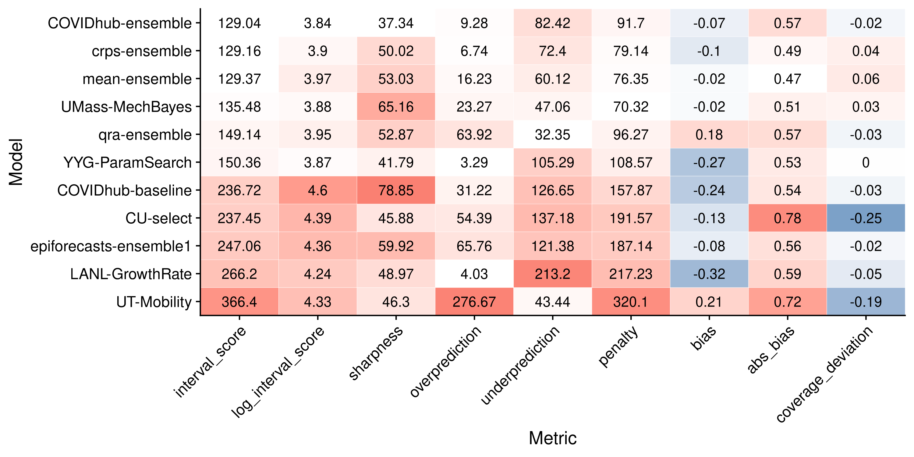

# Results - evaluation and aggregation of Covid-19 death forecasts {#results}

After chapters \@ref(evaluation) and \@ref(model-aggregation) have introduced the necessary tools for model evaluation and model aggregation, it is now time to apply these tools to the data introduced in Chapter Chapter \@ref(background-data). 

The overall goal of the model evaluation is to understand which models perform well and why. 

The structure of this Chapter largely follows the general structure proposed in Chapter \@ref(evaluation). 
At some times we digress to discuss additional aspects of interest. Examples: understanding the metrics better, looking at the ensemble models

The starting point of the analysis forms the visualisation of the forecasts and observed values. We then assess overall model performance to determine which models perform well and which less so. To that end we examine summarised scores and take a look at scores in terms of a mixed effects regression. This first analysis tells us which models perform well, but not why. In order to obtain an explanation, we subsequently analyse how the different metrics relate, what contributes to the performance measures and what drives differences in performance. We first examine correlations between the individual metrics. While this is not strictly necessary for the model evaluation, it provides us with a better understanding of the metrics we use. We then look at how different aspects of the predictive distribution contribute to different scores. This analysis focuses mainly on the weighted interval score (WIS) and breaks it down into its components, but we also look at how different ranges of the predictive distributions contribute to our measures of sharpness, calibration and overall performance. This again gives us a deeper understanding of the metrics, but is also a first step towards finding out what drives overall performance. We then look at the main external factors and especially the characteristics of the different locations that drive performance differences. After having analysed the properties of the metrics and external factors that drive differences in scores, we then look at the innate model properties that explain performance differences. We look at different aspects of calibration and sharpness in detail that help us to explain performance differences as well as hint to ways in which the models could be improved. 

The evaluation is followed by a more detailed look at the ensemble models that will discuss some specific aspects in more detail. These include a look at ensemble weights over time as well as analysis of different ensemble alternatives. REPHRASE THIS. 

The chapter will conclude with a brief sensitivity analysis that serves as a quick check of the plausibility of the inferences made throughout the chapter. 


Procedure: 

1) get a feeling for the data --> visualisation
2) get a ranking, e.g. if we wanted to make a quick decision
    --> summarised score
    --> regression
    
3) understand the metrics and what really drives them
    --> look at correlation between scores
    --> look at contributions from missing / too little sharpness
    --> look at contribution from individual ranges
    --> correlation between WIS and case numbers / WIS and horizons?
    --> contributions from states / 
    
4) understand what drives differences in performance 
    --> different states: which were the ones that models did badly in? 
    --> different horizons? when? interaction with states? 
    
5) understand individual models and how to improve them
    --> calibration
    --> sharpness

summary: do I find characteristics of well / badly performing models? 


Interesting questions
- how do different ranges contribute to scoes
--> if a score is not good, what do we look for? 
which states were hard to forecast and why? 
do models do consistently well or badly? 
What do models get right? 
	- trend changes
	- changes in uncertainty? 
Drivers of the WIS
	correlation metrics
	scores at different ranges
	scores at different locations
	

## Forecast visualisation

A natural first starting point for the evaluation process is to visualise the forecasts and the observations to get a sense of the data. Figure \@ref(fig:models-us) shows one and four-week-ahead forecasts for the United States as a whole. Plots for other locations can be seen in the APPENDIX. Plots like the one shown in Figure \@ref(fig:models-us) give us a first impression for how the models perform. From a brief look we can for example see that most models generally capture the dynamic one week ahead into the future well. For four-week-ahead predictions, performance seems to deteriorate significantly. We can already identify models that do well and others that do less well. The mean-ensemble, the crps-ensemble and the UMass-MechBayes model for example seem to do a consistently good job at one and four week ahead predictions. The UT-Mobility looks good for one week ahead (except for the last time point), but performs poorly four weeks ahead. The LANL-GrowthRate model seems rather off regardless of the horizon. 

``` {r models-us, echo = FALSE, out.width = "100%", fig.cap = "One week ahead forecasts for the US from all models. Models are sorted alphabetically."}

knitr::include_graphics("../visualisation/chapter-5-results/US-forecast-1-4-wk-ahead.png")

```

## Summarised scores and overall performance

The overall goal of the model evaluation is to understand which models perform well and why. A natural next step of the evaluation process is therefore to look at overall model performance. This gives us an answer to the first and often most important part, "which models perform well". It also us with a natural mental framework to structure our search for answers to the second part "why do some models perform well and others poorly". In order to evaluate overall performance, we first look at aggregated scores from the different metrics. Subsequently, we use a regression framework to determine differences between models. This regression framework is not only helpful in terms of model selection, but also provides a starting point to determine factors that drive differences in overall model scores. 

<!-- After that we perform a mixed effects regression that helps us to understand the ranking better and forms the basis for a model selection decision. Idea: we probably shouldn't choose a model that performs significantly worse than the top performer, but we should still look out for calibration and sharpness.  -->

<!-- We next turn to the aggregated scores from the different metrics and proper scoring. These help us to summarise the complexity and nuances of overall model performance with a few numbers. They are therefore a sensible starting point before going deeper into assessing model calibration and sharpness.  -->

Figure \@ref(fig:coloured-summarised-scores) shows the summarised scores for all eleven models from the metrics presented in Chapter \@ref(evaluation). Models are ordered in terms of performance as judged by the weighted interval score (WIS). This gives us a very concise overview of overall model performance. We can for example see a rather clear divide between the four ensembles, UMass-MechBayes and YYG-ParamSeach, and a second group less favourably ranked. This largely confirms the first visual impression obtained from Figure \@ref(fig:models-us). Note that model ranking is slightly different if we apply a log transformation to the WIS. This suggests that the average weighted interval score is substantially influenced by extreme values. 
``` {r coloured-summarised-scores, echo = FALSE, out.width = "100%", fig.cap = "Colour coded summary of scores. Neutral / optimal values are shown in white, too low values in blue and too high values in red. Overprediction and underprediction refer to the over- and underprediction penalty parts of the WIS. They are added together to form the column 'penalty' which again together with the 'sharpness' column sums up to the WIS. 'abs_bias' denotes the absolute bias. This was included, as the original bias summarises both positive and negative values and can therefore be misleading."}

knitr::include_graphics("../visualisation/chapter-5-results/scenario-baseline/coloured-summarised-scores.png")

```


<!-- We don't, however, see the full picture from these aggregate scores. The epiforecasts-ensemble1, for example, does far worse than the UMass-MechBayes, even though both have similar values for coverage deviation, bias, absolute bias and sharpness.  -->

A natural next step to assess model differences is a mixed effects regression framework. This allows us to make a better founded decision in a model selection process, but also allows us to more closely examine the main determinants of weighted interval scores. The regression framework is also very helpful in case of an incomplete set of predictions. If a certain research group for example misses a submission or does not submit forecasts in all states, then we can better mitigate this in a regression framework than by merely averaging over all available data. We employ a mixed-effects model with fixed effects for models and horizons and random effects for states and forecast dates. The model formula looks as shown below. Interval scores are log transformed to mitigate issues with the heavy tails of the original distribution. As a baseline we take the COVIDhub-ensemble model (the top performer). This helps us to discern whether models at the top can actually be distinguished and show significant performance differences. 
```{r random-effects-model-code, eval = FALSE}
fit <- lme4::lmer(log_scores ~ model + horizon + (1|state) + (1|forecast_date),
                  data = unsummarised_scores)

```
Table \@ref(tab:random-effects-model) shows the results from that regression. We can see that the regression confirms general tendencies observed before. The overall ranking of model effects corresponds to the model ranking by log interval score presented in \@ref(fig:coloured-summarised-scores). The regression output suggests again a clear split between two groups of models in terms of perfomance. Models in the top group were roughly comparable, except for the mean ensemble and maybe the qra-ensemble which fared a bit worse. As expected, the horizon had a highly significant positive effect on the weighted interval score. 


```{r random-effects-model, message = FALSE, echo = FALSE, message=FALSE, results="as.is"}
library(kableExtra)

fit <- readRDS("../visualisation/chapter-5-results/scenario-baseline/random-effects-model.RDS")
fit %>%
  summary() %>%
  coef() %>% 
  as.data.frame() %>%
  knitr::kable(caption = 'Mixed model regression of the log weighted interval score on model, horizon (both fixed), state, and forecast date (both random)',
               format = "latex", 
               booktabs = TRUE) %>%
  kable_styling(latex_options="scale_down")

```
<!-- The mean-ensemble1 is interesting, because it looked much better when viewed in terms of the untransformed score, rather than log WIS. This suggests that mean-ensemble avoids outliers, but does a bit worse on a typical forecast.  -->

This regression can of course be adapted. We could for example include an interaction between model and horizon to control for the fact that some models cope better or worse with increasing uncertainty. It also seems sensible to model horizon as a factor instead of a metric variable. If we were especially interested in performance over say a four-week-ahead horizon, we could then estimate a separate effect for every model at horizon four by looking at the combination of the model effect and the interaction. 

We now have a clear picture of how the models do in terms of overall performance and also in terms of the individual metrics. But we still don't have a good understanding of how the individual metrics relate, how exactly different metrics influence overall performance and what drives differences in scores. The following sections approach these questions one by one. 

REWRITE THIS. Section XXX elaborates on how the relationship between the individual metrics. Goal: understand metrics better. This section is not strictly necessary just for model evaluation. Section XXX looks at the composition of the WIS. Goal: understand models, get a better feeling for key drivers of performance. Section XXX looks at external factors that drive differences in scores. Section XXX looks at model properties that drive performance differences. 


REWRITE THIS. The next sections split this question up in subquestions. 
1) how do the metrics relate, how well do they capture the different aspects? This is not strictly part of the model evaluation, but done here to understand the metrics
Composition of the WIS
2) Which external factors explain differences in WIS? 3) Which model properties result in performance differences. The next section looks at how different metrics are able to explain differences in WIS. The section after that looks at external determinants of WIS, followed by internal factors.


## Understanding the relationship between indivudal metrics

In order to get a clearer understanding of how the different metrics relate, we can look at correlation between different metrics. Figure \@ref(fig:correlation-map) shows the correlation matrix. We can see that the penalty and sharpness terms correlative very strongly with the weighted interval score which is unsurprising. It looks like the penalty has a slightly stronger influence, but this is hard to tell just from the correlation. Bias and coverage deviation, as measured by the metrics described in Chapter \@ref(evaluation) seem to have a weaker direct influence on the interval score. This is not necessarily a bad thing, it simply means that coverage deviation and bias measure things that the WIS does not capture directly. Note in this context that the WIS is not equal to overall predictive performance, but instead it is one possible measure of performance. As long as we follow the forecasting paradigm of maximising sharpness subject to calibration it does make sense to also take other measures into account. Bias, for example, broadly measures a similar thing like the over- and underprediction penalties do. It may, however, give you a clearer sense in terms of model improvement, as the percentage of values below or above the true value is not conflated with the actual width of the predictive intervals. Two models may have similar bias, but incur very different penalties, because one model is less sharp and even farther away from the observations. THINK ABOUT THIS AGAIN. We can also see that absolute bias and coverage deviation are more strongly correlated with the log interval score than the untransformed score. This makes intuitive sense as log interval score is less influenced by outliers. Coverage deviation and bias are also not heavily influenced by outliers, but more by the average behaviour. 
It is therefore be useful to look at both aspects separately, but to understand how they interact. Note also that these correlations are influenced by the specific weighting, $\frac{\alpha}{2}$ chosen for the WIS and that other weights may yield different results. 
``` {r correlation-map, echo = FALSE, out.width = "100%", fig.align = "center", fig.cap = "Correlation between the different metrics "}

knitr::include_graphics("../visualisation/chapter-5-results/scenario-baseline/correlation-map.png")

```

Figure \@ref(fig:correlation-plot) shows a full correlation plot with all univariate and bivariate distributions. We can clearly see on the diagonal that the WIS, as well as its components, have heavy tails. We can also make some other interesting observations: A positive coverage deviation (i.e. covering too much by stating too wide prediction intervals) is still associated with a lower WIS in the models analysed, even though a positive coverage deviation is also a form of miscalibration. This suggests that better models also tend to exhibit positive coverage deviation, but could be even better if they had narrower prediction intervals (i.e. increased sharpness). 

We also see that while absolute bias and coverage deviation correlate with WIS, the variance is still immense. 

<!-- We can also see that bias and coverage deviation correlate strongly, which makes intuitive sense. A large absolute bias will lead to a lower empirical coverage which in turn results in a negative value for coverage deviation since coverage deviation is calculated as the difference between empirical coverage and desired nominal coverage.  -->


``` {r correlation-plot, echo = FALSE, out.width = "100%", fig.align = "center", fig.cap = "Correlation plot that shows bivariate scatter plots for all evaluation metrics."}


```


<!-- Table \@ref(tab:regression-wis-metrics) shows a quick regression of the log weighted interval score on absolute bias, coverage deviation and sharpness. All regressors have been standardised, so the effect size should be interpreted in terms of standard deviations. Coverage deviation and sharpness have the expected sign while absolute bias does not. As we have seen in Figure \@ref(fig:correlation-map) bias and coverage deviation do correlate strongly, which might make estimation harder. Also for some reason it might be that coincidentally upwards biased models still performed well overall.  -->

<!-- HOW DO I EXPLAIN THIS? MAYBE JUST DROP THE REGRESSION ALTOGETHER?? -->

<!-- ``` {r regression-wis-metrics-code, eval = FALSE} -->
<!-- lm(log_scores ~ abs_bias_std + coverage_deviation_std + log_sharpness_std,  -->
<!--    data = unsummarised_scores)  -->

<!-- ``` -->


<!-- ```{r regression-wis-metrics, echo = FALSE} -->
<!-- library(magrittr) -->
<!-- unsum_scores <- readRDS("../visualisation/chapter-5-results/scenario-baseline/unsummarised_scores.rds") %>% -->
<!--   dplyr::mutate(log_scores = log(interval_score), -->
<!--                 abs_bias_std = (abs(bias) - mean(abs(bias))) / sd(abs(bias)), -->
<!--                 coverage_deviation_std = (coverage_deviation - -->
<!--                                             mean(coverage_deviation)) /sd(coverage_deviation), -->
<!--                 log_sharpness_std = (log(sharpness) - mean(log(sharpness)))/sd(log(sharpness)), -->
<!--                 sharpness_std = (sharpness - mean(sharpness))/sd(sharpness)) %>% -->
<!--   dplyr::filter(is.finite(log_scores)) -->


<!-- lm(log_scores ~ abs_bias_std + coverage_deviation_std + log_sharpness_std, data = unsum_scores) %>% -->
<!--   summary() -->
<!--   broom::tidy() %>% -->
<!--   knitr::kable(caption = 'Regression of the log weighted interval score on the (standardised) absolute bias, coverage deviation and sharpness. ', -->
<!--   booktabs = TRUE) -->

<!-- ``` -->


## Composition of the Weighted Interval Score

The last section has given us a better sense of how different metrics relate. As the WIS is the main metric that summarises performance it makes sense to look more closely at the composition of the WIS and at what contributes to it. 

- look at what drives WIS in terms of the individual components
- where do contributions to WIS come from? 

We first look at contributions to overall WIS from the different components sharpness, overprediction and underprediction. This is shown in Figure \@ref(fig:wis-contributions), where WIS is also separated according to horizons. We first see that forecasts further ahead into the future have the largest impact on average WIS. We can see that for most forecasts, the 'over-' and 'underprediction' make a bigger share of the overall WIS then 'sharpness'. We can also observe that for better performing models, the share of 'sharpness' relative to the overall WIS increases. This makes sense in the context of the forecasting paradigm where sharpness should become increasingly important once calibration is satisfied. We can also observe that most models tend to get the majority of their penalties from underprediction. This is even true for models that according to Figure \@ref(fig:coloured-summarised-scores) exhibit no 'bias' or even a slight upward 'bias' like the mean-ensemble. This is not surprising given that seven out of thirteen locations, and especially the US as a whole, exhibited rising case numbers. Inaccuracies in one direction will be more severely punished than inacurracies in the other. REWRITE THIS SENTENCE. 

Figure \@ref(fig:wis-contributions) shows WIS contributions by horizon. We see that sharpness does increase with horizon, but the main driver is values falling outside of prediction intervals. For better models, the ratio of sharpness / penalty is better


``` {r wis-contributions, echo = FALSE, out.width = "100%", fig.align = "center", fig.cap = "Correlation plot that shows bivariate scatter plots for all evaluation metrics."}

knitr::include_graphics("../visualisation/chapter-5-results/scenario-baseline/wis-contributions.png")

```

To understand the composition of the weighted interval score better we can also look at the contributions from different interval ranges to the overall WIS. Figure \@ref(fig:scores-ranges) shows that the WIS as implemented here seems to be more strongly influenced by the inner prediction intervals (small interval range) than the outer intervals (large range). Note again that other weightings are possible for the weighted interval score. 
Message: outer prediction intervals are more wrong, but they get weighted down


``` {r scores-ranges, echo = FALSE, fig.show = "hold", out.width = "100%", fig.cap = "Story here: outer interval ranges are more wrong, but get weighted down"}

knitr::include_graphics("../visualisation/chapter-5-results/scores-by-range.png")
knitr::include_graphics("../visualisation/chapter-5-results/sharpness-by-range.png")

knitr::include_graphics("../visualisation/chapter-5-results/coverage-deviation-by-range.png")

```


### External drivers of WIS

So far we have asked: "What is the composition of the WIS and what contributes to it?" Now we want to ask: what drives differences in WIS. 

From Figure \@ref(fig:wis-contributions) and from the regression we already know that the forecast horizon makes a large difference. We also knwo that models make a difference, but turn to that later. We can go one step further and analyse the estimated random effects from the regression. This is shown in Figure \@ref(fig:random-effects). We can see that forecast dates don't have a very strong effect, but that states do. This difference could be completely driven by differences in death numbers (remember the WIS is an absolute metric) or it could be due to different difficulties in different states. Let us examine this more closely. 

``` {r random-effects, echo = FALSE, out.width = "100%", fig.cap = "Random effects of the different locations (left) and forecast dates (right"}


```

Figure \@ref(fig:wis-deaths) shows WIS from the different models versus deaths. It shows some variation in scores received by the models, but overall very strong relationship is visible^[One could argue whether or not to include the US as a whole in this plot. On the one hand the overall US death numbers are closely related to the sum of death numbers from the twelve states analysed. On the other hand numbers were not identical as the majority of states was missing from the analysis. We could therefore also think of the US as just another very large state. We tried both options and found that the difference was very small in terms of the regression fit and the overall relationship observed.]. It therefore seems that most of the variation in observed interval scores in different states can be explained by the overall level of death numbers. It is still interesting to try and find which states were harder and easier to forecast. 

``` {r wis-deaths, echo = FALSE, out.width = "100%", fig.cap = "Story here: outer interval ranges are more wrong, but get weighted down"}

knitr::include_graphics("../visualisation/chapter-5-results/scenario-baseline/wis-vs-deaths.png")

```

One natural way would be to estimate difficulty as the difference between the interval scores actually observed in a state and the ones that would be expected from this relationship. To that end we fit the following regression to the log interval scores: 

``` {r dfficulty-states-lm, eval = FALSE, message = FALSE}

fit <- lm(log(wis) ~ log(deaths), data = df)

```

Difficulty was then calculated as 
$$\text{difficulty}_{\text{location}} = \log(\text{WIS}) - (\beta_0 + (\text{intercept} + \beta_1 \cdot \log(\text{deaths}_{\text{location}}))$$
The results are shown in Figure \@ref(fig:dfficulty-states). We can see that indeed models consistently struggled with some states, but did well in others. Comparing this again to Figure \@ref(fig:us-data), however, we do not immediately see a clear picture emerge from this analysis. At least visually, for example, California looks harder to forecast than New Jersey. The states hardest to forecast according to Figure \@ref(fig:difficulty) still seem to be locations with high death numbers (the US as a whole as an exception). They include states with falling death numbers (New Jersey), states with rapidly increasing numbers (Texas) as well as states with very little change overall (New York). We can maybe explain New York as an outlier due to the high uncertainty and correspondingly high WIS of the COVIDhub-baseline model. Nevertheless we were not able to identify clear characteristics that correlate directly with how difficult a state is to predict. 

``` {r dfficulty-states, echo = FALSE, out.width = "100%", fig.cap = "Story here: outer interval ranges are more wrong, but get weighted down"}

knitr::include_graphics("../visualisation/chapter-5-results/scenario-baseline/difficulty-states-heatmap.png")

```

We tried a second approach and looked at coverage deviation by state to get a feeling for how much models were off in terms of calibration in different states. Figure \@ref(fig:coverage-deviation-states) shows this. We see that this visualisation corresponds a bit better with our intuition of how hard it is to forecast states. 
``` {r coverage-deviation-states, echo = FALSE, out.width = "100%", fig.cap = "Coverage deviation for different ranges"}

knitr::include_graphics("../visualisation/chapter-5-results/heatmap-model-coverage.png")

```
APPENDIX: BIAS by STATE, PENALTY by STATE

To see what is going on it makes sense to visusalise again predictions vs. true values. Figure \@ref(fig:pred-texas) shows one-week-ahead predictions and observed values in Texas. Surprisingly, all models are unable to keep up with the change in trend. 

``` {r pred-texas, echo = FALSE, out.width = "100%", fig.cap = "One week ahead predictions and observed values in Texas"}

knitr::include_graphics("../visualisation/chapter-5-results/scenario-baseline/Texas-one-week.png")

```

We now have looked into external factors that drive differences in WIS. We now turn to the models themselves and ask what differences in the models drives performance? 


## Understanding the individual models

We now ask: what differences in the models drives perforamnce. --> Look at Bias, Coverage, PIT histograms, Sharpness for the models. 

Before: Sensible starting point: do models perform badly in all scenarios, or does performance vary substantially by states? This is shown in Figure \@ref(fig:heatmap-performance-states). Result: LANL-GrowthRate seems to do well in some stats, but generally models tend to perform well or badly across the board. 

also: General characteristics for well performing models
- ensemble
- SEIR model
but: hard to tell from the limited amount of models. 

``` {r heatmap-performance-states, echo = FALSE, out.width = "100%", fig.cap = "Heatmap with the average of the weighted interval score over all horizons, states and forecast dates. The colouring indicates the rank of the model per state"}

knitr::include_graphics("../visualisation/chapter-5-results/scenario-baseline/heatmap-model-scores.png")

```


### Looking closer at bias

Just as we did with in Chapter \@ref(evaluation), we start our analysis of calibration with bias. 
Before: bias to look at differences in states. Focus now: differences in models. 

Figure \@ref(fig:bias-all) shows bias for all models. 
ALSO NEEDED: FIGURE WITH OVER- AND UNDERPREDICTION BY MODEL. 

Message: no clear picture from bias alone, but over- and underprediction give clear indication. 

``` {r bias-all, echo = FALSE, out.width = "100%", fig.cap = "Bias for all models and different horizons. The black dot denotes the median bias, the black square the mean bias and different colour shadings show the 20, 40, and 90 percent intervals of all observed quantile values. Models are again ordered according to their overall performance by WIS."}

knitr::include_graphics("../visualisation/chapter-5-results/bias-horizons.png")

```

For the purpose of model improvement it seems most useful to compare the evolution of bias over time with the actual predictions and observations. With the help of this comparison we can obtain insights regarding the particular situations that cause models to biased or not. While this is of course unfeasible to do for all eleven models, Figure \@ref(fig:bias-ensemble) shows one-week-ahead predictions and  bias for the three ensemble models in the six locations with the highest average WIS. We see that all models make very similar predictions. The qra-ensemble seems to have a slight tendency for higher bias values, but this is hard to infer just from looking at the plots.
All models seems to have some difficulties with picking up rapid changes in trends. This is especially pronounced in Texas. We can see that models seem to overpredict when deaths are increasing (Arizona, Texas) and seem to underpredict when cases are decreasing (New Jersey, last two weeks in Arizona). 

<!-- Looking at the plot we can digress a bit and make a second unrelated observation regarding the crps-ensemble model: Plots of New Jersey (and maybe Florida) show that the model sometimes produces very large spikes in uncertainty. This can probably be attributed to the loss of precision that results from the sampling in the crps model aggregation progress. If we look back at the PLOT IN CHAPTER MODEL AGGREGATION, we can probably attribute this to the loss of precision due to sampling. We saw IN THE PLOT that samples from the gamma distribution tend to have much larger tails than the actual distribution.  -->

``` {r bias-ensemble, echo = FALSE, out.width = "100%", fig.cap = "Observations and predictions (top) as well as bias (bottom) for the YYG-ParamSearch model in the six states that exhibited the largest absolute bias."}

knitr::include_graphics("../visualisation/chapter-5-results/bias_ensemble.png")

```


### Looking closer at coverage

We next turn to examine coverage. Figure \@ref(fig:coverage-all) shows the empirical interval and quantile coverage for all eleven models. We see that some models (especially CU-select and UT-mobility) have problems with calibration. The COVIDhub-baseline model is an interesting case. While the aggregated coverage deviation score in Figure \@ref(fig:coloured-summarised-scores) looked very good, we can now conclude from this plot that the COVIDhub-baseline is not well calibrated. It instead is covering too much by its inner prediction intervals, but too little by its outer intervals. The epiforecasts-ensemble1, the qra-ensemble and especially the COVIDhub-ensemble seem to do best in terms of interval coverage. Looking only at interval coverage plots, however, does not tell us where the lack of coverage comes from. 

Figure \@ref(fig:coverage-all) therefore goes into more detail and shows quantile coverage, i.e. the proportion of predictions lower than the true value for each quantile of the model predictions. This makes it possible to see whether a lack of coverage in a certain interval range is more a problem of the lower or the upper bounds of the interval range. For the epiforecasts-ensemble1, for example, we could see a lack of coverage in the outer prediction intervals in Figure \@ref(fig:coverage-all). With the help of the quantile coverage plot we can now see that the problem lies in the upper, rather than the lower bounds. It seems that the epiforecasts-ensemble1 did well in quantifying uncertainty below the median, but was underpredicting the likelihood of extreme events above the median. This quantile coverage visualisation also allows us to reexamine the bias component of calibration again. We can for example see that the UT-Mobility and qra-ensemble, which exhibit an upward bias (compare \@ref(fig:coloured-summarised-scores)), are moved to the left of the diagonal, while e.g. the YYG-ParamSearch or the LANL-GrowthRate model, which are downward biased, are moved to the right. 


``` {r coverage-all, echo = FALSE, out.width = "100%", fig.cap = "Coverage of the prediction intervals across all locations and forecast dates"}

knitr::include_graphics("../visualisation/chapter-5-results/scenario-baseline/coverage-plots.png")

```


One major advantage this type of visualisation has over PIT histograms is that we can easily compare different models in a single plot. Figure \@ref(fig:coverage-ensemble) exemplifies this for the ensemble models. It is obvious taht the COVIDhub-ensemble did best in terms of interval as well as quantile coverage. The crps-ensemble and the mean-ensemble have a slightly too high interval coverage, which we confirms what we have already seen in the summarised scores in Figure \@ref(fig:coloured-summarised-scores). Looking at the quantile coverage plot (on the right) we can see clearly see that the qra-ensemble model is the most biased of all ensemble models. It is therefore maybe surprising to see the model looks quite well in terms of interval coverage (on the left). We can explain this discrepancy by taking sharpness into account. In Figure \@ref(fig:coloured-summarised-scores) we could see that the COVIDhub-ensemble was much sharper than the other three ensembles which were about equally sharp. For the mean-ensemble and the crps-ensemble the increased width of the prediction intervals for the translated into a positive coverage deviation, while for the qra-ensemble it only mitigated the effect the increased bias would have had on interval coverage. This discrepancy between quantile and interval coverage, however, highlights again that interval coverage only shows one kind of calibration. Good interval coverage is a necessary condition, but not sufficient to prove good calibration. In general, it seems that the quantile plot (right) visually correlates better with overall model performance as judged by WIS. We should therefore look at the quantile coverage plot rather than the interval coverage plot if we were to choose only one. 

``` {r coverage-ensemble, echo = FALSE, out.width = "100%", fig.cap = "Interval coverage (left) and quantile coverage (right)"}
knitr::include_graphics("../visualisation/chapter-5-results/coverage_ensemble.png")

```


APPENDIX: Coverage by horizon (sort plot by model achievement)
<!-- We can again look at coverage in different subgroups to get a better understanding for how the models and the metrics behave. We might for example want to ask how coverage changes over different prediction horizons, as this could give an indication of how well we far into the future we can confidently make predictions. Figures \@ref(fig:interval-coverage-horizon) and \@ref(fig:quantile-coverage-horizon) show the interval and quantile coverage over different prediction horizons. We can generally see that coverage generally tends to deteriorate at least slightly with increasing forecast horizons for many models. WORK ON THIS INTERPRETATION OR MAYBE JUST MOVE THE PLOTS TO THE APPENDIX.   -->

MAYBE MORE INTERSTING PLOT COULD BE COVERAGE DEVIATION BY QUANTILE - THIS WOULD GIVE A MAYBE NICE VISUALISATION OF BIAS.


### Looking closer at PIT histograms

In addition to looking at coverage plots, we can also approach calibration through PIT histograms. Figure \@ref(fig:all-pit-plots) shows the PIT histograms for all eleven models. We can immediately see that the Anderson-Darling test for uniformity is rejected for all models. While some models are indeed severely miscalibrated (as seen before in the coverage plots), we may probably also conclude that the Anderson-Darling test has limited value for most practical purposes of model comparison. PIT histograms are arguably somewhat hard to interpret for many readers. However, they provide a very good way to succinctly summarise different aspects of calibration and show again a lot of the things previously observed in other plots. We can for example see again the bias in the qra-ensemble and the YYG-ParamSearch model. Or we can recognise the hump shape corresponding to the positive coverage deviation of the crps-ensemble and the mean-ensemble (the predictions are wider than they actually need be). We will, however, not revisit all these aspects again, but instead turn to sharpness now. 

``` {r all-pit-plots, echo = FALSE, out.width = "100%", fig.cap = "PIT histograms for all models. Samples were obtained by first fitting a gamma distribution to the set of quantiles. Note that the PIT plots shown here don't have the same scale on the y-axis, which make them easier to read on their own, but a bit harder to compare. "}


```


### Looking at sharpness

In order to understand the individual model better it is again most helpful to plot sharpness next to predictions. Figure \@ref(fig:sharpness-crps-ensemble) does this for the crps-ensemble model for one-week-ahead predictions. Only one of the ensemble models is shown as all four make very similar forecasts. We can see that sharpness does not really follow a clearly identifiable pattern. It is much larger, of course, in locations like the US as a whole that have many more cases. But we cannot really see the ensemble model consistently adapting to past mistakes. Ideally, we would want a model to make wider predictions whenever predictions and observations do not match (for example, when the trend changes) and narrower ones when past predictions and observations have matched. Unfortunately, none of the original PLOT IN APPENDIX models really seems to exhibit that kind of behaviour and the ensemble is not able to mitigate this shortcoming. Instead we see rather random looking changes in sharpness (see e.g. Arizona, US). 

``` {r sharpness-crps-ensemble, echo = FALSE, out.width = "100%", fig.cap = "Sharpness over different horizons. for the CRPS ensemble model"}

knitr::include_graphics("../visualisation/chapter-5-results/scenario-baseline/sharpness-predictions-ensemble.png")

```

In order to get a better feeling for differences in model behaviour we can again try and compare sharpness in different subgroups. Figure \@ref(fig:sharpness-horizons) shows sharpness over different horizons for all eleven models. This visualisation shows that prediction intervals tends to grow with increasing forecast horizons for almost all models. This provides a simple sanity check, as we should expect prediction intervals to grow with uncertainty. Only CU-select and LANL-GrowthRate fail this check as their median sharpness does not increase over all horizons. For the better performing models we mostly see a moderate increase with the only exception of UMass-MechBayes among the top performers. Comparing this with WIS over horizon (see Figure \@ref(fig:heatmap-performance-horizon)) we can conclude that this lack of sharpness for four-week-ahead forecasts is indeed accompanied by a worse weighted interval score. We can now also conclude that it is this lack of sharpness for four-week-ahead-predictions that cause UMass-MechBayes to rank among the bottom in terms of average sharpness (compare again Figure \@ref(fig:coloured-summarised-scores)). 

``` {r sharpness-horizons, echo = FALSE, out.width = "100%", fig.cap = "Sharpness over different horizons. "}

knitr::include_graphics("../visualisation/chapter-5-results/sharpness-horizons.png")

```
Looking at sharpness separated by different interval ranges allows us again to discern the contributions to overall sharpness from individual prediction intervals. Figure \@ref(fig:scores-ranges) the contributions from inner and outer prediction intervals for all eleven models. It generally seems that 50% intervals tend to contribute most to sharpnes, while neither narrow intervals near the median nor the tails of the predictive distribution seem to make large contributions. 

Visualising sharpness for different states is again a way to see how different states vary in the sharpness they permit as well as how consistetnly models do in terms of sharpness. Figure \@ref(fig:sharpness-ensemble) shows sharpness for every model and ensemble. We clearly see that average sharpness is largely dominated by sharpness in the US as a whole. We can also observe that some models (e.g. COVIDhub-ensemble, YYG-ParamSearch, CU-select) consistently tend towards sharper forecasts, while other models vary a lot across regions. 


<!-- ``` {r sharpness-ensemble, echo = FALSE, out.width = "100%", fig.cap = "Sharpness of the ensemble models in different states. The shading indicates how much higher a certain sharpness value is compared to the minimum value achieved in that state."} -->
<!--  -->

<!-- ``` -->

SECTION SUMMARY? 


## Assessing ensemble performance

The following section will explore some aspects concerning the ensemble models in a bit more detail. These paragraphs will focus on the qra and the crps ensemble, as these are the ones of greatest interest. The first part will examine how ensemble member weights evolve over time for the two model aggregation approaches. The second part will then look at different variants of the qra and crps ensemble that alter the number of past observations to take into account or the horizon to optimise for. A regression framework will be used again to determine differences between the different ensemble variants. The COVIDhub-ensemble will here serve as a benchmark against which to compare the other ensembles. 

The mean-ensemble will not be discussed in more depth as it is not very interesting in terms of further investigation. Since its member models are all already included in the COVIDhub-ensemble model, performance differences between the mean-ensemble and the COVIDhub-ensemble can be fully attributed to the subselection of models from the Forecast Hub for this thesis. 

### Model weights over time

Looking at the how ensemble weights evolve over time can give us insights about how the ensembles work. Figure \@ref(fig:weights-time) visualises this evolution. We can see that both model aggregation approaches seem to 

``` {r weights-time, echo = FALSE, out.width = "100%", fig.cap = "Weights given to the different models in the ensemble over time"}

knitr::include_graphics("../visualisation/chapter-5-results/weights-time.png")

```

Figure \@ref(fig:weights-vs-scores) shows the weights over time against the performance of the models. We can see that both ensembles prefer to include similar models. We can also see that model inclusion is not necessarily only determined by overall performance. For example, the CU-select and UT-Mobility model are included in both ensembles and seem to add something of value even though they are not among the top performers. 

``` {r weights-vs-scores, echo = FALSE, out.width = "100%", fig.cap = "Weights given to the different models in the ensemble over time"}


```


## Other ensemble variants

The ensemble variants above are a sensible default, but are of course not the only possible ensemble combination. This section therefore explores different ensembles with different parameters. The default was run with otpimisation based on the two last forecasts. The qra ensembles were now run with one to four weeks of past forecasts and were therefore called qra-ensemble-1 to qra-ensemble-4. The default used previously corresponds to qra-ensemble-2. For the crps-ensemble, an additional choice was made, namely the horizon on which to optimise. In contrast to the `quantgen` package, `stackr` currently only supports one horizon. The second number in the crps-ensemble name therefore indicates the horizon for which the crps was optimised. The default model corresponds to crps-ensemble-2-2. We can see from a comparison with \@ref(fig:coloured-summarised-scores) that aggregate scores for the crps-ensemble-2-2 model turn out slightly different. This can most certainly be explained by the fact that the crps-ensemble relies on random sampling. 
Figure \@ref(fig:ensemble-comparison) shows aggregate model performance for the different ensemble variants. No obvious picture emerges regarding the superiority of either qra or crps ensembles. There is, however, a couple of interesting patterns to observe. Firstly, crps-ensembles optimised only on one-week-ahead forecast horizon tend to do worst, while those optimised on three and especially two weeks do best. For the crps ensemble it seems that the forecast horizon matters more than the number of past forecasts included in the weighting. This is somewhat surprising given that qra-ensemble-1 is among the top performers. If we only ever include the past forecast, this of course implies that weighting can only be done on one-week-ahead forecasts. Normally, we would therefore expect the qra-ensemble-1 to perform similarly to crps-ensemble-1-1. We can also see that the qra-ensemble-4 and qra-ensemble-1 are top performers, while qra-ensemble-3 and qra-ensemble-2 are not. This casts doubt whether there is a clear best choice of the number of past observations to include. Additional analysis could be conducted by including arbitrary combinations of horizons in the qra optimisation instead of simply all available horizons. We also see that qra ensemble tend to overpredict, while crps ensembles tend to underpredict. This, however, may also be an artifact of the model aggregation process in which a gamma distribution gets fit to predictive quantiles. 

``` {r ensemble-comparison, echo = FALSE, out.width = "100%", fig.cap = "Weights given to the different models in the ensemble over time"}

knitr::include_graphics("../visualisation/chapter-5-results/ensembles/scenario-baseline/coloured-summarised-scores.png")

```

``` {r regression-ensemble, echo = FALSE}
fit <- readRDS("../visualisation/chapter-5-results/ensembles/scenario-baseline/random-effects-model-ensemble.RDS")
fit %>%
  summary() %>%
  coef() %>% 
  as.data.frame() %>%
    dplyr::arrange(-Estimate) %>%
  knitr::kable(caption = 'Mixed model regression of the log weighted interval score on model (fixed), state, and forecast date (both random)',
               format = "latex", 
               booktabs = TRUE) %>%
  kable_styling(latex_options="scale_down")

```


INTERESTING: WEIGHTS OVER TIME


ADD TO INTERPRETATION: The second thing to keep in mind is that the crps-ensemble implementation in this thesis entails fitting a gamma distribution to the set of predictive quantiles which is bound to lose some precision. It is therefore expected to the see the crps-ensemble perform worse and therefore rather surprising that it keeps up in performance with the other ensembles. 

## Sensitivity analysis

In order to test the validity and robustness of the results obtained, this section presents a small validity analysis. This analysis could of course be expanded greatly. 

Instead of looking at the whole time window, the three latest dates were successively removed. Figure \@ref(fig:senitivity) shows the summarised scores for all models in the four different scenarios. We can see XXX. 

``` {r senitivity, echo = FALSE, fig.show = "hold", out.width = "50%", fig.cap = "Weights given to the different models in the ensemble over time"}

knitr::include_graphics("../visualisation/chapter-5-results/scenario-baseline/coloured-summarised-scores.png")

knitr::include_graphics("../visualisation/chapter-5-results/scenario-2/coloured-summarised-scores.png")
knitr::include_graphics("../visualisation/chapter-5-results/scenario-3/coloured-summarised-scores.png")
```

The same analysis is of course also interesting for the ensemble variants. Figure \@ref(fig:senitivity) therefore shows aggregated scores for all ensemble variants for the four different scenarios. REWORK INTERPRETATION. qra-ensemble-4 stays at the top consistently, it seems like qra is slightly outperforming crps. It still seems like crps-ensemble horizon 2 is best. 


``` {r senitivity-ensembles, echo = FALSE, fig.show = "hold", out.width = "50%", fig.cap = "Weights given to the different models in the ensemble over time"}

knitr::include_graphics("../visualisation/chapter-5-results/ensembles/scenario-baseline/coloured-summarised-scores.png")
knitr::include_graphics("../visualisation/chapter-5-results/ensembles/scenario-1/coloured-summarised-scores.png")
knitr::include_graphics("../visualisation/chapter-5-results/ensembles/scenario-2/coloured-summarised-scores.png")
knitr::include_graphics("../visualisation/chapter-5-results/ensembles/scenario-3/coloured-summarised-scores.png")
```


## Discussion / chapter summary

- Which states were easy to forecast? Which ones were hard to forecast? 
- exntension: dealing with missing forecasts
- sensitivity analysis: time included for ensemble weight estimation


<!-- old parts -->


<!-- In Figure \@fig(fig:coloured-summarised-scores) we could see that the qra-ensemble performs best by quite a margin. Figure \@ref(fig:heatmap-performance)  -->


<!-- shows that this the case because the qra-ensemble seems to perform well in the three most important locations (as judged by average WIS), while it doesn't excel in Pennsylvania, Massachusetts and Maryland.  -->


<!-- We see that the ensemble models do well which is of course expected (or at least hoped). Especially the qra-ensemble that learns weights from past observations performs well.  -->

<!-- The crps-ensemble does worse, but that as well is at least not unexpected. The crps ensemble implementation in this thesis entails fitting a gamma distribution to the set of predictive quantiles which is bound to lose a lot of precision. It is nevertheless a bit surprising just from this overview that the crps-ensemble does substantially worse regarding the WIS, even though it is only slightly less sharp but a lot less biased.  -->

<!-- We can clearly see that models seem to perform well or badly for different reasons. The COVIDhub-baseline model for example stands out for its lack of sharpness. The UT-mobility model predictions are very sharp, but they exhibit quite significant bias and a quite substantial fraction of true values falls out of the prediction its prediction intervals. Its good overall performance as judged by the weighted interval score (WIS) seems a bit puzzling at first glance, and we cannot yet tell what might serve to explain this.  -->

