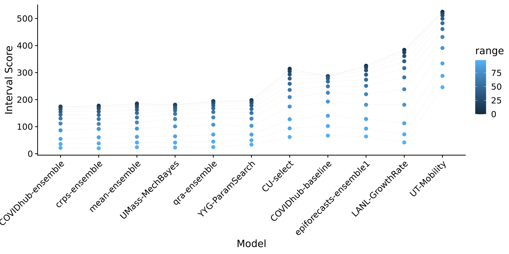
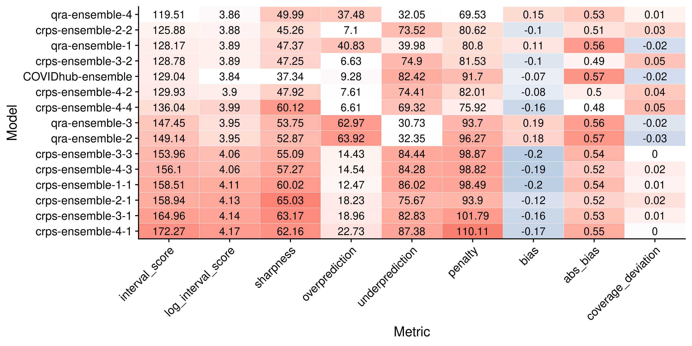

# Results - evaluation and aggregation of Covid-19 death forecasts {#results}

Chapters \@ref(evaluation) and \@ref(model-aggregation) have introduced the tools we need for model evaluation and model aggregation. Chapter \@ref(results) will now apply these instruments to the Forecast Hub with the goal of better understanding their behaviour. 

The majority of this chapter will deal with the evaluation of the eight models described in Chapter \@ref(background-data) as well as the three different ensembles of the eight original models. This evaluation is as much about understanding model performance in the Forecast Hub as it is about understanding the tools used for evaluation themselves. The chapter will therefore digress at times to look at additional things like how different metrics correlate. A large part of model assessment is visual in nature - the chapter will therefore involve a lot of discussion of visual representations of different evaluation aspects. The evaluation will follow the general structure proposed in Chapter \@ref(evaluation): First the forecasts will be visually inspected. Afterwards, the attention will turn to the summarised scores and metrics, followed by a detailed look at calibration (including bias, coverage and PIT histograms) and sharpness. A mixed-effects model of the weighted interval score will help to summarise the conclusions from the model evaluation. WHERE TO PUT THE MIXED MODEL? 

The evaluation is followed by a more detailed look at the ensemble models that will discuss some specific aspects in more detail. These include a look at ensemble weights over time as well as analysis of different ensemble alternatives. REPHRASE THIS. 

The chapter will conclude with a brief sensitivity analysis that serves as a quick check of the plausibility of the inferences made throughout the chapter. 


<!-- The chapter will examine the performance of   -->


<!-- One of the original eight models is itself an ensemble of all models submitted to the Forecast Hub - this ensemble shall serve as a reference point against which we can compare our three ensembles.  -->

<!-- ## Evaluation of model performance -->

<!-- The following section is structured as follows:  -->
<!-- - first look at the data and the projections directly -->
<!-- - numerical grading of models using the weighted interval score -->
<!-- - look at calibration and sharpness to understand in which systematic ways models fail or succeed -->

## Forecast visualisation

In order to get a general sense for how the models do we shall start with a look at the projections versus the actual data. Figure \@ref(fig:models-us) gives an overview of the projections for one and four week ahead forecasts for the United States as a whole. Plots for other locations can be seen in the APPENDIX. From a brief look we can see that most models generally do a good job at capturing the dynamic one week ahead into the future. For four-week-ahead predictions, performance seems to deteriorate significantly. The mean-ensemble, the crps-ensemble and the UMass-MechBayes model seem to do a consistently good job at one and four week ahead predictions. The UT-Mobility looks good for one week ahead (except for the last time point), but performs poorly four weeks ahead. The LANL-GrowthRate model seems rather off regardless of the horizon. 

``` {r models-us, echo = FALSE, out.width = "100%", fig.cap = "One week ahead forecasts for the US from all models"}

knitr::include_graphics("../visualisation/chapter-5-results/US-forecast-1-4-wk-ahead.png")

```


## Summarised scores

We next turn to the aggregated scores from the different metrics and proper scoring. These help us to summarise the complexity and nuances of overall model performance with a few numbers. They are therefore a sensible starting point before going deeper into assessing model calibration and sharpness. 

Figure \@ref(fig:coloured-summarised-scores) shows the summarised scores for all eleven models from the metrics presented in Chapter \@ref(evaluation). 
<!-- Table \@ref(tab:sum-scores) shows the summarised scores for all eleven models from the metrics presented in Chapter \@ref(evaluation).  -->

<!-- ```{r sum-scores, echo=FALSE, results='asis'} -->
<!-- df <- readRDS("../visualisation/chapter-5-results/ -->
<!--                      summarised_scores.rds") -->

<!-- options(knitr.kable.NA = '') -->
<!-- knitr::kable( -->
<!--   df,  -->
<!--   caption = 'Evaluation metrics for all models, aggregated over all forecast dates, horizons and locations', -->
<!--   booktabs = TRUE)  -->
<!-- ``` -->
``` {r coloured-summarised-scores, echo = FALSE, out.width = "100%", fig.cap = "Colour coded summary of scores. Neutral / optimal values are shown in white, too low values in blue and too high values in red"}


```
We can see that our quick visual ranking largely corresponds to the perfomance as judeged by the weighted interval score. The ensembles and UMassMechBayes rank at the top, while LANL-GrowthRate and UT-Mobility are ranked at the bottom. We don't, however, see the full picture from these aggregate scores. The epiforecasts-ensemble1, for example, does far worse than the UMass-MechBayes, even though both have similar values for coverage deviation, bias, absolute bias and sharpness. Absolute bias is included in Figure \@ref(fig:coloured-summarised-scores), as bias is aggregated over both positive and negative values and can therefore be misleading. We can see that the ranking is slightly different if we apply a log transformation to the weigthed interval score. This suggests that the average weighted interval score is heavily influenced by extreme values. 


### Correlation between metrics

To get a clearer understanding of how the different metrics relate, it seems sensible to look at the correlation between different metrics. Figure \@ref(fig:correlation-map) shows the correlation matrix. This matrix also included log interval score and log sharpness, as both have very heavy tails and outliers. We can see that sharpness seems to have a surprisingly large influence on the weighted interval score. This may well be a feature of the weighted interval score. It cannot, however, be ruled out that the sharper models analysed here simply do better for other unknown reasons. 

We can also see that bias and coverage deviation correlate strongly, which makes intuitive sense. A large absolute bias will lead to a lower empirical coverage which in turn results in a negative value for coverage deviation since coverage deviation is calculated as the difference between empirical coverage and desired nominal coverage. It is quite surprising to see, however that the correlation is nearly perfect and that coverage deviation and sharpness do not seem to correlate at all. 

Other weightings for the weighted interval score may yield different relative influences of the other metrics. It could therefore be sensible to adapt the weights, e.g. to get a stronger influence of the central intervals. This, however, is beyond the scope of this thesis. When interpreting the correlation, it is also important to note that the correlation  matrix doesn't show 'bias' and 'calibration' as abstract concepts. Rather, it shows how the actual metrics chosen to measure bias and calibration correlate with the WIS - these may not actually cover all of what we would like them to cover. 

``` {r correlation-map, echo = FALSE, out.width = "100%", fig.align = "center", fig.cap = "Correlation between the different metrics "}

knitr::include_graphics("../visualisation/chapter-5-results/correlation-map.png")

```

Figure \@ref(fig:correlation-plot) shows a full correlation plot with all univariate and bivariate distributions. We can clearly see on the diagonal that sharpness and weighted interval score (WIS) have heavy tails. We can make some other interesting observations: A positive coverage deviation (i.e. covering too much by stating too wide prediction intervals) is still associated with a lower WIS in the models analysed. We also see that while absolute bias and coverage deviation correlate with WIS, the variance is still immense. 

``` {r correlation-plot, echo = FALSE, out.width = "100%", fig.align = "center", fig.cap = "Correlation plot that shows bivariate scatter plots for all evaluation metrics."}


```


Table \@ref(tab:regression-wis-metrics) shows a quick regression of the log weighted interval score on absolute bias, coverage deviation and sharpness. All regressors have been standardised, so the effect size should be interpreted in terms of standard deviations. Coverage deviation and sharpness have the expected sign while absolute bias does not. As we have seen in Figure \@ref(fig:correlation-map) bias and coverage deviation do correlate strongly, which might make estimation harder. Also for some reason it might be that coincidentally upwards biased models still performed well overall. 

HOW DO I EXPLAIN THIS? MAYBE JUST DROP THE REGRESSION ALTOGETHER??

``` {r regression-wis-metrics-code, eval = FALSE}
lm(log_scores ~ abs_bias_std + coverage_deviation_std + log_sharpness_std, 
   data = unsummarised_scores) 

```


```{r regression-wis-metrics, echo = FALSE}
library(magrittr)
unsum_scores <- readRDS("../visualisation/chapter-5-results/scenario-baseline/unsummarised_scores.rds") %>%
  dplyr::mutate(log_scores = log(interval_score),
                abs_bias_std = (abs(bias) - mean(abs(bias))) / sd(abs(bias)),
                coverage_deviation_std = (coverage_deviation -
                                            mean(coverage_deviation)) /sd(coverage_deviation),
                log_sharpness_std = (log(sharpness) - mean(log(sharpness)))/sd(log(sharpness)),
                sharpness_std = (sharpness - mean(sharpness))/sd(sharpness)) %>%
  dplyr::filter(is.finite(log_scores))


lm(log_scores ~ abs_bias_std + coverage_deviation_std + log_sharpness_std, data = unsum_scores) %>%
  summary()
  broom::tidy() %>%
  knitr::kable(caption = 'Regression of the log weighted interval score on the (standardised) absolute bias, coverage deviation and sharpness. ',
  booktabs = TRUE)

```


### Scores by subgroups

Proceeding further we can break down the performance by different subgroups such as states,  forecast horizons, and interval ranges to obtain a better understanding of what drives differences in the overall model scores. Figure \@ref(fig:heatmap-performance) gives an overview of the model performance as judged by the WIS for every state. The colour indicates the overall rank that the model achieved in a given state. States are sorted from highest average interval score to lowest to illustrate contributions from different states. When averaging over different states, the overall weighted interval score is heavily influenced by few very large values. Large WIS values are most common in states with high case numbers (as small relative errors translate to large absolute deviations) and for larger horizons (as uncertainty grows). 

MAYBE PLOT OF AVERAGE WIS VS NUMBER OF CASES OR / AND HORIZON

``` {r heatmap-performance, echo = FALSE, out.width = "100%", fig.cap = "Heatmap with the average of the weighted interval score over all horizons, states and forecast dates. The colouring indicates the rank of the model per state"}

knitr::include_graphics("../visualisation/chapter-5-results/heatmap-model-scores.png")

```

Figure \@ref(fig:heatmap-performance-horizon) shows performance over horizons instead of states. The colouring now indicates how much higher a score is relative to the score achieved for one-week-ahead forecasts by the model. Models are again sorted from lowest to highest average weighted interval score. The plot highlights how much general model performance is affected by the accuracy of long term forecasts rather than short term forecasts. The qra-ensemble for example does very well for one-week-ahead forecasts, but its performance deteriorates substantially further ahead into the future. 

``` {r heatmap-performance-horizon, echo = FALSE, out.width = "100%", fig.cap = "Heatmap with the average of the weighted interval score across all states and forecast dates. The colouring indicates how much higher a score is relative to the lowest average score achieved by a model"}

knitr::include_graphics("../visualisation/chapter-5-results/heatmap-model-scores-horizon.png")

```

To understand the composition of the weighted interval score better we can also look at the contributions from different interval ranges to the overall WIS. Figure \@ref(fig:scores-ranges) shows that the WIS as implemented here seems to be more strongly influenced by the inner prediction intervals (small interval range) than the outer intervals (large range). Note again that other weightings are possible for the weighted interval score. 

``` {r scores-ranges, echo = FALSE, out.width = "100%", fig.cap = "Interval scores across all states and forecast dates and horizons for different interval ranges"}



```

After having examined the aggregated scores we can now move to visualise and analyse calibration and sharpness in detail. 

## Assessing Calibration

### Bias

Just as we did with in Chapter \@ref(evaluation), we start our analysis of calibration with bias. For the purpose of model improvement it seems most useful to compare the evolution of bias over time with the actual predictions and observations. With the help of this comparison we can obtain insights regarding the particular situations that cause models to biased or not. While this is of course unfeasible to do for all eleven models, Figure \@ref(fig:bias-YYG) exemplifies this for the YYG-ParamSearch model. From the plot we can see that the model seems to have difficulties with picking up changes in trends. As death numbers were mostly starting to rise again during the time frame analysed here, this translates into a downward bias. As the bias in California (and to a certain extent in Georgia) suggests, this picture could have looked much different at another stage of the epidemic. 

``` {r bias-YYG, echo = FALSE, out.width = "100%", fig.cap = "Observations and predictions (top) as well as bias (bottom) for the YYG-ParamSearch model in the six states that exhibited the largest absolute bias."}

knitr::include_graphics("../visualisation/chapter-5-results/bias-YYG.png")

```

#### Bias by subgroups

horizons, states

Figure \@ref(fig:bias-all) shows bias for all models over different forecast horizons. We see that absolute bias tends to be a bit larger for greater horizons (though maybe not as much larger as expected) and that bias tends to be a slightly larger for worse ranked models. Overall, however, no really clear picture emerges. 

``` {r bias-all, echo = FALSE, out.width = "100%", fig.cap = "Bias for all models and different horizons. The black dot denotes the median bias, the black square the mean bias and different colour shadings show the 20, 40, and 90 percent intervals of all observed quantile values. Models are again ordered according to their overall performance by WIS."}

knitr::include_graphics("../visualisation/chapter-5-results/bias-horizons.png")

```

BIAS IN DIFFERENT STATES? 

### Coverage

We next turn to examine coverage. Figure \@ref(fig:interval-coverage-all) shows the empirical interval coverage for all eleven models. We see that some models, and especially CU-select and UT-mobility have problems with calibration. The COVIDhub-baseline model is an interesting case. While the aggregated coverage deviation score in Figure \@ref(fig:coloured-summarised-scores) looked very good, we can now conclude from this plot that the COVIDhub-baseline is not well calibrated. It instead is covering too much by its inner prediction intervals, but too little by its outer intervals. The qra-ensemble and especially the COVIDhub-ensemble seem to do best in terms of coverage. Note that for the qra-ensemble this is maybe a little surprising as Figure \@ref(fig:coloured-summarised-scores) suggests the qra-ensemble has some issues with bias. Note again that empirical coverage only shows one kind of calibration and that good coverage is a necessary condition, but not sufficient to prove good calibration.

``` {r interval-coverage-all, echo = FALSE, out.width = "100%", fig.cap = "Coverage of the prediction intervals across all locations and forecast dates"}

knitr::include_graphics("../visualisation/chapter-5-results/interval-coverage-all.png")

```

Figure \@ref(fig:quantile-coverage-all) goes into more detail and shows the proportion of predictions lower than the true value for each quantile of the model predictions. This visualisation shows more information, but is also harder to interpret. Now the UMass-MechBayes model looks especially good, while the qra-ensemble seems less ideal than before. This quantile coverage representation allows us to investigate the bias component of calibration more precisely. We can for example see that the qra-ensemble which exhibits an upward bias (compare \@ref(fig:coloured-summarised-scores)) is moved to the left of the diagonal, while e.g. the YYG-ParamSearch, which is downward biased, is moved to the right. An interesting extension to this thesis could therefore be to analyse bias more closely in terms of quantile coverage deviation and compare this to the bias measure chosen here. 

<!-- We can also see a slight discrepancy between the plot and the numerical values, as the YYG-ParamSearch model (bias: -0.13) looks about the same or even a bit further away from the diagonal than the qra-ensemble (bias: +0.21), even though the latter exhibits more absolute bias. This then of course brings up the question which of the ways to look at it is the 'better' one.  -->

``` {r quantile-coverage-all, echo = FALSE, out.width = "100%", fig.cap = "Coverage of the prediction intervals across all locations and forecast dates"}

knitr::include_graphics("../visualisation/chapter-5-results/quantile-coverage-all.png")

```
#### Coverage by subgroups

Instead of looking at overall coverage, we can again look at coverage in different subgroups. 

We might for example ask how coverage changes over different prediction horizons, as this could give an indication of how well we far into the future we can confidently make predictions. Figures \@ref(fig:interval-coverage-horizon) and \@ref(fig:quantile-coverage-horizon) show the interval and quantile coverage over different prediction horizons. We can generally see that coverage generally tends to deteriorate at least slightly with increasing forecast horizons for many models. WORK ON THIS INTERPRETATION OR MAYBE JUST GET RID OF THE PLOTS? 

``` {r interval-coverage-horizon, echo = FALSE, out.width = "100%", fig.cap = "Coverage of the prediction intervals across all locations and forecast dates over different horizons"}

knitr::include_graphics("../visualisation/chapter-5-results/interval-coverage-horizons.png")

```

``` {r quantile-coverage-horizon, echo = FALSE, out.width = "100%", fig.cap = "Coverage of the prediction intervals across all locations and forecast dates over different horizons"}

knitr::include_graphics("../visualisation/chapter-5-results/quantile-coverage-horizons.png")

```

As before, we may also be interested in how different ranges contribute to overall coverage deviation.  \@ref(fig:coverage-deviation-range) therefore shows coverage deviation by range. MAYBE THIS PLOT IS NOT SO INTERESTING AND I SHOULD DROP IT. A MAYBE MORE INTERSTING PLOT COULD BE COVERAGE DEVIATION BY QUANTILE - THIS WOULD GIVE A MAYBE NICE VISUALISATION OF BIAS. 

``` {r coverage-deviation-range, echo = FALSE, out.width = "100%", fig.cap = "Coverage deviation for different ranges"}


```

Coverage deviation by state is interesting as it gives us some feeling for how hard different states are to forecast. Figure \@ref(fig:coverage-deviation-states) shows the deviation by state. We see that some states are very prone to over- and underprediction. While better performing models tend to be more right we see that all models fail significantly in states like Texas. Figure \@ref(fig:pred-texas) shows one-week-ahead predictions and observed values in Texas. Surprisingly, all models are unable to keep up with the change in trend. 

``` {r coverage-deviation-states, echo = FALSE, out.width = "100%", fig.cap = "Coverage deviation for different ranges"}

knitr::include_graphics("../visualisation/chapter-5-results/heatmap-model-coverage.png")

```
``` {r pred-texas, echo = FALSE, out.width = "100%", fig.cap = "One week ahead predictions and observed values in Texas"}

knitr::include_graphics("../visualisation/chapter-5-results/scenario-baseline/Texas-one-week.png")

```
### PIT histograms

In addition to looking at coverage plots, we can also approach calibration from PIT histograms. Figure \@ref(all-pit-plots) shows the PIT histograms for all eleven models. We can immediately see that the Anderson-Darling test for uniformity is rejected for all models. While some models are indeed severely miscalibrated (as illustrated by the coverage plots), we may probably also conclude that the Anderson-Darling test has limited value for most practical purposes of model differentiation. The PIT histograms summarise a lot of information included in the previous analysis. We can for example again see the bias in the qra-ensemble and the YYG-ParamSearch model that we observed previously. We can also again see the hump shape corresponding to the fact that the crps-ensemble and the mean-ensemble have have a positive coverage deviation, i.e. the predictions are wider than they actually need be. Note that the PIT plots don't have the same scale on the y-axis, which make them easier to read on their own, but a bit harder to compare. 

``` {r all-pit-plots, echo = FALSE, out.width = "100%", fig.cap = "PIT histograms for all models. Samples were obtained by first fitting a gamma distribution to the set of quantiles. "}

knitr::include_graphics("../visualisation/chapter-5-results/all-pit-plots.png")

```

After having looked at calibration in detail, let us now torn to sharpness. 


## Assessing sharpness

INTRODUCION TO SECTION

MAYBE A SIMILAR PLOT FOR SHARPNESS AND YYG AS WE HAD FOR BIAS? 

Sharpness by range, state, horizon

Figure \@ref(fig:sharpness-horizons) is a stupid plot and should probably be replaced? 

Not much useful information apart from the fact that sharpness decreases with horizon

``` {r sharpness-horizons, echo = FALSE, out.width = "100%", fig.cap = "Sharpness over different horizons. "}

knitr::include_graphics("../visualisation/chapter-5-results/sharpness-horizons.png")

```


Figure \@ref(fig:scores-ranges) shows how different interval ranges contribute to the overall sharpness of a forecast (the sharpness value shown in Figure \@ref(fig:coloured-summarised-scores) is just the average). It generally seems that 50% intervals tend to contribute most to sharpnes, while neither narrow intervals near the median nor the tails of the predictive distribution seem to make large contributions. We also see again an overall trend that sharper models tend to do better (again with the slight exception of the top three models). 

``` {r sharpness-ranges, echo = FALSE, out.width = "100%", fig.cap = "Sharpness across all states and forecast dates and horizons for different interval ranges"}

knitr::include_graphics("../visualisation/chapter-5-results/sharpness-by-range.png")

```


## Model evaluation in a regression framework

To complement the analysis presented above we can look at evaluation in a regression. This is a natural next steps towards model selection that in principle allows us to make a better founded decision for or against a specific model to choose for future predictions. It is also very helpful for the case in which we do not have a complete set of predictions. If a certain research group for example misses a submission or does not submit forecasts in all states, then we can better mitigate this in a regression framework than by merely averaging over all available data. 

To that end we employ a mixed-effects model with fixed effects for models and horizons and random effects for states and forecast dates. The model formula looks as shown below. Interval scores are again log transformed to mitigate issues with the heavy tails of the original distribution. The baseline is the COVIDhub-baseline model

```{r random-effects-model-code, eval = FALSE}
fit <- lme4::lmer(log_scores ~ model * horizon + (1|state) + (1|forecast_date),
                  data = unsummarised_scores)

```

Table \@ref(tab:random-effects-model) shows the results from that regression, sorted by size of the estimate. We can see that the regression confirms general tendencies observed before. The horizon, for example, has a highly significant positive effect on the the weighted interval score. For some models this effect is more pronounced (e.g. the UT-Moblity model that also has a significant positive interaction), for others less (e.g. the COVIDhub-ensemble). The overall ranking of marginal model effects largely corresponds to the model ranking presented in \@ref(fig:coloured-summarised-scores). Small discrepancies occur, because we separated the horizon effect in the regression. If we were to make a model choice irrespective of the horizon one could simply remove this term. If one were especially interested in say 4-week-ahead predictions, one could include horizon as a dummy and look for the combined estimate for 4-week-ahead predictions. 

```{r random-effects-model, message = FALSE, echo = FALSE, message=FALSE}
library(kableExtra)

fit <- readRDS("../visualisation/chapter-5-results/random-effects-model.RDS")
fit %>%
  summary() %>%
  coef() %>% 
  as.data.frame() %>%
    dplyr::arrange(-Estimate) %>%
  knitr::kable(caption = 'Mixed model regression of the log weighted interval score on model, horizon (both fixed), state, and forecast date (both random)',
               format = "latex", 
               booktabs = TRUE) %>%
  kable_styling(latex_options="scale_down")

```

We can also use the regression framework to learn more about the effects of different locations and forecast dates. Figure \@ref(fig:random-effects) shows the estimated random effects from all different locations and forecast dates. We can see that location effects are much larger than time effects. The strength of this regression framework, however, is its ability to aid with model selection. The end of the next section will try to put that into practice WORK ON THAT SENTENCE / PARAGRAPH. 

``` {r random-effects, echo = FALSE, out.width = "100%", fig.cap = "Random effects of the different locations (left) and forecast dates (right"}
knitr::include_graphics("../visualisation/chapter-5-results/random-effects.png")

```


## Assessing ensemble performance

So far we have simply treated the three ensemble models as one of our eleven candidate models. The following section shall discuss some of the particularities of the ensemble models in more detail. REWRITE THIS. GOAL: Understand ensemble behaviour better? 

Structure: 
- bias
- compare coverage
- compare sharpness
- look at ensemble weights
- look at other ensemble possibilities + regression (Maybe another section)


The following section will explore the ensemble models in a bit more detail. While the ensemble models were already included in the analysis above, some nuances will be highlighted again. 

Two things have to be kept in mind when looking at the ensemble models: First, the mean ensemble is of course itself a subset of the COVIDhub-ensemble. The COVIDhub-ensemble is itself a mean ensemble of all submitted and eligible models. Therefore the only difference we see in performance between the mean-ensemble and the COVIDhub-ensemble is due to the selection of models for this analysis. If models included here perform better on average, then we should expect the mean ensemble to outperform the COVIDhub-ensemble model. As Figure \@ref(fig:coloured-summarised-scores) shows this is not the case. 

The second thing to keep in mind is that the crps-ensemble implementation in this thesis entails fitting a gamma distribution to the set of predictive quantiles which is bound to lose some precision. It is therefore expected to the see the crps-ensemble perform worse and therefore rather surprising that it keeps up in performance with the other ensembles. 

### Additional details to forecast visualisation, bias, coverage, sharpness

Figure \@ref(fig:bias-ensemble) plots the observations and predictions, as well as bias, in the six locations with the highest WIS. We see that all models make very similar predictions. The qra-ensemble seems to have a slight tendency for higher bias values, but this is hard to infer just from looking at the plots. We can see, e.g. in New Jersey, that the crps-ensemble sometimes produces very large spikes in uncertainty. If we look back at the PLOT IN CHAPTER MODEL AGGREGATION, we can probably attribute this to the loss of precision due to sampling. We saw IN THE PLOT that samples from the gamma distribution tend to have much larger tails than the actual distribution. 

``` {r bias-ensemble, echo = FALSE, out.width = "100%", fig.cap = "Bias of the ensemble models"}


```

Figure \@ref(fig:coverage-ensemble) summarises interval and quantile coverage for all ensemble models in one plot, which makes it easier to directly compare them. Looking at the quantile plot (on the right) we can now see the bias more pronounced in the qra-ensemble model. The COVIDhub-ensemble exhibits very good interval as well as quantile coverage. The crps-ensemble and the mean-ensemble have a slightly too high interval coverage. Interestingly though, the crps-ensemble looks somewhat downward biased in the quantile plot. Going back to Figure \@ref(coloured-summarised-scores), however, we hardly see any bias on the aggregate level. This may again warrant more investigation into different possible bias metrics. Visually, it seems, that the distance from the diagonal in the quantile plot correlates better with overall model performance as judged by WIS than distance in the interval coverage plot on the left (COVIDhub-ensemble as the top performer, qra-ensemble as the worst among the ensembles). 
GOAL / DIRECTION OF THIS PARAGRAPH? 

``` {r coverage-ensemble, echo = FALSE, out.width = "100%", fig.cap = "Interval coverage (left) and quantile coverage (right)"}
knitr::include_graphics("../visualisation/chapter-5-results/coverage_ensemble.png")

```

Figure \@ref(fig:sharpness-ensemble) shows sharpness for every model and ensemble. We can see that the mean-ensemble and the qra-ensemble model are less sharp than the other two models. Comparing with Figure @\ref(fig:coverage-ensemble) we can now explain why the qra-ensemble still seems to maintain almost perfect interval coverage even though it is biased. The mean-ensemble, which is less biased, has even more interval coverage. 

``` {r sharpness-ensemble, echo = FALSE, out.width = "100%", fig.cap = "Sharpness of the ensemble models in different states. The shading indicates how much higher a certain sharpness value is compared to the minimum value achieved in that state."}


```


### Model weights over time

Figure \@ref(fig:weights-time) shows the weights over time. 

``` {r weights-time, echo = FALSE, out.width = "100%", fig.cap = "Weights given to the different models in the ensemble over time"}

knitr::include_graphics("../visualisation/chapter-5-results/weights-time.png")

```

Figure \@ref(fig:weights-vs-scores) shows the weights over time against the performance of the models. We can see that both ensembles prefer to include similar models. We can also see that model inclusion is not necessarily only determined by overall performance. For example, the CU-select and UT-Mobility model are included in both ensembles and seem to add something of value even though they are not among the top performers. 

``` {r weights-vs-scores, echo = FALSE, out.width = "100%", fig.cap = "Weights given to the different models in the ensemble over time"}

knitr::include_graphics("../visualisation/chapter-5-results/weights-vs-wis.png")

```


## Other ensemble variants

The ensemble variants above are a sensible default, but are of course not the only possible ensemble combination. This section therefore explores different ensembles with different parameters. The default was run with otpimisation based on the two last forecasts. The qra ensembles were now run with one to four weeks of past forecasts and were therefore called qra-ensemble-1 to qra-ensemble-4. The default used previously corresponds to qra-ensemble-2. For the crps-ensemble, an additional choice was made, namely the horizon on which to optimise. In contrast to the `quantgen` package, `stackr` currently only supports one horizon. The second number in the crps-ensemble name therefore indicates the horizon for which the crps was optimised. The default model corresponds to crps-ensemble-2-2. We can see from a comparison with \@ref(fig:coloured-summarised-scores) that aggregate scores for the crps-ensemble-2-2 model turn out slightly different. This can most certainly be explained by the fact that the crps-ensemble relies on random sampling. 
Figure \@ref(fig:ensemble-comparison) shows aggregate model performance for the different ensemble variants. No obvious picture emerges regarding the superiority of either qra or crps ensembles. There is, however, a couple of interesting patterns to observe. Firstly, crps-ensembles optimised only on one-week-ahead forecast horizon tend to do worst, while those optimised on three and especially two weeks do best. For the crps ensemble it seems that the forecast horizon matters more than the number of past forecasts included in the weighting. This is somewhat surprising given that qra-ensemble-1 is among the top performers. If we only ever include the past forecast, this of course implies that weighting can only be done on one-week-ahead forecasts. Normally, we would therefore expect the qra-ensemble-1 to perform similarly to crps-ensemble-1-1. We can also see that the qra-ensemble-4 and qra-ensemble-1 are top performers, while qra-ensemble-3 and qra-ensemble-2 are not. This casts doubt whether there is a clear best choice of the number of past observations to include. Additional analysis could be conducted by including arbitrary combinations of horizons in the qra optimisation instead of simply all available horizons. We also see that qra ensemble tend to overpredict, while crps ensembles tend to underpredict. This, however, may also be an artifact of the model aggregation process in which a gamma distribution gets fit to predictive quantiles. 

``` {r ensemble-comparison, echo = FALSE, out.width = "100%", fig.cap = "Weights given to the different models in the ensemble over time"}

knitr::include_graphics("../visualisation/chapter-5-results/ensembles/scenario-baseline/coloured-summarised-scores.png")

```

``` {r regression-ensemble, echo = FALSE}
fit <- readRDS("../visualisation/chapter-5-results/ensembles/scenario-baseline/random-effects-model-ensemble.RDS")
fit %>%
  summary() %>%
  coef() %>% 
  as.data.frame() %>%
    dplyr::arrange(-Estimate) %>%
  knitr::kable(caption = 'Mixed model regression of the log weighted interval score on model (fixed), state, and forecast date (both random)',
               format = "latex", 
               booktabs = TRUE) %>%
  kable_styling(latex_options="scale_down")

```


INTERESTING: WEIGHTS OVER TIME


## Sensitivity analysis

Figure \@ref(fig:senitivity) shows model performance over 4 different time frames. 

``` {r senitivity, echo = FALSE, fig.show = "hold", out.width = "50%", fig.cap = "Weights given to the different models in the ensemble over time"}

knitr::include_graphics("../visualisation/chapter-5-results/scenario-baseline/coloured-summarised-scores.png")
knitr::include_graphics("../visualisation/chapter-5-results/scenario-1/coloured-summarised-scores.png")
knitr::include_graphics("../visualisation/chapter-5-results/scenario-2/coloured-summarised-scores.png")
knitr::include_graphics("../visualisation/chapter-5-results/scenario-3/coloured-summarised-scores.png")
```
Figure \@ref(fig:senitivity) shows ensemble model performance over 4 different time frames. qra-ensemble-4 stays at the top consistently, it seems like qra is slightly outperforming crps. It still seems like crps-ensemble horizon 2 is best. 


``` {r senitivity-ensembles, echo = FALSE, fig.show = "hold", out.width = "50%", fig.cap = "Weights given to the different models in the ensemble over time"}

knitr::include_graphics("../visualisation/chapter-5-results/ensembles/scenario-baseline/coloured-summarised-scores.png")

knitr::include_graphics("../visualisation/chapter-5-results/ensembles/scenario-2/coloured-summarised-scores.png")

```


## Discussion 

- Which states were easy to forecast? Which ones were hard to forecast? 
- would be good to have a plot / some analysis on how good the gamma fit for the CRPS actually works
- restriction due to inclusion of the epiforecasts-ensemble1 --> locations and dates
- exntension: dealing with missing forecasts
- sensitivity analysis: time included for ensemble weight estimation
- break up interval score in width part and miss penalty part


<!-- old parts -->


<!-- In Figure \@fig(fig:coloured-summarised-scores) we could see that the qra-ensemble performs best by quite a margin. Figure \@ref(fig:heatmap-performance)  -->


<!-- shows that this the case because the qra-ensemble seems to perform well in the three most important locations (as judged by average WIS), while it doesn't excel in Pennsylvania, Massachusetts and Maryland.  -->


<!-- We see that the ensemble models do well which is of course expected (or at least hoped). Especially the qra-ensemble that learns weights from past observations performs well.  -->

<!-- The crps-ensemble does worse, but that as well is at least not unexpected. The crps ensemble implementation in this thesis entails fitting a gamma distribution to the set of predictive quantiles which is bound to lose a lot of precision. It is nevertheless a bit surprising just from this overview that the crps-ensemble does substantially worse regarding the WIS, even though it is only slightly less sharp but a lot less biased.  -->

<!-- We can clearly see that models seem to perform well or badly for different reasons. The COVIDhub-baseline model for example stands out for its lack of sharpness. The UT-mobility model predictions are very sharp, but they exhibit quite significant bias and a quite substantial fraction of true values falls out of the prediction its prediction intervals. Its good overall performance as judged by the weighted interval score (WIS) seems a bit puzzling at first glance, and we cannot yet tell what might serve to explain this.  -->

