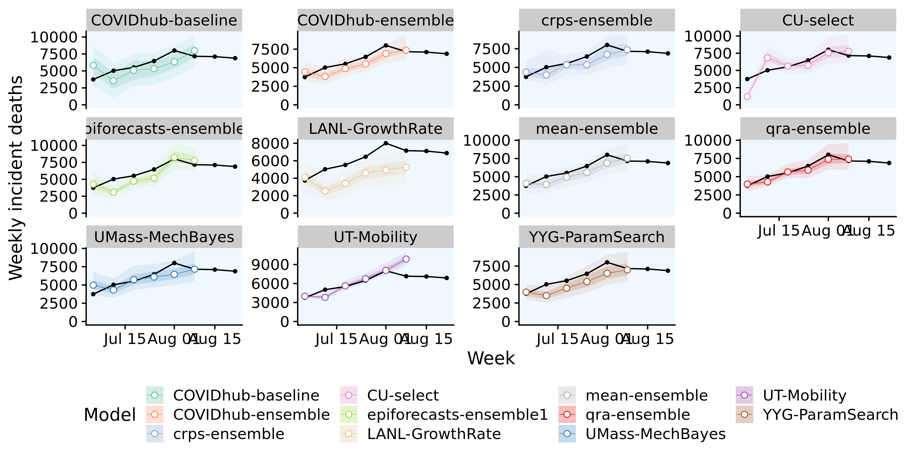

# Results - evaluation and aggregation of Covid-19 death forecasts {#results}

SOMEWHERE: NUMBER OF STATES, OBSERVATIONS, MODELS ETC


``` {r models-us, echo = FALSE, fig.cap = "One week ahead forecasts for the US from all models"}



```

More plots --> Appendix

Plots: 
- overall performance
- performance in different states
- performance over horizons


Which states were easy to forecast? Which ones were hard to forecast? 

Which model perform well and why?

Which ensembling approaches perform well? 

Plot with weights over time


## Discussion 

- would be good to have a plot / some analysis on how good the gamma fit for the CRPS actually works
- restriction due to inclusion of the epiforecasts-ensemble1 --> locations and dates
- exntension: dealing with missing forecasts
- sensitivity analysis: time included for ensemble weight estimation

