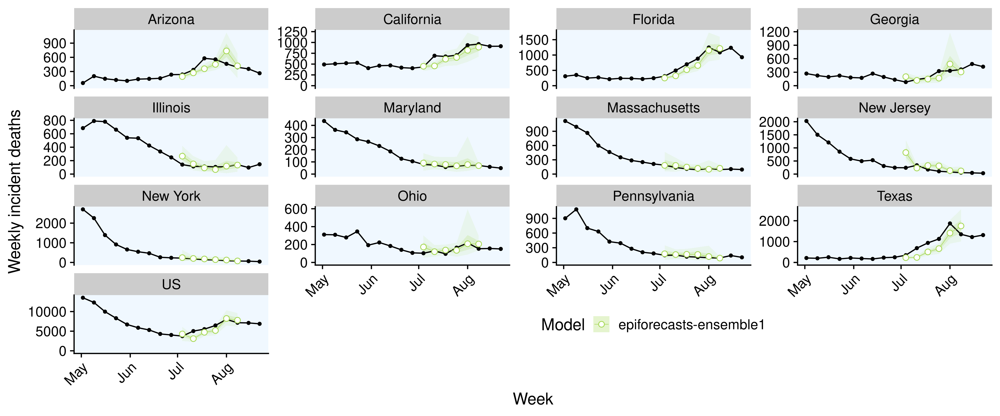

# (APPENDIX) Appendix {-}

# Appendix

``` {r predictions-baseline, echo = FALSE, out.width = "100%", fig.cap = "One week ahead forecasts for all locations for the COVIDhub-baseline model."}
knitr::include_graphics("../visualisation/chapter-5-results/scenario-baseline/APPENDIX-COVIDhub-baseline-forecasts.png")

```

``` {r predictions-covid-ensembe, echo = FALSE, out.width = "100%", fig.cap = "One week ahead forecasts for all locations for the COVIDhub-ensemble model."}
knitr::include_graphics("../visualisation/chapter-5-results/scenario-baseline/APPENDIX-COVIDhub-ensemble-forecasts.png")
```

``` {r predictions-crps, echo = FALSE, out.width = "100%", fig.cap = "One week ahead forecasts for all locations for the crps-ensemble model."}
knitr::include_graphics("../visualisation/chapter-5-results/scenario-baseline/APPENDIX-crps-ensemble-forecasts.png")
```

``` {r predictions-cu-select, echo = FALSE, out.width = "100%", fig.cap = "One week ahead forecasts for all locations for the CU-select model."}
knitr::include_graphics("../visualisation/chapter-5-results/scenario-baseline/APPENDIX-CU-select-forecasts.png")
```


``` {r predictions-epiforecasts, echo = FALSE, out.width = "100%", fig.cap = "One week ahead forecasts for all locations for the epiforecasts-ensemble1 model."}

```


``` {r predictions-lanl-growthrate, echo = FALSE, out.width = "100%", fig.cap = "One week ahead forecasts for all locations for the LANL-GrowthRate model."}
knitr::include_graphics("../visualisation/chapter-5-results/scenario-baseline/APPENDIX-LANL-GrowthRate-forecasts.png")
```


``` {r predictions-mean-ensemble, echo = FALSE, out.width = "100%", fig.cap = "One week ahead forecasts for all locations for the mean-ensemble model."}

```


``` {r predictions-umass-mechbayes, echo = FALSE, out.width = "100%", fig.cap = "One week ahead forecasts for all locations for the UMass-MechBayes-ensemble model."}

```


``` {r predictions-ut-mobility, echo = FALSE, out.width = "100%", fig.cap = "One week ahead forecasts for all locations for the UT-mobility model."}
knitr::include_graphics("../visualisation/chapter-5-results/scenario-baseline/APPENDIX-UT-Mobility-forecasts.png")
```


``` {r predictions-yyg-paramsearch, echo = FALSE, out.width = "100%", fig.cap = "One week ahead forecasts for all locations for the YYG-ParamSearch  model."}
knitr::include_graphics("../visualisation/chapter-5-results/scenario-baseline/APPENDIX-YYG-ParamSearch-forecasts.png")
```


``` {r wis-contributions-relative, echo = FALSE, out.width = "100%", fig.align = "center", fig.cap = "Relative contributions to the Weighted Interval Score from its underprediction (blue), overprediction (red) and sharpness (green) components."}


```


``` {r wis-contributions-rel-state, echo = FALSE, out.width = "100%", fig.align = "center", fig.cap = "Relative contributions to the Weighted Interval Score from its underprediction (blue), overprediction (red) and sharpness (green) components in different locations."}

knitr::include_graphics("../visualisation/chapter-5-results/scenario-baseline/wis-contributions-rel-state2.png")

```


``` {r coverage-horizons, echo = FALSE, out.width = "100%", fig.cap = "Evolution of interval and quantile coverage over multiple horizons.."}
knitr::include_graphics("../visualisation/chapter-5-results/scenario-baseline/APPENDIX-coverage-plots-horizons.png")
```

